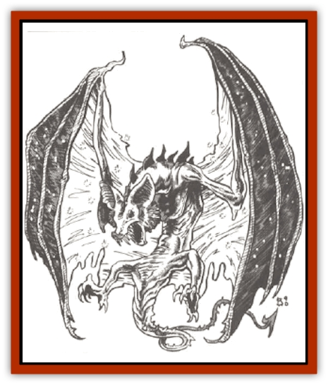

# Q'nidar

| Statistic | **Q'nidar** |
| --- | --- |
| **Activity Cycle:** | Any |
| **Alignment:** | Neutral |
| **Armor Class:** | -1 (3) |
| **Climate/Terrain:** | Wildspace/Temperate and Subarctic |
| **Damage/Attack:** | See below |
| **Diet:** | Light and heat |
| **Frequency:** | Uncommon |
| **Hit Dice:** | 6-8 |
| **Intelligence:** | Low (5-7) |
| **Magic Resistance:** | Nil |
| **Morale:** | Average (8-10) |
| **Movement:** | Fl 16 (C); See below |
| **No. Appearing:** | 1-6 |
| **No. of Attacks:** | 1 |
| **Organization:** | Pack |
| **Size:** | H (12'-15' long) |
| **Special Attacks:** | See below |
| **Special Defenses:** | Immune to heat, flame |
| **THAC0:** | 6 HD: 15 / 7-8 HD: 13 |
| **Treasure:** | None |
| **XP Value:** | 1,400 |

The q'nidar are bat-like creatures that frequent the warmer areas of wildspace in search of food. They appear as gigantic bats with a semi-crystalline hide (not unlike that of the [[Dragon_Radiant|radiant dragon]] in appearance). The q'nidar feed on heat and light, which can be seen constantly arcing around and through them; from afar, these heat and light patters streak behind them, resembling a vaporous trail. The [[Dracon|dracon]] were the first to encounter these creatures and named them <q>q'nidar</q>, or heat-eaters. The rest of the races in space usually refer to the creatures as <q>vapor bats</q>.

The q'nidar have a unique form of communication: They <q>speak</q> via a thermal breath that is easily detected and understood by other q'nidar. Even though they feed on heat and light, they are not always found near heat-based celestial bodies; too much background heat confuses their senses and their speech.

**Combat:** Q'nidar are attracted to spelljamming ship because of the lights and activity, as well as curiosity. In the past, q'nidar would confuse ships with other vapor bats and <q>speak</q> with the ship, resulting in disaster.

The breath of a q'nidar is extremely hot. It is harmless in the void, but, when exposed to the atmospheric envelope of a ship, it ignites the air in its path and any flammables it contacts. The breath weapon is a cone of fire 30 feet long that is ten feet wide at its far end. Anyone within the area of the flame suffers 2d12 points of damage. and any flammable materials must roll successful saving throws or ignite. The breath also causes 1d3 points of hull damage (wooden and organic hulls only).

The vapor bats generally wait for fires they started to build to 5-point intensity (5 hull points of damage per round), and then they begin absorbing the heat and light from the flames. This process extinguishes the flames in two rounds. Thus, the bats put out any flames they caused, but only if given the chance. If attacked while <q>talking</q>, a vapor bat will scream at the ship, causing an additional 1d12 points of damage with its breath, and an added point of hull damage. It continues to scream until it is no longer interrupted while feeding.

**Habitat/Society:** Q'nidar travel in a single-line formation to feed upon the heat trails of the pack leader. Their flight in wildspaee is erratic because they get confused by background thermals. The vapor bats have learned that much food is generated by talking with spelljamming ships, and thus they are commonly found along the spaceways and trade lanes of space. They are simple creatures, meaning no malice, but they are still one of the feared monsters of the void.

Q'nidar are capable of moving at spelljamming speed (SR of 3), but only after they have absorbed major amounts of heat and light. If a q'nidar is brought out of spelljamming speed by a passing ship, it needs <q>food</q> to maintain its speed, and it begins breathing on the ship to generate heat and light for its needs. Q'nidar rarely need to absorb more than 5 or 6 points of heat energy before returning to spelljamming speed.

Q'nidar are never found in the phlogiston except in their rare, crystalline form (see <q>Ecology</q>). In the phlogiston, the vapor bats' breath causes a constant fireball about the q'nidar and effectively kills them by overabsorption of heat. Q'nidar killed in the phlogiston this way have a different crystal structure, and this crystal is quite useful for creating a crystal ball. Q'nidar subjected to fireballs of greater Hit Dice than their own will absorb all the heat and light, forming this same crystal.

**Ecology:** The hides of the q'nidar make effective components of heat- and Iight-based spells. When heated, the scales are quite effective for extra lighting. Remains of the q'nidar are rarely encountered, outside of those killed along the tradeways.

Responding to some racial instinct, the dying q'nidar dive toward the nearest star, absorbing heat and light until their bodies crystallize fully. Often, these bodies of crystal simply get pulled into the star, but some have been recovered. The crystalline formation reacts like a spelljamming helm, absorbing not only heat and light, but magic. The crystalline remains may be carved into a small chair, creating a minor spelljamming helm.

---
## Discovery & Documentation

**Source Publication:** MC7 Spelljammer Appendix I (1990)
**Campaign Setting:** Advanced Dungeons & Dragons 2nd Edition
**Author(s):** various

### Other Creatures Found in This Source Book
   * [[Aartuk|Aartuk]]
   * [[Albari|Albari]]
   * [[Ancient_Mariner|Ancient Mariner]]
   * [[Argos|Argos]]
   * [[Beholder_Abomination_Astereater|Beholder (Abomination), Astereater]]
   * [[Blazozoid|Blazozoid]]
   * [[Chattur|Chattur]]
   * [[Chevall|Chevall]]
   * [[Clockwork_Horror|Clockwork Horror]]
   * [[Colossus|Colossus]]
   * [[Delphinid|Delphinid]]
   * [[Dizantar|Dizantar]]
   * [[Dog|Dog]]
   * [[Dog_Bog_Hound|Dog, Bog Hound]]
   * [[Esthetic|Esthetic]]
   * [[Focoid|Focoid]]
   * [[Fractine|Fractine]]
   * [[Giant_Spacesea|Giant, Spacesea]]
   * [[Golem_Furnace|Golem, Furnace]]
   * [[Golem_Radiant|Golem, Radiant]]
   * [[Gravislayer|Gravislayer]]
   * [[Grommam|Grommam]]
   * [[Hadozee|Hadozee]]
   * [[Hamster_Giant_Space|Hamster, Giant Space]]
   * [[Jammer_Leech|Jammer Leech]]
   * [[Lakshu|Lakshu]]
   * [[Lumineaux|Lumineaux]]
   * [[Lutum|Lutum]]
   * [[Mimic_Space|Mimic, Space]]
   * [[Misi|Misi]]
   * [[Moon_Rogue|Moon, Rogue]]
   * [[Mortiss|Mortiss]]
   * [[Murderoid|Murderoid]]
   * [[Nay-Churr|Nay-Churr]]
   * [[Phlog-Crawler|Phlog-Crawler]]
   * [[Plasman|Plasman]]
   * [[Plasmoid_DeGleash|Plasmoid, DeGleash]]
   * [[Plasmoid_DelNoric|Plasmoid, DelNoric]]
   * [[Plasmoid_General_Information|Plasmoid, General Information]]
   * [[Plasmoid_Ontalak|Plasmoid, Ontalak]]
   * [[Puffer|Puffer]]
   * [[Rastipede|Rastipede]]
   * [[Reigar|Reigar]]
   * [[Rock_Hopper|Rock Hopper]]
   * [[Slinker|Slinker]]
   * [[Spider_Asteroid|Spider, Asteroid]]
   * [[Spiritjam|Spiritjam]]
   * [[Survivor|Survivor]]
   * [[Syllix|Syllix]]
   * [[Symbiont_Power|Symbiont, Power]]
   * [[Vine_Infinity|Vine, Infinity]]
   * [[Wiggle|Wiggle]]
   * [[Wizshade|Wizshade]]
   * [[Wryback|Wryback]]
   * [[Zard|Zard]]
   * [[Zodar|Zodar]]
