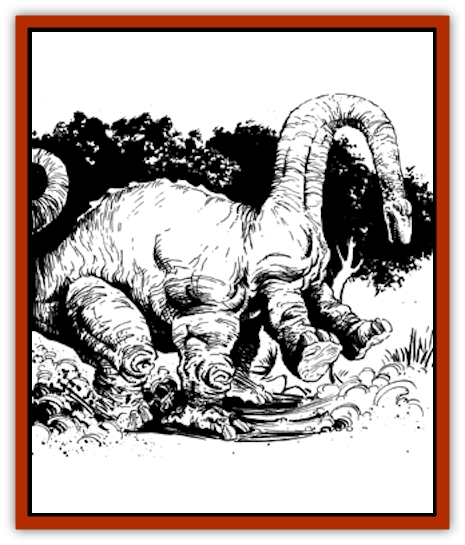

# Quakedancer

| Statistic | **Quakedancer** |
| --- | --- |
| **Activity Cycle:** | Day |
| **Alignment:** | Neutral |
| **Armor Class:** | 6 |
| **Climate/Terrain:** | Subarctic to subtropical/Plains, prairies, grasslands |
| **Damage/Attack:** | See below |
| **Diet:** | Omnivore |
| **Frequency:** | Rare |
| **Hit Dice:** | See below |
| **Intelligence:** | Semi- (2-4) |
| **Magic Resistance:** | Nil |
| **Morale:** | Steady (12) |
| **Movement:** | 6 |
| **No. Appearing:** | 1 |
| **No. of Attacks:** | 1 bite and 1 stomp |
| **Organization:** | Solitary |
| **Size:** | See below |
| **Special Attacks:** | Stunning, swallowing whole |
| **Special Defenses:** | Nil |
| **THAC0:** | See below |
| **Treasure:** | Nil |
| **XP Value:** | See below |

The quakedancer (a.k.a. quakebeast, quakemaker, thunderer) is a large reptilian beast that resembles a [[Dinosaur_II|Brontosaurus]], except for the fact that it has six legs. It is not a true dinosaur. The middle pair of legs have thick-clawed toes that point outward, both forward and backward, and oversized knee joints, while the feet of the other, normal pairs of legs are broader at the base than would be expected of a true sauropod of comparable size.

While it looks like a herbivore, the quakedancer is really omnivorous, eating plants only as a ruse to convince true plant-eaters that it is harmless. It doesn't have the specialized equipment of other meat-eaters (oversized claws and fangs, camouflage coloring, powerful legs to run down its prey, etc.). It hunts by means of its unique ability to create a miniature earthquake in its immediate vicinity.

**Combat:** When hungry (which is often), the quakebeast pretends to be a normal sauropod, vacuously grazing on the greenery until a good number of unsuspecting creatures are within range doing the same thing, attracted by the illusion of safety the quakedancer provides. The quakedancer then roots the toes of its middle legs into the ground and balances its large body on these two pivots. Slowly at first, then faster and faster, it rocks back and forth from its front legs to its back like a living see-saw, pumping with its neck and tail to produce more force, resoundingly crashing its bulk down with each swing.

The impact produced by this constant ground-pounding creates nerve-shattering shock waves in the beast's vicinity, stunning unlucky creatures smaller than itself that happen to be too close to it. It takes 3-6 rounds of rocking to warm up to the stunning attacks. Creatures within range must make a save vs. paralysis every round that the quakedancer maintains its stunning attack (it makes only one stomp per round) or be stunned for 2d4 rounds; details on what creature sizes are affected and the range of the attack are given in the Quakedancer Growth Table. Stunning effects are cumulative to a maximum
of 20 rounds. Once sufficient stunned prey is present for the quakedancer's appetite (about 2d6 creatures of the largest size it can affect, or more of smaller sizes), it will cease its stomping and automatically swallow its stricken prey whole at the rate of one creature per round. No to-hit roll is needed for such swallowing; moving prey is ignored unless it attacks, in which case the quakedancer attempts to stomp and bite the victim. A swallowed victim either dies from suffocation (as per the rules on breath-holding in the *Player's Handbook*, page 122; monsters use twice their hit dice for an equivalent constitution score) or takes 3d8 hp damage per round from the beast's stomach acids, starting on the third round after the victim is swallowed.

**Habitat/Society:** Quakedancers are careful to hunt only in level, stable areas away from other predators, in order to prevent two possible threats: scavengers outside quake range darting in to snatch their hard-earned prey, or quaking in unstable areas that could open crevasses and rockslides rendering prey inaccessible. As they get older, and larger, quakedancers relax this "rule", as terrain that would seem imposing to a 6' human is much less so to a 50' quakedancer.

These beasts have no lairs, as the repeated devastation of a single region would mark it as too dangerous to enter. Instead, they are constantly on the move looking for new hunting grounds where they are not feared by the local wildlife. A person with the Tracking proficiency could follow a quakedancer with ease, even years after it left an area, following the trail of slowly eroding wounds in the earth until he found the quake-producing beast at work.

Annually, a quakedancer lays a cluster of 2d10 eggs in a shallow burrow at the center of a newly devastated area (these areas are often shunned for some time by other creatures that might threaten the 4-foot-long eggs). After laying the eggs, the female quakedancer abandons them, as the male quakedancer abandoned her weeks before. Most of these eggs successfully hatch, but few of the young survive to see their first year, being eaten by predators or their clutch-mates.

As hatchling quakedancers haven't the mass to use the quake-making attack of adults, newborn quakedancers quickly scurry for cover after hatching, surviving that first year on a diet of vegetation, insects, and other small creatures. Those living through the trying first year are able to use their quaking ability to stun Tiny creatures in their near vicinity, and their success is virtually assured from this point on. Quakedancers grow shockingly fast. Sexual maturity does not arrive until their fifth year, at which point they are as much as 50' in length and well able to clear an area for egg-laying.

**Ecology:** Though their actions appear highly destructive, in the long run a quakedancer has only a slight effect on its environment. Wildlife returns to a devastated area soon after the quakedancer leaves, and it does not overhunt, as much of its stunned prey usually escapes upon recovery. Streams and rivers may have their courses altered, and once in a while a quakedancer might accidentally trigger a more severe disaster with its movements (e.g., landslide, avalanche, natural earthquake, flooding after dam collapse, etc.). Civilized beings who rely on fixed urban and agricultural areas find these beings to be highly troublesome, however, and quakedancers are hunted into extermination in most areas.

Although quakedancer eggs are easy to find if one knows where to look, they have little market value considering the potentially devastating effects a few years after they hatch. Some unscrupulous individuals will sell the eggs as something else (e.g., [[Dragon_General_Information|dragon]] eggs), while others have sent them as anonymous gifts to their enemies. Cities that have suffered through such pranks usually institute strict laws against the importation, marketing, and possession of these time bombs.

At the other end of their life-cycle, rumors claim that quakedancers never die of old age; they can be brought down by predators, adventurers, disease, natural disaster, or even larger members of their own species, but if none of these factors intrudes, they just continue to grow without cease. In regions where such legends are widespread, all earthquakes are attributed either directly to gargantuan quakedancers passing through, or indirectly to the passage of the semi-mythical First Quaker, which supposedly roams far-off regions but still causes local earthquakes by way of transmitted shockwaves and aftershocks.

|  |
| --- |
| Age | 0-1 years | 1-2 years | 2-3 years | 3-4 years | 4-5 years | 5-6 years | 6-7 years | 7+ years |
| Hit dice | 1 | 4 | 8 | 12 | 16 | 20 | 24 | 28 |
| Size | 2-10' S-L | 10-20' H | 20-30' H | 30-40' G | 40-50' G | 50-60' G | 60-70' G | 70-80' G |
| THAC0 (stunned) | 20 (nil) | 16 (12) | 12 (8) | 8 (4) | 4 (0) | 0 (-4) | -4 (-8) | -8 (-12) |
| Bite damage | 1d2 | 1d4 | 1d6 | 1d8 | 1d10 | 1d12 | 1d12 + 1d2 | 1d12 + 1d4 |
| Stomp damage | nil | 1d8 | 2d8 | 3d8 | 4d8 | 5d8 | 6d8 | 7d8 |
| Quake radius | nil | 10' | 20' | 30' | 40' | 50' | 60' | 70? |
| Max. size of prey stunned | nil | T | S | S | M | L | L | H |
| XP value | 15 | 270 | 1,400 | 5,000 | 9,000 | 13,000 | 17,000 | 21,000 |

---
## Discovery & Documentation

**Source Publication:** Dragon180 (1992)
**Campaign Setting:** Dragon Magazine
**Author(s):** 

### Other Creatures Found in This Source Book
   * [[Faerie_Petty_Gorse|Faerie, Petty, Gorse]]
   * [[Ram_Battering|Ram, Battering]]
