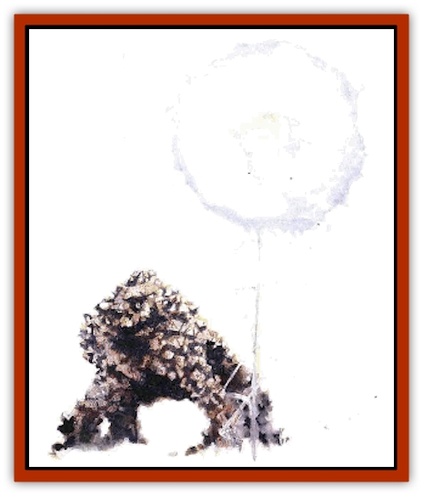
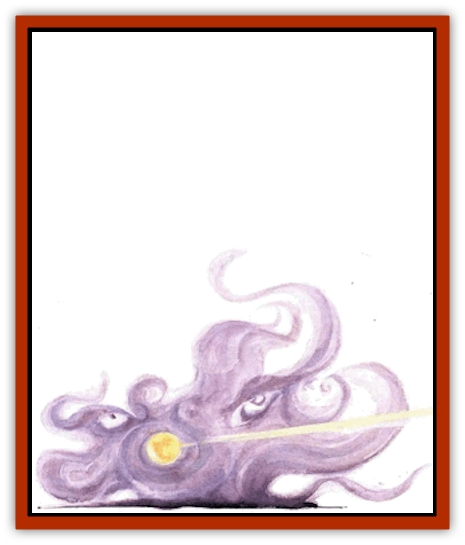

# Quasielemental - Positive

| Statistic | **Lightning** | **Mineral** | **Radiance** | **Steam** |
| --- | --- | --- | --- | --- |
| **Activity Cycle:** | Any | Any | Any | Any |
| **Alignment:** | Neutral | Neutral | Neutral | Neutral |
| **Armor Class:** | 2 | 0 | 0 | 2 |
| **Climate/Terrain:** | Quasiplane of Lightning | Quasiplane of Mineral | Quasiplane of Radiance | Quasiplane of Steam |
| **Damage/Attack:** | 1d6 + 1 hp/HD | 1d8 + 1 hp/HD | 1d3 + 1 hp/HD | 1d6 + 1 hp/HD |
| **Diet:** | Any energy | Any stone | Darkness | Any gas |
| **Frequency:** | Common | Common | Common | Common |
| **Hit Dice:** | 6, 9, or 12 | 6, 9, or 12 | 6, 9, or 12 | 6, 9, or 12 |
| **Intelligence:** | Low to high (5-14) | Low to high (5-14) | Low to high (5-14) | Low to high (5-14) |
| **Magic Resistance:** | Nil | Nil | Nil | Nil |
| **Morale:** | Champion (15-16) | Champion (15-16) | Champion (15-16) | Champion (15-16) |
| **Movement:** | Fl 18 (E) (plus special) | 6 | Fl 48 (E) | Fl 12 (E) |
| **No. Appearing:** | 1d6 | 1d6 | 1d6 | 1d6 |
| **No. of Attacks:** | 1 | 1 | 1 | 1 |
| **Organization:** | Band | Band | Band | Band |
| **Size:** | S (3' diameter) | L (9-12' high) | S (3' diameter) | G (60' wide) |
| **Special Attacks:** | Lightning globe | Merging | Beams, blinding | None |
| **Special Defenses:** | See below | See below | See below | See below |
| **THAC0:** | 6 HD: 15 / 9 HD: 11 / 12 HD: 9 | 6 HD: 15 / 9 HD: 11 / 12 HD: 9 | 6 HD: 15 / 9 HD: 11 / 12 HD: 9 | 6 HD: 15 / 9 HD: 11 / 12 HD: 9 |
| **Treasure:** | Nil | Nil | Nil | Nil |
| **XP Value:** | 6 HD: 2,000 / 9 HD: 5,000 / 12 HD: 8,000 | 6 HD: 3,000 / 9 HD: 6,000 / 12 HD: 8,000 | 6 HD: 3,000 / 9 HD: 6,000 / 12 HD: 9,000 | 6 HD: 2,000 / 9 HD: 5,000 / 12 HD: 8,000 |

This entry sheds light on the positive quasielementals - the ones that come from Lightning, Mineral, Radiance, and Steam. Scholars think of them as "positive" because they're natives of the quasiplanes formed from the conjunction of the Positive Energy Plane and Air, Earth, Fire, or Water.

**Note: **For general information on quasielementals, refer to the first few paragraphs of the entry for [[Quasielemental_Negative|negative quasielementals]].

## Lightning Quasielemental

The Quasiplane of Lightning is a wild and dangerous place, and the living embodiments of the realm are no different. If any of the quasielementals (or [[Paraelemental|paraelementals]], for that matter) could be said to lean a bit more toward chaos than pure neutrality. it'd have to be those of Lightning.

These creatures look like small balls of lightning, with bolts of electricity constantly arcing from them toward the nearest conductor. Further, they can carry themselves along one of these arcs, effectively teleporting (as per the spell) up to 60 yards away to any grounded or metallic object with a mass greater than 5 pounds. Each round, a quasielemental can "teleport" in this fashion in addition to physically moving its normal rate (18).

**Combat:** The touch of a lightning quasielemental carries with it a powerful jolt of electricity, enough to inflict 1d6 points of damage plus 1 additional point for each of the creature's Hit Dice.

The quasielemental can also discharge globes of electricity, one per round, for as many rounds per day as it has Hit Dice. (Thus, once per day a quasielemental of 6 HD can release six globes, one of 9 HD can release nine, and one of 12 HD can release 12.) These globes float near the creature, sticking close wherever it goes. When a significant amount of metal (such as a basher in armor) or any living being of 200 pounds or more comes within 5 feet of the quasielemental, the globes move toward the target and discharge. Each globe inflicts damage according to the strength of the quasielemental: 1d4 points (for 6-HD quasielementals), 1d6 points (for 9-HD), or 1d8 points (for 12-HD). The victim receives no saving throw versus the attack, which could prove exceedingly dangerous if many globes zap the sod at once.

A lightning quasielemtntal can be struck only by a weapon of +1 or greater enchantment. Anyone who strikes it with a conductive material (such as a metal sword, even one that's magical) suffers 1d4 points of electrical damage from the creature's power. Not surprisingly, the quasielemental is immune to electricity. Fire- and acid-based attacks cause only half damage. Water, on the other hand, inflicts 1d8 points of damage per gallon to a lightning quasielemental.

**Ecology:** Virtually nothing is known or the life cycle of lightning quasielementals. Still, it's clear that they're the undisputed masters of their plane. Should a need for hierarchy arise (which it hardly ever does), the creatures known as [[Shocker|shockers]] are almost always subservient to the quasielementals.

## Mineral Quasielemental

In many respects, the mineral quasielemental looks like an [[Elemental_Air_Earth|earth elemental]], but one made of precious stones and metals. It can, however, take other forms. Fact is, it can mimic the basic shape of any other creature, though the new form is always made of sparkling minerals. When the poet Verismil wrote or "gem-studded dragons and multifaceted knights," he was actually refering to a unit of mineral quasielemental warriors marching into the Great Crystalline War of a few hundred years ago.

**Combat:** When a mineral quasielemental needs to bring down a foe, it simply clubs him with whatever sort of limbs it has in its current form. They always inflict 1d8 points of damage plus 1 additional point for each of its Hit Dice. The quasielemental can also pass through stone at will (at its normal movement rate) in the same manner as a [[Xorn|xorn]], but it rarely uses this ability with any craftiness or stealth. Rather, its attacks are straightforward and guileless.

It's bad enough when a berk has to fight just one mineral quasielemental, but things really take a turn for the worse when two of 'em are near. See, the pair can merge to form a single gigantic mineral being with all the hit points and combined Hit Dice of its component parts. Each blow landed by this creature inflicts 2d8 points of damage plus 1 additional point per Hit Die (using the combined HD total), and the merged quasielemental makes two attacks per round. No more than two quasielementals can join together in this fashion.

Mineral quasielementals regenerate 2 hit points per round as long as they're alive and in contact with solid, inorganic matter. They can be struck only by weapons of +1 or better enchantment. Furthermore, they're immune to petrification and paralyzation, but they suffer twice the normal amount of damage from acid. Lightning-based attacks inflict normal damage, but they also force a merged quasielemental to break down into its component individuals if it fails a saving throw versus spell.

**Habitat/Society:** Fairly warlike, mineral quasielementals gather into bands and patrol the glittering caverns of their plane. 'Course, who could blame them? Many bashers think that the quasiplane of Mineral is just a treasure-trove waiting to be plundered. The quasielementals despise creatures like xorn and [[Khargra|khargra]] that seek to devour precious minerals, but, truth is, they're generally hostile to any intruder who doesn't offer a really good reason for being there.

**Ecology:** When a mineral quasielemental is slain, its body becomes little more than uncut gems and valuable metal ore - approximately 200 gp worth for each of the creature's Hit Dice. But few berks're barmy enough to try to get rich by killing the plane's guardians. See, there are far easier methods of obtaining the valuable materials - after all, the whole quasiplane is filled with them!

If a quasielemental dies on any other plane, it simply falls apart into the gems and ore used to summon it in the first place. In other words, unless the creature stepped through a gate, its corpse probably won't yield anything its slayer didn't already have access to.

## 

Radiance Quasielemental

A basher new to the Inner Planes might mistake a radiance quasielemental for one made of lightning. That's because a radiance quasielemental appears to be a glowing ball of energy, but unlike its lightning counterpart, it doesn't crackle chaotically with arcs of energy. Instead, it emits a steady, orderly glow, varied only by the intensity of the creature's continual, smooth spinning. The glow is equivalent to a double-strength *continual light* spell, though the quasielemental can dim the illumination if it chooses.

**Combat:** The touch of a radiance quasielemental inflicts 1d3 points of damage plus 1 additional point for each of the creature's Hit Dice. However, when forced to defend itself, the quasielemental usually prefers to drive off its attackers by emitting rays of light. It can release seven different beams, each with its own effect:

<ul><li>*Red beam: *inflicts 1d6 points of cold damage +1 additional point for each of the quasielemental's Hit Dice.</li><li>*Orange beam: *inflicts 1d6 points of heat damage +1 point/HD.</li><li>*Yellow beam: *inflicts 1d6 points of acidic damage +1 point/HD.</li><li>*Green beam: *inflicts 1d6 points of poisonous damage +1 point/HD.</li><li>*Blue beam: *inflicts 1d6 points of electrical damage +1 point/HD.</li><li>*Indigo beam: *inflicts 1d6 points of "holy" damage +1 point/HD. This attack only affects creatures susceptible to damage from holy water.</li><li>*Violet beam: *inflicts 1d6 points of impact damage +1 point/HD.</li></ul>Each beam is 1 foot wide and has a range equal to the Hit Dice of the quasielemental in tens of yards. The creature can emit only one beam each round, but it can otherwise use the rays as often as it likes. The beams don't automatically hit their target; the quasielemental must make an attack roll. But it's canny enough to notice if a particular ray fails to injure a given basher; if that occurs, it'll try to hit him with a different colored beam next time.

Finally, a quasielemental can harm its foes by spinning very quickly and blinding those looking at it. Anyone within 120 yards of the creature when it uses this power must make a saving throw versus death magic or be struck blind for 2d10 days.

A radiance quasielemental can be struck only by weapons of +1 or better enchantment. Magical darkness of any kind wounds the creature, causing 1 point of damage per level of the caster. Attacks based on fire, cold, and electricity inflict only half damage, however.

**Habitat/Society:** These light-based beings stick to small groups on their home plane. They rarely so much as move except to avoid the [[Scile|scile]] (other residents of the quasiplane). Chant is, the more intelligent radiance quasielementals are philosophers that remain in one position for eons in peaceful contemplation. 'Course, if disturbed, they grow quite temperamental.

Quaslelementals that care less for philosophy move about a good deal more on their plane as well as on others, carrying out errands or simply looking to feed.

**Ecology:** Since their plane is such a safe haven for creatures like themselves, radiance quasielementals have little to fear from predators or other threats. And the scile aren't so much a danger as a minor annoyance. But a few planewalkers say they've heard that evil creatures from the Demiplane of Shadow occasionally invade Radiance and cause havoc. These raids are fairly trivial, but they could presage some thing larger and more dire.

## Steam Quasielemental

Also known as mist quasielementals, these vaporous beings look like large clouds of virtually transparent gas. Their ghostly appearance should be a warning even to an addlecove that the creatures are best left alone.

**Combat:** Steam quasielementals have full control of their temperature. They can become a mass of scalding steam or a cloud of freezing mist at will, even switching back and forth between the extremes every round.

In battle, they simply surround and engulf their foes. Each round, anyone within a quasielemental's area (which can fill a cube up to 60 feet on a side) suffers 1d6 points of either hot or cold damage plus 1 additional point for each of the creature's Hit Dice. The quasielemental doesn't need to make an attack roll, and the victim receives no saving throw. The gaseous creature can also strike those outside its area with a single misty tendril.

A steam quasielemental can be struck only by weapons or +1 or greater enchantment. It's immune to cold-based attacks, weather-affecting spells, and any harmful effects from water. Fire-based attacks cause only half damage. Electricity inflicts full damage, but it also can hurt anyone currently engulfed by the creature. (Sods in the cloud must make a saving throw versus spell; failure indicatesthat they suffer half damage from the electrical attack, and success means that they suffer none.)

Steam quasielementals can move through the air or water with equal ease, and they can pass through the smallest of openings or cracks in solid objects.

**Habitat/Society:** Steam quasielementals are said to slip their misty tendrils into all aspects or life on their home plane, where they're virtually impossible to detect. The most intelligent ones organize their lessers into cadres of spies and agents. Thus, they not only know everything that happens on the Quasiplane of Steam (and other planes nearby), but they can try to control those events as well.

These dangerous creatures don't hesitate to attack whenever a berk stands in the way of their plans - or whenever it serves their purposes. More frequently, they try to take intruders as slaves, because their one limitation is their inability to manipulate objects. Planewalkers or other bashers made of solid matter prove useful for such tasks (which, admittedly. don't arise too often).

**Ecology:** Steam quasielementals absorb gases to sustain themselves and reproduce simply by absorbing a great deal and then splitting in two.

---
## Discovery & Documentation

**Source Publication:** Planescape III (1996)
**Campaign Setting:** Planescape
**Author(s):** Monte Cook

### Other Creatures Found in This Source Book
   * [[Animental|Animental]]
   * [[Archomental_Evil|Archomental, Evil]]
   * [[Archomental_Good|Archomental, Good]]
   * [[Belker|Belker]]
   * [[Bzastra|Bzastra]]
   * [[Chososion|Chososion]]
   * [[Darklight|Darklight]]
   * [[Devete|Devete]]
   * [[Devourer_Planescape|Devourer (Planescape)]]
   * [[Dharum_Suhn|Dharum Suhn]]
   * [[Egarus|Egarus]]
   * [[Elemental_Athas_Lesser_Air_Earth|Elemental (Athas), Lesser, Air/Earth]]
   * [[Elemental_Athas_Lesser_Fire_Water|Elemental (Athas), Lesser, Fire/Water]]
   * [[Elemental_Fire_Kin_Salamander_II|Elemental, Fire Kin, Salamander II]]
   * [[Entrope|Entrope]]
   * [[Facet|Facet]]
   * [[Frost_Salamander|Frost Salamander]]
   * [[Fundamental_Air_Earth|Fundamental, Air/Earth]]
   * [[Fundamental_Fire_Water|Fundamental, Fire/Water]]
   * [[Fundamental_All_Elements|Fundamental, All Elements]]
   * [[Garmorm|Garmorm]]
   * [[Homunculus_Elemental|Homunculus, Elemental]]
   * [[Immoth|Immoth]]
   * [[Khargra|Khargra]]
   * [[Klyndes|Klyndes]]
   * [[Magran|Magran]]
   * [[Menglis|Menglis]]
   * [[Nathri|Nathri]]
   * [[Ooze_Sprite|Ooze Sprite]]
   * [[Paraelemental|Paraelemental]]
   * [[Phirblas|Phirblas]]
   * [[Psurlon|Psurlon]]
   * [[Quasielemental_Negative|Quasielemental, Negative]]
   * [[Rast|Rast]]
   * [[Ravid|Ravid]]
   * [[Ruvoka|Ruvoka]]
   * [[Scile|Scile]]
   * [[Shad|Shad]]
   * [[Shocker|Shocker]]
   * [[Sislan|Sislan]]
   * [[Suisseen|Suisseen]]
   * [[Terithran|Terithran]]
   * [[Thoqqua|Thoqqua]]
   * [[Trilloch|Trilloch]]
   * [[Tsnng|Tsnng]]
   * [[Ungulosin|Ungulosin]]
   * [[Vacuous|Vacuous]]
   * [[Wavefire|Wavefire]]
   * [[Xag-Ya_Xeg-Yi|Xag-Ya/Xeg-Yi]]
   * [[Xill|Xill]]
