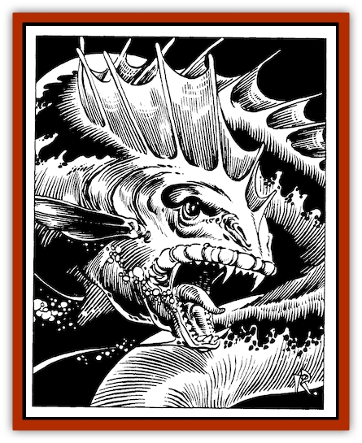

# Quelzarn

| Statistic | **Quelzarn** |
| --- | --- |
| **Activity Cycle:** | Any |
| **Alignment:** | Neutral |
| **Armor Class:** | 5 |
| **Climate/Terrain:** | Tropical, subtropical, and temperate fresh and salt water |
| **Damage/Attack:** | 3d4 |
| **Diet:** | Carnivore |
| **Frequency:** | Uncommon |
| **Hit Dice:** | 5-10 |
| **Intelligence:** | Low (5-7) |
| **Magic Resistance:** | 40% |
| **Morale:** | Very steady (13-14) |
| **Movement:** | 6, swim 20 |
| **No. Appearing:** | 1 |
| **No. of Attacks:** | 1 |
| **Organization:** | Solitary |
| **Size:** | G (up to 60' long) |
| **Special Attacks:** | Hold monster ability |
| **Special Defenses:** | Immune to electrical attacks |
| **THAC0:** | 5-6 HD: 15 / 7-8 HD: 13 / 9-10 HD: 11 |
| **Treasure:** | J,K,L,N,Q |
| **XP Value:** | 5 HD: 1,250 / 6 HD: 1,500 / 7 HD: 1,750 / 8 HD: 2,000 / 9 HD: 2,250 / 10 HD: 2,500 |

Quelzarn are giant, solitary water snakes found in both fresh- and saltwater. They are swift, agile hunters, and may be of magical origin.

Quelzarn are [[Eel|eel]]-like in appearance, with mottled brown or green slimy skin that is extremely slippery. The slime enables them to breathe air through skin membranes, and is often home to mosses and weeds. Quelzarn are usually thirty to forty feet long, and have a spinelike fin running the length of their backs. Broad, leafshaped fins cover their gills just behind their wide, toothed jaws, and a quelzarn's head sports a bony, fin-shaped crest.

**Combat:** Quelzarn will eat anything living (and carrion if desperate). They spend their days cruising for meals, or drifting while the digest one. Quelzarn can cast a sixty-foot-range *hold monster* spell once per turn. They use this in battle and to immobilize prey. Quelzarn are highly resistant to the polluted waters of busy harbors and vast swamps alike. They have been known to hold a sailor standing on a dock, and then rear out the water to pluck him off the deck.

Quelzarn bite for 3d4 points of damage and are capable of swallowing whole any creature 4½ feet tall or less. (The victim, even if held, is allowed a Dexterity check to avoid this fate.) Swallowed victims drown in six rounds; they will find that the interior of a quelzarn is AC 9, and inflicting 20 points of damage to one will cause the creature to spit its victim(s) out. Swallowed victims suffer only 1d2 points of damage from the creature's teeth. Angry quelzarn are capable of vomiting a swallowed creature out in order to bite it again.

**Habitat/Society:** Quelzarn are thought to have a magical origin, perhaps the result of long-ago experimentation by mages of Unther (certainly, the creatures were once hunted there for sport). They have a natural magic resistance, and are entirely immune to all electrical attack, both magical and natural. Quelzarn are attracted by magical attempts to control their wills, but receive a saving throw every second round against such magic (or spelllike magical natural or item powers) to break free of control. The interest of quelzarn in magic use, plus their shape and humanlike eyes, sometimes cause them to be mistaken for [[Naga|nagas]].

Quelzarn roam great distances in their lives, and are thought to mate (they do so only seldomly) in deep undersea caves. They may cooperate with other creatures (in return for food), and never attack another of their kind. If one quelzarn encounters another attacking prey, they tend to ignore each other and attack independently rather than fighting over the prey or cooperating to share it.

**Ecology:** Quelzarn have no distinct lairs. Any treasure found with a quelzarn will be inorganic matter that has been swallowed (such as coins and gems). The digestive juices of quelzarn slowly break down flesh and even bone. The brain and cranial fluids of quelzarn have been found useful in the making of spell inks for *slow* and *hold* magic, and as a distillate in the manufacture of *rings of free action*. Quelzarn tissue is a useful alternative ingredient in the seasoning of wood to be used in the fashioning of *wands of lightning*. Quelzarn skin is leathery and snakelike, but death or removal causes it to cease producing its slimy coating. It soon shrivels to uselessness.

**Greater Quelzarn**

These creatures are thought to be very rare or even extinct, but are often referred to in Untherian hunting accounts of long ago. Larger than most quelzarn, they had an additional magical ability; that of *spell turning* (as a *ring of spell turning*). They were cunning and highly intelligent, often luring hunting ships into traps, and were known to ally with other marine creatures on occasion.

---
## Discovery & Documentation

**Source Publication:** The Wyrmskull Throne (1994)
**Campaign Setting:** Forgotten Realms
**Author(s):** Steven E. Schend, thomas M. Reid

### Other Creatures Found in This Source Book
   * [[Feeblestar|Feeblestar]]
   * [[Shalarin|Shalarin]]
   * [[Slithering_Hoard|Slithering Hoard]]
