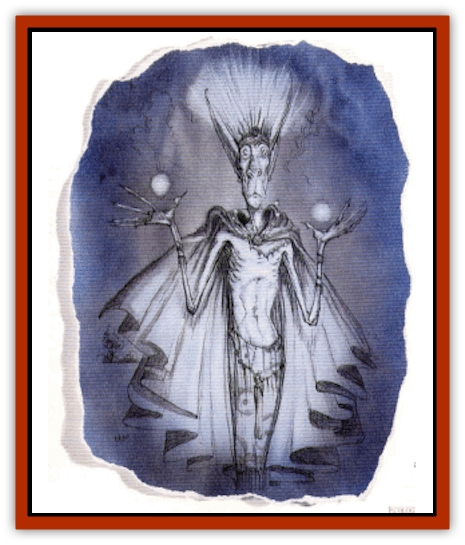

# Quesar

| Statistic | **Quesar** |
| --- | --- |
| **Activity Cycle:** | Day |
| **Alignment:** | Neutral good |
| **Armor Class:** | 0 |
| **Climate/Terrain:** | Elysium |
| **Damage/Attack:** | 1d12 |
| **Diet:** | Daylight |
| **Frequency:** | Very rare |
| **Hit Dice:** | 8 |
| **Intelligence:** | Average (8-10) |
| **Magic Resistance:** | 50% |
| **Morale:** | Average (8-10) |
| **Movement:** | 24 |
| **No. Appearing:** | 1d6 |
| **No. of Attacks:** | 1 |
| **Organization:** | Solitary |
| **Size:** | M (6' tall) |
| **Special Attacks:** | Blinding, burning, and disintegration |
| **Special Defenses:** | +3 or better weapon to hit, immune to fire and lightning, regeneration |
| **THAC0:** | 13 |
| **Treasure:** | Nil |
| **XP Value:** | 6,000 |

Quasar, it is said, were created by a group of lawful [[Aasimon_General_Information|aasimon]] to serve as guardians over celestial treasures. These aasimon went to the radiant plains of Elysium and into the layer known as Belierin. There, they formed from the marshy mud a dried husk of human shape and form. In a hidden fortress called Nillis-thur, the aasimon magically transformed this mannequin so that it would absorb its energy from daylight. The fires of the construct began deep within it, but they quickly blossomed forth in cascades of might.

Soon the creation was more essence than form. The aasimon named the fruit of their labor a *quesar*, which meant "borrowed from heaven's crown". They were so enamored with themselves and their ingenuity that they immediately began creating more of the quesar.

Things continued at an ever-incrcasing pace until the aasimon began to assign their creations tasks to accomplish. In the beginning, the quasar carried out the missions they were given out of a feeling of gratitude or respect for their creators. It did not take long, however, for the quesar to decide for themselves that they had no intention of being slaves or servants of any other creature. The newly formed creatures attempted to relate this concept to their creators peacefully, but the aasimon did not react well to the news that all of their labor was for naught.

The quesar thanked the aasimon for their existence and assured them that they had not worked in vain, for the energy constructs would be a powerful force for good even if they did not work directly for the aasimon. Still, the champions of the Upper Planes did not take kindly to their creations acting in such a manner. "The clockworks do not tell the clock maker what to do. The clay does not instruct the sculptor," they said.

So there was war in heaven, but it was a short conflict, for some of the powers that called Elysium home intervened. "The quesar are not creatures of order - they follow the commands of no one. That is the way of Elysium," they said to the aasimon. Then the powers turned to the quesar. "You do not strike out at those who have treated you well. Creatures such as you do not act of rash thoughts and chaos. That is the way of Elysium."

Wordlessly, the aasimon left the marshes of Belierin. The quesar remained, to make a home for themselves and ponder the true purpose of their new lives. Most remain hidden until such meaning is found.

A quasar is vaguely human in shape, with two graceful arms, powerful legs, and a noble head joined by a slender torso. This form is obscured by the incredible amounts of energy radiating from the creature. Almost [[Golem_General_Information|golem]]like in nature, the quesar are nonetheless free-thinking beings with the energy, power, and life span of a star.

**Combat:** There is one word of advice that those evil beings knowing anything about quesar give in regards to meeting them in battle: "Don't." Although they never use weapons (for even those of powerful enchantment would eventually melt or dissolve in their hands), their potent strikes inflict 1d12 points of damage.

The truly terrifying might of a quesar is displayed in its energy halo which emanates forth from its corporeal form. At its lowest intensity, which can be generated by a quasar at will, all within 100 yards must make a saving throw versus spells or be blinded for 1d10 rounds. It should be noted that this energy is equivalent to sunlight for purposes of battling certain evil or undead creatures. After one round of blinding light, the intensity can be increased to a level which sears all creatures within 10 yards, inflicting 6d6 points of damage (a saving throw versus breath weapon reduces this damage by half). This attack can be used six times each day. After a round of searing power, the intensity ran be increased further. In this case, the light and force become so great that everything within 5 yards must save versus death magic or be disintegrated. This fearsome power is usable only three times each day.

Only magical weapons of +3 or greater enchantment can harm quesar. They are immune to energy-based attacks such as fire, lighting, and *magic missiles*. Cold, however, inflicts normal damage upon the constructs, assuming their magic resistance can be overcome. These beings of energy regenerate 1 hp per round while in daylight, even after they have been "slain". There are only two ways to kill a quesar permanently. The first is to defeat it in battle and then place the creature's remains in darkness where the light of day never reaches. The second method requires the virtual obliteration of the creature by magical means, such as *disintegration*, multiple *energy drains*, or *wish*.

Quesar cannot be summoned, and greatly resent being controlled or forced into submission. As the archmage Tessis Ro'lariv said, "Sometimes righteous wrath can be as horrible as evil's vengeance."

**Habitat/Society:** In many ways, the quasar are outcasts and enigmas in the Upper Planes. While they are creatures of goodness, kindness, and light, the aasimon and other lawful beings of the good planes resent their insolence and resistance to accepting the hierarchy of the heavens. On the planes of goodness, the aasimon are to be obeyed without question. Those that do not adhere to that stricture are not well liked.

Therefore, even when their might would make them useful allies in some conflict against evil waged by [[Aasimon_Deva|devas]], [[Aasimon_Planetar|planetars]], or even [[Asuras|asuras]], the quasar are not approached for aid. They are never found in the company of other such beings. A select few have chosen paths of action for themselves, but most remain on Elysium still searching for a purpose. Rare quesar may decide to single-handedly attack the fiends in the Lower Planes. The battles that result are often spectacular displays of power in which many [[Tanar'ri_General_Information|tanar'ri]], [[Baatezu_General_Information|baatezu]], [[Yugoloth_General_Information|yugoloths]], or other evil creatures are laid low. Despise the quesar's great power, however, these attacks are suicidal. Even their might cannot stand alone against the hosts of all evil for very long.

**Ecology:** Quesar absorb daylight's healing power through their fragile flesh. Without this energy, they are humanoid creatures of simple appearance and delicate construction. If they are slain and this form is destroyed, even if their remains are scattered to the mercies of the four winds, the power of the sun (or whatever generates daylight on the plane they are on) rejuvenates and regenerates them. In most other respects the quesar are similar to golems, constructs without need of food, air, or water.

---
## Discovery & Documentation

**Source Publication:** Planes of Conflict (1995)
**Campaign Setting:** Planescape
**Author(s):** Colin Mccomb, Dale Donovan

### Other Creatures Found in This Source Book
   * [[Aeserpent|Aeserpent]]
   * [[Asuras|Asuras]]
   * [[Buraq|Buraq]]
   * [[Delphon|Delphon]]
   * [[Diakk|Diakk]]
   * [[Ethyk|Ethyk]]
   * [[Gautiere|Gautiere]]
   * [[Linqua|Linqua]]
   * [[Ni'iath|Ni'iath]]
   * [[Phiuhl|Phiuhl]]
   * [[Slasrath|Slasrath]]
   * [[Warden_Beast|Warden Beast]]
   * [[Yugoloth_Greater_Baernaloth|Yugoloth, Greater, Baernaloth]]
