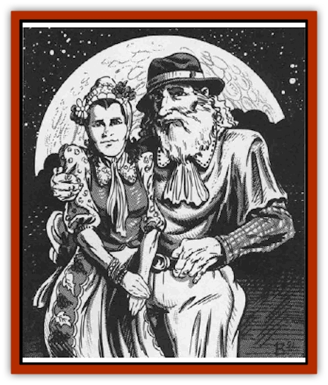

# Quevari

| Statistic | **Quevari** |
| --- | --- |
| **Activity Cycle:** | Any |
| **Alignment:** | Lawful good or chaotic evil |
| **Armor Class:** | 10 or 7 |
| **Climate/Terrain:** | Any land |
| **Damage/Attack:** | 1d2 or by weapon |
| **Diet:** | Omnivore |
| **Frequency:** | Uncommon |
| **Hit Dice:** | 1 |
| **Intelligence:** | Average (8-10) |
| **Magic Resistance:** | Nil |
| **Morale:** | Average (8-10) or Fanatic (17-18) |
| **Movement:** | 12 |
| **No. Appearing:** | 1-8 |
| **No. of Attacks:** | 1 |
| **Organization:** | Village |
| **Size:** | M (6' tall) |
| **Special Attacks:** | Nil or see below |
| **Special Defenses:** | Nil |
| **THAC0:** | 19 |
| **Treasure:** | A, B, C, or D (Z) |
| **XP Value:** | 15 or 65 |

The quevari are a race almost indistinguishable from normal humans. As a rule, they are friendly and helpful people who seem to go about their lives without concern for the evils that abound in the land around them. Their true nature is revealed only on the three nights of the full moon - when they become foul creatures of the night.

The quevari, as mentioned above, look just like normal humans. They are fond of bright colors in their clothes and flowers in their hair. Many observers will quickly notice that the quevari might well be taken as a light-skinned offshoot of the [[Human_Vistana|Vistani]].

The quevari language is a sweet and mild sounding one, filled with musical sounds and a poetic grammar. Those fluent in it marvel at the easy way its words can be linked together to form enchanting songs and delicate verse. In addition to this, most quevari can speak one or two other languages, making communication with them an easy matter in all but the most unusual of cases.

**Combat:** The quevari shun combat when they are in their pacifistic phase. At such times they can be counted on to defend themselves and little more. Their primary weapons in such situations are those they use to hunt - short bows and slings - or those they use in their labors - sickles and knives. Their natural reluctance to enter into battle against intelligent opponents, however, imposes a -2 penalty on all attack rolls.

On the three nights of the full moon, however, the quevarl become bloodthirsty killers who strike with the skill and finesse of trained assassins, The quevari call this time "the rising of the bloodmoon" and accept it as an inescapable part of their nature. Those who are unaware of this side of the quevari personality (but who have had dealings with them while they were in their timid phase) suffer a -2 penalty on their initiative roll for the first round of any combat with these supposedly peaceful people. Their agility becomes greatly heightened at this time, dropping their natural armor class from 10 to 7. This increase in agility also gives them a +2 bonus on all missile fire attack or initiative rolls, and allows them to move silently, hide in shadows, and hear noise 75% of the time, as if they were thieves. Further, they can climb sheer surfaces with a 95% chance of success at these times.

While the weapons the quevari bring to play in combat do not change, their skill with them does. During the bloodmoon, the quevari always strike with a +2 on their attack rolls when using a weapon familiar to them (as described earlier.) If they are using weapons not found in their daily lives (a war hammer or polearm, perhaps), they strike normally.

**Habitat/Society:** Quevari villages tend to be small, farm communities with not more than three or four score inhabitants in any town. The community will decide on all issues important to their populations by simple votes or with the aid of an elected town council. There is nothing about a quevari community that makes it seem at all different from any other small village - until the full moon rises. Because of this, most of the people who enter or travel through a quevari town have no reason to suspect that it is not a human village. For their part, the quevari are unlikely to mention the fact that they are not strictly "human" unless asked directly. Even in this case, however, the quevari will not spell out the nature of their dark and cyclical psyches.

During the three nights of the full moon, the quevari metabolism and psychology changes. Some scholars liken this to a form of [[Lycanthrope_General_Information|lycanthropy]] that affects their minds. The quevari themselves never speak of this time (thus, they never warn strangers to leave before the full moon rises) and have learned to block out those three nights from their lives. While this means nothing to them (it's just the way things are, after all) travellers who are staying in a quevari town at the time of the bloodmoon will be in for a great surprise.

**Ecology:** Normally the quevari are a people who live by gathering nuts and berries, tending their modest farms, and hunting or fishing for the meat they need in their diet. When they are under the spell of the bloodmoon, however, they are ravenous cannibals who feast upon the flesh of their victims.

---
## Discovery & Documentation

**Source Publication:** MC10 Ravenloft Appendix I (1989)
**Campaign Setting:** Planescape
**Author(s):** William W. Connors

### Other Creatures Found in This Source Book
   * [[Bastellus|Bastellus]]
   * [[Bat_Ravenloft|Bat (Ravenloft)]]
   * [[Bowlyn|Bowlyn]]
   * [[Broken_One|Broken One]]
   * [[Bussengeist|Bussengeist]]
   * [[Darkling|Darkling]]
   * [[Doom_Guard|Doom Guard]]
   * [[Doppelganger_Plant|Doppelganger Plant]]
   * [[Elemental_Ravenloft|Elemental (Ravenloft)]]
   * [[Ermordenung|Ermordenung]]
   * [[Ghoul_Lord|Ghoul Lord]]
   * [[Goblyn|Goblyn]]
   * [[Golem_III|Golem III]]
   * [[Golem_IV|Golem IV]]
   * [[Golem_Ravenloft|Golem (Ravenloft)]]
   * [[Grim_Reaper|Grim Reaper]]
   * [[Human_Abber_Nomad|Human, Abber Nomad]]
   * [[Human_Ravenloft|Human (Ravenloft)]]
   * [[Imp_Assassin|Imp, Assassin]]
   * [[Impersonator|Impersonator]]
   * [[Lycanthrope_Werebat|Lycanthrope, Werebat]]
   * [[Lycanthrope_Wereraven|Lycanthrope, Wereraven]]
   * [[Mist_Horror|Mist Horror]]
   * [[Mummy_Greater|Mummy, Greater]]
   * [[Quickwood|Quickwood]]
   * [[Ravenkin|Ravenkin]]
   * [[Reaver|Reaver]]
   * [[Scarecrow_Ravenloft|Scarecrow (Ravenloft)]]
   * [[Shadow_Fiend|Shadow Fiend]]
   * [[Skeleton_Giant|Skeleton, Giant]]
   * [[Strahd's_Skeletal_Steed|Strahd's Skeletal Steed]]
   * [[Treant_Evil|Treant, Evil]]
   * [[Treant_Undead|Treant, Undead]]
   * [[Valpurgeist|Valpurgeist]]
   * [[Vampire_Dwarf|Vampire, Dwarf]]
   * [[Vampire_Elf|Vampire, Elf]]
   * [[Vampire_Gnome|Vampire, Gnome]]
   * [[Vampire_Halfling|Vampire, Halfling]]
   * [[Vampire_General_Information|Vampire, General Information]]
   * [[Vampire_Kender|Vampire, Kender]]
   * [[Vampyre|Vampyre]]
   * [[Widow_Red|Widow, Red]]
   * [[Wolfwere_Greater|Wolfwere, Greater]]
   * [[Zombie_Lord|Zombie Lord]]
