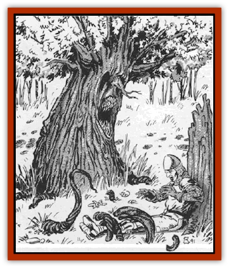

# Quickwood

| Statistic | **Quickwood** |
| --- | --- |
| **Activity Cycle:** | Any |
| **Alignment:** | Neutral |
| **Armor Class:** | 5 |
| **Climate/Terrain:** | Any/Forests |
| **Damage/Attack:** | Nil and 3-12 |
| **Diet:** | Soil nutrients and water |
| **Frequency:** | Very rare |
| **Hit Dice:** | 5-10 |
| **Intelligence:** | Very (11-12) |
| **Magic Resistance:** | Special |
| **Morale:** | Champion (15-16) |
| **Movement:** | 1 (3 for roots) |
| **No. Appearing:** | 1 (90%), 2-4 (10%) |
| **No. of Attacks:** | 1d6+12 and mouth |
| **Organization:** | Solitary |
| **Size:** | L (12'+) |
| **Special Attacks:** | Roots |
| **Special Defenses:** | Spell channeling |
| **THAC0:** | 5-6 HD: 15 / 7-8 HD: 13 / 9-10 HD: 11 |
| **Treasure:** | Special |
| **XP Value:** | Variable |

This great hardwood tree appears to be an oak, although close inspection reveals that it has a visage and sensory organs that resemble a distorted human face. It is 90% unlikely that the "face" is noticed unless the observer is within ten feet of the quickwood (spy tree).

**Combat:** As it is very difficult for a quickwood to move its massive trunk, the creature usually remains still if at all possible. It can, however, send out thick roots that move 30 feet per round through the loose top soil (90-foot range). These roots can seize and hold immobile any creature under 1,000 pounds of weight (the creature is then drawn to the maw in one round to be chewed upon). The roots are too strong to be broken, and blunt weapons do not damage them, but an edged weapon may be used to sever one. Treat roots as large-sized creatures, with 10 hit points each. Note that damage inflicted upon roots does not count toward destruction of the quickwood proper. The creature allows only six of its roots to be severed before it withdraws the other 1d6+6 to safety. The roots cause no damage.

The limbs of the creature are too stiff to serve as offensive members, but a quickwood has a mouth-like opening that can clamp shut for 3d4 points of damage. The victim must be touching the trunk or forced into position by a nearby grasping root where the maw can inflict damage before this is an actual danger, however. The visual, auditory, and olfactory organs (resembling large human eyes, ears, and nose) are slightly superior to the human norm, and the creature's infravision extends to 120 feet. The quickwood has numbers of lesser roots it spreads to sense approaching creatures. Its sensitive leaves can detect air movements and changes in pressure.

It is possible to use plant-affecting spells against a quickwood, but most others do not work. The creature is able to perspire, drenching itself in water so fire does not harm it. Lightning is harmlessly channeled off into the grounds and poisons and gases do not harm a quickwood. A *disintegrate* spell will certainly destroy one of these things, if successful. However, if under spell attack, a quickwood uses the spell energy to radiate fear in a radius equal to 10 feet per level of spell energy. If the caster fails his saving throw, the quickwood has channelled off all of the spell energy into fear; otherwise the fear is only a side effect of the spell use, and the magic has standard effects on the spy tree (saving throws are still permitted, of course). Mind-affecting spells do not affect a quickwood.

In addition to its own attacks and defenses, a mature spy tree is able to call 2d4 other normal oaks to serve as its hosts. These trees resemble the quickwood while so possessed, having visages and sensory organs through which the master tree actually controls the hosts and gains information. Such control extends up to one mile.

**Habitat/Society:** These creatures may be found in any habitat that supports normal oak trees, including the warmer regions where live oaks are found.

**Ecology:** It is said that quickwoods grow only through the magical offices of some great wizard (or possibly druid) who planted mandragora roots after imbuing them with mighty spells. Others claim that these weird trees are a natural progression of vegetable life toward sentience and mobility. In any case, quickwoods are certainly sentient, unlike most of the vegetation found in the world.

Quickwoods are sometimes *charmed* or otherwise convinced to serve as repositories for treasure or as guardians of an area. In the former role, the treasure guarded is typical of the creature having placed it there. Such items are always stored within the trunk orifice of the quickwoods. As guardians, the creatures spy for intruders and upon sighting them send out a hollow drumming sound that can be heard for a mile or more.

---
## Discovery & Documentation

**Source Publication:** MC10 Ravenloft Appendix I (1989)
**Campaign Setting:** Planescape
**Author(s):** William W. Connors

### Other Creatures Found in This Source Book
   * [[Bastellus|Bastellus]]
   * [[Bat_Ravenloft|Bat (Ravenloft)]]
   * [[Bowlyn|Bowlyn]]
   * [[Broken_One|Broken One]]
   * [[Bussengeist|Bussengeist]]
   * [[Darkling|Darkling]]
   * [[Doom_Guard|Doom Guard]]
   * [[Doppelganger_Plant|Doppelganger Plant]]
   * [[Elemental_Ravenloft|Elemental (Ravenloft)]]
   * [[Ermordenung|Ermordenung]]
   * [[Ghoul_Lord|Ghoul Lord]]
   * [[Goblyn|Goblyn]]
   * [[Golem_III|Golem III]]
   * [[Golem_IV|Golem IV]]
   * [[Golem_Ravenloft|Golem (Ravenloft)]]
   * [[Grim_Reaper|Grim Reaper]]
   * [[Human_Abber_Nomad|Human, Abber Nomad]]
   * [[Human_Ravenloft|Human (Ravenloft)]]
   * [[Imp_Assassin|Imp, Assassin]]
   * [[Impersonator|Impersonator]]
   * [[Lycanthrope_Werebat|Lycanthrope, Werebat]]
   * [[Lycanthrope_Wereraven|Lycanthrope, Wereraven]]
   * [[Mist_Horror|Mist Horror]]
   * [[Mummy_Greater|Mummy, Greater]]
   * [[Quevari|Quevari]]
   * [[Ravenkin|Ravenkin]]
   * [[Reaver|Reaver]]
   * [[Scarecrow_Ravenloft|Scarecrow (Ravenloft)]]
   * [[Shadow_Fiend|Shadow Fiend]]
   * [[Skeleton_Giant|Skeleton, Giant]]
   * [[Strahd's_Skeletal_Steed|Strahd's Skeletal Steed]]
   * [[Treant_Evil|Treant, Evil]]
   * [[Treant_Undead|Treant, Undead]]
   * [[Valpurgeist|Valpurgeist]]
   * [[Vampire_Dwarf|Vampire, Dwarf]]
   * [[Vampire_Elf|Vampire, Elf]]
   * [[Vampire_Gnome|Vampire, Gnome]]
   * [[Vampire_Halfling|Vampire, Halfling]]
   * [[Vampire_General_Information|Vampire, General Information]]
   * [[Vampire_Kender|Vampire, Kender]]
   * [[Vampyre|Vampyre]]
   * [[Widow_Red|Widow, Red]]
   * [[Wolfwere_Greater|Wolfwere, Greater]]
   * [[Zombie_Lord|Zombie Lord]]
