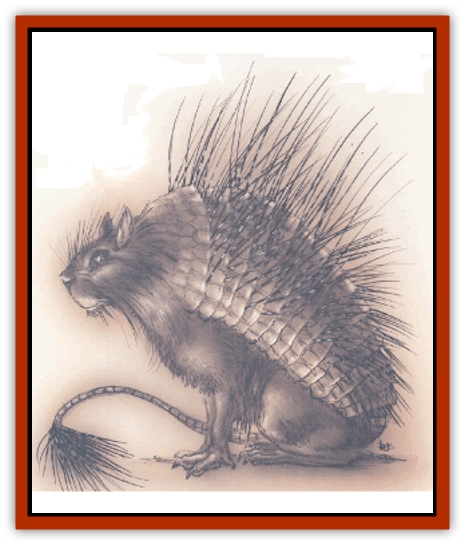

# Quill

| Statistic | **Quill** |
| --- | --- |
| **Activity Cycle:** | Night |
| **Alignment:** | Neutral |
| **Armor Class:** | 5 |
| **Climate/Terrain:** | Any brush or scrub |
| **Damage/Attack:** | 1d3/1d6+1 |
| **Diet:** | Omnivore |
| **Frequency:** | Uncommon |
| **Hit Dice:** | 3 |
| **Intelligence:** | Animal (1) |
| **Magic Resistance:** | None |
| **Morale:** | Unreliable (2-4) |
| **Movement:** | 6 |
| **No. Appearing:** | 1-6 |
| **No. of Attacks:** | 1 bite, 1 tail |
| **Organization:** | Family |
| **Size:** | M (4' long) |
| **Special Attacks:** | Throw quills |
| **Special Defenses:** | Quills |
| **THAC0:** | 17 |
| **Treasure:** | None |
| **XP Value:** | 270 |

Quills are natural animals native to some of the most inhospitable reaches of the Great Wheel. They're common enough in grassland or scrub all over the Outlands, but they're also found in places where it doesn't seem possible for a herbivore to exist. A body can run across a quill in the howling tunnels of Pandemonium, the iron battle-plains of Acheron, the fiery waste of Avernus, or the war-torn Plain of Infinite Portals.

A sharp basher can make a meal of a quill when his rations're running low and there's nothing else to eat. He's just got to be a little careful about catching his dinner.

Quills look like large [[Porcupine|porcupines]], but their spiny hide alternates with bands of tough, thick, leathery skin like an armadillo's. A quill's spines are much larger and more dexterous than a porcupine's - each clump is rooted in a small but powerful muscle that can twitch and agitate the spines with surprising strength and speed. The creature's tail is long and strong, with a dense clump of spines at the end. The quill's been known to kill a human in mail armor with a single blow of its tail.

Quills are voracious foragers and grazers who'll chew their way through anything given enough time. They'll eat [[Razorvine|razorvine]], [[Plant_Dangerous_II|bloodthorn]], or even chew on [[Ironmaw|ironmaw]] roots, let alone less formidable vegetation such as grass or brush. Quills aren't real tasty, but they're better than nothing, and most fiends'll try to kill and eat one if they're hungry. 'Course, minor fiends like [[Baatezu_Least_Spinagon|spinagons]] or [[Imp|imps]] are better off looking for an easier meal.

**Combat:** Quills don't normally initiate combat. When they encounter anything that looks human or demihuman, they're inclined to keep a moderate distance and go about their business. If some addle-cove persists in trying to get too close, the quill's first lines of defense are its throwing spines. Each round, the quill can fire 1 to 4 spines at any target within 20 feet, with a THACO of 20 (they're not terribly accurate with fired spines.) The spines each inflict 1 to 3 points of damage per hit, and stick in the victim. (See below.)

If that doesn't deter an aggressor, the quill defends itself with its bite and its tail lash. The bite's not much to worry about, but the tail's capable of killing a full-grown human. A blow from the tail inflicts 1d6+1 points of damage, and leaves 0 to 3 (1d4- 1) spines stuck in the victim. The quill can't fire spines and make its melee attacks in the same round.

Attacking the quill bare-handed or with natural weaponry's a bad idea. Each time the attacker scores a hit, the quill counterattacks with 1d4+1 spines, which each inflict 1 to 3 points of damage per hit. Even striking the creature with a hand-held melee weapon creates a counterattack of 0 to 3 spines (1d4-1). These incidental attacks strike with a THAC0 of 20, and any spines that hit stick in their target. The quill can be safely attacked with missiles or thrown weapons.

Fighting a quill's likely to mean that the attacker has a few spines stuck in him by the end of the combat. Quill spines are wickedly barbed. Removing a spine causes 1 goint of damage unless the character pulling the spine out passes an unmodified healing proficiency check or a Dexterity check at a -4 penalty. Leaving the spine in the wound prevents the wound from healing and activates a cumulative 10% chance per day that the wound festers. Festering wounds cause 1 point of damage per day per wound unless the victim survives a saving throw versus poison, and they continue to do so until the victim succeeds with three consecutive saves or is treated with *cure disease*.

**Habitat/Society:** Quills usually gather in small family groups comprising a mated pair and several offspring of various ages. (Very young quills have just 1 Hit Die, and their spines are too soft to do any real damage, although they still hurt.) Quills aren't particularly aggressive or territorial, and quickly withdraw from a confrontation with a predator.

Quill spines can be modified for use as blowgun darts or other light weapons. With a successful check of the armorer proficiency, a basher could fix spines to his armor anywhere he's wearing a level plate, such as his shoulders, knees, or elbows. The DM can decide how effective a deterrent this might be - generally, the spines look dangerous but offer no measurable combat effect.

**Ecology:** Quills're very useful because they take otherwise indigestible plant life and turn it into marginally digestible meat. Quill meat may not taste good, but it'll sustain life, and in some quarters of the Lower Planes, it's actually considered a delicacy. Quills are naturally reclusive and usually forage only by night, so they can be harder to find than a cutter'd think.

Quills typically nest in labyrinthine earth burrows not much bigger than 1½ to 2½ feet in diameter. If they're anywhere near their burrow when danger threatens, they're likely to go to ground and wait it out. Even a determined fiend'll think twice about trying to pull a quill out of its burrow.

---
## Discovery & Documentation

**Source Publication:** Planescape II (1996)
**Campaign Setting:** Planescape
**Author(s):** Rich Baker, Karen S. Boomgarden

### Other Creatures Found in This Source Book
   * [[Aasimar|Aasimar]]
   * [[Abrian|Abrian]]
   * [[Arcane|Arcane]]
   * [[Balaena|Balaena]]
   * [[Beholder-kin_Observer|Beholder-kin, Observer]]
   * [[Bloodthorn|Bloodthorn]]
   * [[Bonespear|Bonespear]]
   * [[Darkweaver|Darkweaver]]
   * [[Demarax|Demarax]]
   * [[Dhour|Dhour]]
   * [[Eater_of_Knowledge|Eater of Knowledge]]
   * [[Eladrin_Greater_Firre|Eladrin, Greater, Firre]]
   * [[Eladrin_Greater_Ghaele|Eladrin, Greater, Ghaele]]
   * [[Eladrin_Greater_Tulani|Eladrin, Greater, Tulani]]
   * [[Eladrin_Lesser_Bralani|Eladrin, Lesser, Bralani]]
   * [[Eladrin_Lesser_Coure|Eladrin, Lesser, Coure]]
   * [[Eladrin_Lesser_Noviere|Eladrin, Lesser, Noviere]]
   * [[Eladrin_Lesser_Shiere|Eladrin, Lesser, Shiere]]
   * [[Fhorge|Fhorge]]
   * [[Ghostlight|Ghostlight]]
   * [[Guardinal_Avoral|Guardinal, Avoral]]
   * [[Guardinal_Cervidal|Guardinal, Cervidal]]
   * [[Guardinal_General_Information|Guardinal, General Information]]
   * [[Guardinal_Equinal|Guardinal, Equinal]]
   * [[Guardinal_Leonal|Guardinal, Leonal]]
   * [[Guardinal_Lupinal|Guardinal, Lupinal]]
   * [[Guardinal_Ursinal|Guardinal, Ursinal]]
   * [[Hollyphant|Hollyphant]]
   * [[Incantifer|Incantifer]]
   * [[Ironmaw|Ironmaw]]
   * [[Keeper|Keeper]]
   * [[Khaasta|Khaasta]]
   * [[Leomarh|Leomarh]]
   * [[Monster_of_Legend|Monster of Legend]]
   * [[Mortai|Mortai]]
   * [[Noctral|Noctral]]
   * [[Razorvine|Razorvine]]
   * [[Reave|Reave]]
   * [[Retriever|Retriever]]
   * [[Rilmani_Abiorach|Rilmani, Abiorach]]
   * [[Rilmani_General_Information|Rilmani, General Information]]
   * [[Rilmani_Argenach|Rilmani, Argenach]]
   * [[Rilmani_Aurumach|Rilmani, Aurumach]]
   * [[Rilmani_Cuprilach|Rilmani, Cuprilach]]
   * [[Rilmani_Ferrumach|Rilmani, Ferrumach]]
   * [[Rilmani_Plumach|Rilmani, Plumach]]
   * [[Shadowdrake|Shadowdrake]]
   * [[Spellhaunt|Spellhaunt]]
   * [[Spider_Hook|Spider, Hook]]
   * [[Sunfly|Sunfly]]
   * [[Sword_Spirit|Sword Spirit]]
   * [[Tanar'ri_Lesser_Bulezau|Tanar'ri, Lesser, Bulezau]]
   * [[Tanar'ri_Lesser_Maurezhi|Tanar'ri, Lesser, Maurezhi]]
   * [[Tanar'ri_Lesser_Yochlol|Tanar'ri, Lesser, Yochlol]]
   * [[Tanar'ri_General_Information|Tanar'ri, General Information]]
   * [[Tanar'ri_True_Alkilith|Tanar'ri, True, Alkilith]]
   * [[Terlen|Terlen]]
   * [[Tso|Tso]]
   * [[T'uen-rin|T'uen-rin]]
   * [[Vaporighu|Vaporighu]]
   * [[Vorr|Vorr]]
   * [[Wastrel|Wastrel]]
   * [[Wraithworm|Wraithworm]]
   * [[Yugoloth_Lesser_Canoloth|Yugoloth, Lesser, Canoloth]]
   * [[Zoveri|Zoveri]]
