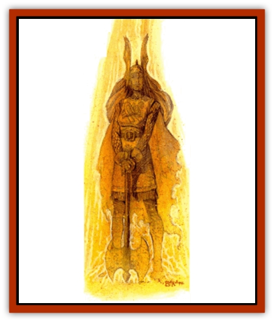

# Raaig

| Statistic | **Raaig** |
| --- | --- |
| **Activity Cycle:** | Any |
| **Alignment:** | Any |
| **Armor Class:** | As in life, or 0 (see below) |
| **Climate/Terrain:** | Any |
| **Damage/Attack:** | By weapon type, or 1d8 |
| **Diet:** | None |
| **Frequency:** | Very rare |
| **Hit Dice:** | As in life, minimum 8 HD |
| **Intelligence:** | Highly (13-14) |
| **Magic Resistance:** | 50% |
| **Morale:** | Fanatic (17.18) |
| **Movement:** | 9, F1 18 (B) |
| **No. Appearing:** | 1-4 (1d4) |
| **No. of Attacks:** | As in life, or 1 |
| **Organization:** | Solitary |
| **Size:** | M (6' tall) |
| **Special Attacks:** | Cause disease (see below) |
| **Special Defenses:** | +1 or better magical weapon to hit (see below) |
| **THAC0:** | As in life, minimum 13 |
| **Treasure:** | E,V |
| **XP Value:** | 3,000 + 1,000 per HD over 8 |

Raaigs are incorporeal [[Undead_Athas_General_Information|undead]] who serve as guardians of temples dedicated to ancient, long-forgotten gods. All raaigs are thousands of years old and the shrines they guard include stone buildings, underground complexes, wooded groves, and deserted grottos.

Raaigs appear much as they did in life, except they are incorporeal. They usually dress in the raiment of a warrior or priest. All raaigs are of the old races (human, elf, dwarf, giant, and halfling). Raaigs can turn invisible at will and seldom make their presence known except to those they are trying to warn away.

Raaigs can communicate with all intelligent creatures. This innate power may be treated as a *tongues* spell.

**Combat:** Raaigs warn trespassers at least once before taking action against them. If the trespassers disobey them, the raaigs attack by surprise. Raaigs become materialized during the attacks and use either the weapon they wielded in life or their touch. Their touch inflicts l-8 (1d8) points of damage, causing open sores to appear immediately on those they touch and infecting them as a *cause disease* spell.

Raaigs can be harmed only on the Ethereal Plane or when they are corporeal. They can be injured only by +l or better magical weapons, spells, or by 6 HD or greater beings. They are immune to *sleep*, *charm*, and *hold* spells and all poisons and paralyzation attacks. Holy water has no effect on them, but a *raise dead* spell destroys them if they fail a save vs. spell.

Even when raaigs become corporeal, they can remain invisible, imposing a -6 penalty on the surprise rolls of those they attack. Those who cannot see or detect the raaigs have a -2 penalty to their attack rolls.

**Habitat/Society:** Raaigs are unaffected by daylight and appear whenever they must. Raaigs are seldom seen, but appear to those who are unworthy of entering their temples to refuse them entry. They allow those who hold similar beliefs to their own (those of the same alignment) to enter their temples as long as they do not steal from them. Occasionally they even speak with those who have somehow proven themselves worthy, but they speak in their own long-dead language that requires magic to translate.

**Ecology:** Raaigs reside on the Ethereal Plane near the shrines they guard. They rarely leave their temples, because for each day they are more than 500 feet away from them, they lose 1 HD until they either return or fade away totally. If they return to their temples, they regain 1 Hit Die per day.

---
## Discovery & Documentation

**Source Publication:** Dark Sun Appendix II - Terrors Beyond Tyr (1991)
**Campaign Setting:** Dark Sun
**Author(s):** Jim Atkiss, Steve Brown, Timothy B. Brown, Andrew P. Morris, Bruce Nesmith, Wes Nicholson, Bill Slavicsek

### Other Creatures Found in This Source Book
   * [[Aarakocra_Athas|Aarakocra (Athas)]]
   * [[Animal_Domestic_Athas_II|Animal, Domestic (Athas) II]]
   * [[Aviarag|Aviarag]]
   * [[Baazrag|Baazrag]]
   * [[Baazrag_Boneclaw|Baazrag, Boneclaw]]
   * [[Bloodgrass|Bloodgrass]]
   * [[Cactus_Hunting|Cactus, Hunting]]
   * [[Cactus_Rock|Cactus, Rock]]
   * [[Cilops|Cilops]]
   * [[Crodlu|Crodlu]]
   * [[Dagorran|Dagorran]]
   * [[Dhaot|Dhaot]]
   * [[Drake_Lesser_Athas_General_Information|Drake, Lesser (Athas), General Information]]
   * [[Drake_Lesser_Athas_Magma|Drake, Lesser (Athas), Magma]]
   * [[Drake_Lesser_Athas_Rain|Drake, Lesser (Athas), Rain]]
   * [[Drake_Lesser_Athas_Silt|Drake, Lesser (Athas), Silt]]
   * [[Drake_Lesser_Athas_Sun|Drake, Lesser (Athas), Sun]]
   * [[Dray|Dray]]
   * [[Drik|Drik]]
   * [[Dune_Reaper|Dune Reaper]]
   * [[Dwarf_Athas|Dwarf (Athas)]]
   * [[Elemental_Beast_Athas_Air|Elemental Beast (Athas), Air]]
   * [[Elemental_Beast_Athas_Earth|Elemental Beast (Athas), Earth]]
   * [[Elemental_Beast_Athas_Fire|Elemental Beast (Athas), Fire]]
   * [[Elemental_Beast_Athas_Water|Elemental Beast (Athas), Water]]
   * [[Elf_Athas|Elf (Athas)]]
   * [[Fael|Fael]]
   * [[Feylaar|Feylaar]]
   * [[Fordorran|Fordorran]]
   * [[Giant_Half-giant|Giant, Half-giant]]
   * [[Giant_Shadow|Giant, Shadow]]
   * [[Golem_Athas_Magma|Golem (Athas), Magma]]
   * [[Golem_Athas_Salt|Golem (Athas), Salt]]
   * [[Golem_Athas_General_Information|Golem (Athas), General Information]]
   * [[Gorak|Gorak]]
   * [[Halfling_Athas|Halfling (Athas)]]
   * [[Human_Athas|Human (Athas)]]
   * [[Jhakar|Jhakar]]
   * [[Kaisharga|Kaisharga]]
   * [[Kes'trekel|Kes'trekel]]
   * [[Klar|Klar]]
   * [[Krag|Krag]]
   * [[Kragling|Kragling]]
   * [[Lirr|Lirr]]
   * [[Mastyrial|Mastyrial]]
   * [[Meorty|Meorty]]
   * [[Mul|Mul]]
   * [[Nikaal|Nikaal]]
   * [[Paraelemental_Beast_General_Information|Paraelemental Beast, General Information]]
   * [[Paraelemental_Beast_Magma|Paraelemental Beast, Magma]]
   * [[Paraelemental_Beast_Rain|Paraelemental Beast, Rain]]
   * [[Paraelemental_Beast_Silt|Paraelemental Beast, Silt]]
   * [[Paraelemental_Beast_Sun|Paraelemental Beast, Sun]]
   * [[Pakubrazi|Pakubrazi]]
   * [[Psionocus|Psionocus]]
   * [[Psurlon|Psurlon]]
   * [[Retriever_Obsidian|Retriever, Obsidian]]
   * [[Ruktoi|Ruktoi]]
   * [[Ruvoka_Athas|Ruvoka (Athas)]]
   * [[Sand_Howler|Sand Howler]]
   * [[Scorpion_Athas|Scorpion (Athas)]]
   * [[Seed_Brain|Seed, Brain]]
   * [[Silt_Horror_Black|Silt Horror, Black]]
   * [[Silt_Horror_Magma|Silt Horror, Magma]]
   * [[Silt_Horror_Red|Silt Horror, Red]]
   * [[Silt_Spawn|Silt Spawn]]
   * [[Slig|Slig]]
   * [[Spider_Athas|Spider (Athas)]]
   * [[Spinewyrm|Spinewyrm]]
   * [[Ssurran|Ssurran]]
   * [[Stalking_Horror|Stalking Horror]]
   * [[Tarek|Tarek]]
   * [[Tari|Tari]]
   * [[Thri-kreen|Thri-kreen]]
   * [[T'liz|T'liz]]
   * [[Tohr-kreen_II|Tohr-kreen II]]
   * [[Tohr-kreen_III|Tohr-kreen III]]
   * [[Trin|Trin]]
   * [[Tul'k|Tul'k]]
   * [[Undead_Athas_General_Information|Undead (Athas), General Information]]
   * [[Wraith_Athas|Wraith (Athas)]]
   * [[Xerichou|Xerichou]]
   * [[Zombie_Thinking|Zombie, Thinking]]
