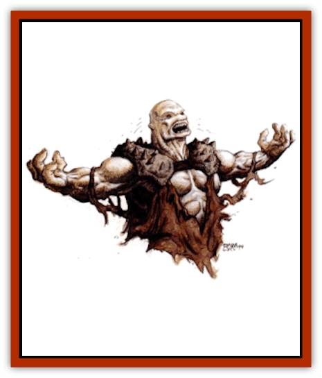
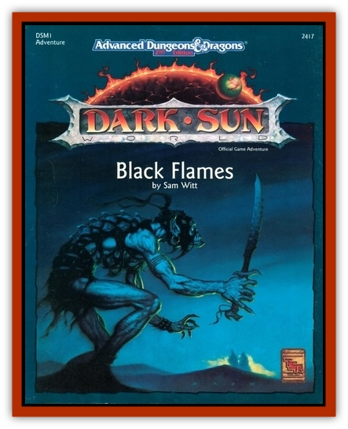

# Racked Spirit

| Statistic | **Racked Spirit** |
| --- | --- |
| **Activity Cycle:** | Night or darkness |
| **Alignment:** | Chaotic evil |
| **Armor Class:** | 6, or as in life (see below) |
| **Climate/Terrain:** | Any |
| **Damage/Attack:** | By weapon type, or 1d6 |
| **Diet:** | None |
| **Frequency:** | Uncommon |
| **Hit Dice:** | As in life, or 4 |
| **Intelligence:** | Average (8-10) |
| **Magic Resistance:** | Nil |
| **Morale:** | Elite (15-16) |
| **Movement:** | 12, Fl 18 (B) |
| **No. Appearing:** | 3-12 (3d4) |
| **No. of Attacks:** | As in life, or 2 |
| **Organization:** | Pack |
| **Size:** | M (5-6' tall) |
| **Special Attacks:** | Energy drain |
| **Special Defenses:** | See below |
| **THAC0:** | As in life, or 17 |
| **Treasure:** | M&times;2,0 |
| **XP Value:** | 2,000 + 500 per HD over 4 |

**Psionics Summary**

| Level | Dis/Sci/Dev | Attack/Defense | Score | PSPs |
| --- | --- | --- | --- | --- |
| 4 | 3/4/13 | EW,II,MT,PB/IF,MB,TS,TW | 14 | 55 |

**Telepathy -** *Sciences:* mind link, psionic blast; *Devotions:* contact, ego whip, empathy, false sensory input, id insinuation, inflict pain, life detection, mind thrust, repugnance, telepathic projection, truthear.

**Psychokinesis -** *Science:* telekinesis; *Devotions:* molecular manipulation, soften.

**Clairsentience -** *Science:* aura sight; *Devotions:* nil.

Racked spirits are the evil remnants of persons who committed acts during their lives that violated the very nature of their being. Racked spirits cannot appease their consciences and the only way to suppress their personal agony is by destroying the lives of happy living beings.

They look just as they did at the time of their death, except they are slightly transparent because part of them is still on the Ethereal Plane. Racked spirits vary in race, but [[Banshee_Dwarf|dwarven banshees]] are the most common. Dwarven banshees are created whenever dwarves forsake their life purpose.

**Combat:** Racked spirits usually attack with their touch that causes 1-6 (1d6) points of damage from its chill. Even creatures immune to cold-based attacks receive the damage. Their touch drains one energy level from their victim. The damage from the chill can heal normally, but the experience points must be earned again, or regained with a *restoration* spell. A being drained of all its life energy becomes a lesser spirit that has only half its former experience level and none of the racked spirit psionic powers. Lesser spirits are under the control of the racked spirits who destroy them. Those who become lesser spirits can only be laid to rest by destroying the racked spirit.

Racked spirits single out happy individuals, attempting to ruin their lives through "bad luck". They appear to those they have ruined to offer their help in exchange for services. The services they require always conflict with the strongest beliefs of the victims. If the victims refuse to do what the spirit requests, the spirit descends on them and drains their life energy. Those who agree and go against their own beliefs become full-strength racked spirits upon their deaths.

Racked spirits can only be harmed by a +1 or better magical weapon, a creature of 5 HD or greater, or by creatures with magical abilities. Racked spirits are immune to *sleep*, *charm*, *hold*, and cold-based spells, and poisons and paralyzation. Holy elements inflicts 2-8 (2d4) points of damage. A *raise dead* spell destroys racked spirits if its save vs. spell is not successful.

**Habitat/Society:** Racked spirits can roam anywhere at will. They do no associate with one another.

**Ecology:** Like most [[Undead_Athas_General_Information|undead]], racked spirits have no ecological impact.

---
## Discovery & Documentation

**Source Publication:** DSM1 Black Flames (1993)
**Campaign Setting:** Dark Sun
**Author(s):** Sam Witt

### Other Creatures Found in This Source Book
   * [[Cursed_Dead_Hungry_Body|Cursed Dead/Hungry Body]]
