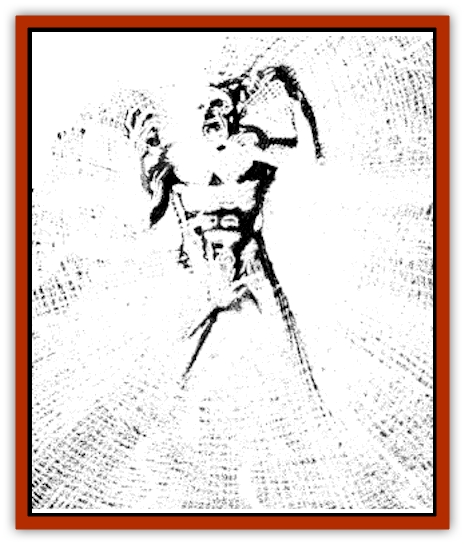

# Radiant Spirit

| Statistic | **Radiant Spirit** |
| --- | --- |
| **Activity Cycle:** | Night |
| **Alignment:** | Lawful evil |
| **Armor Class:** | 8 |
| **Climate/Terrain:** | Ravenloft |
| **Damage/Attack:** | 1-10 |
| **Diet:** | Nil |
| **Frequency:** | Very rare |
| **Hit Dice:** | 10 |
| **Intelligence:** | Genius (17-18) |
| **Magic Resistance:** | Nil |
| **Morale:** | Special |
| **Movement:** | 9 |
| **No. Appearing:** | 1 |
| **No. of Attacks:** | 1 |
| **Organization:** | Solitary |
| **Size:** | M (5-6' tall) |
| **Special Attacks:** | Blinding rays |
| **Special Defenses:** | See below |
| **THAC0:** | 11 |
| **Treasure:** | E,S |
| **XP Value:** | 1,000 |

A radiant spirit is the [[Ghost|ghost]] of a powerful paladin or lawful good cleric killed while pursuing a holy cause. The anguish that fills his heart traps his spirit on the demiplane and taunts him with the failure of his quest.

The spirit is near impossible to see as it appears in a blinding, brilliant flash of white light. The few who have somehow managed to penetrate this aura say that the spirit inside is a figure wracked in constant agony of the deeds he is forced to perform.

Radiant spirits retain the same knowledge of languages that they had when alive. When they speak, however, their voices are remorseful and tortured, full of sorrow and grief.

**Combat:** Radiant spirits are forced to haunt the grounds on which they died. They can operate within a mile of the site, but often remain in a ruin or other fixed location.

Creatures who simply look at the brilliant image of the radiant spirit must make a save vs. spell or be blinded for 1d4 rounds.

The spirit can use this power actively as well. In this case, the ghost concentrates its energies and sends them out in pulses that permanently blind those looking at it. It may use this ability once per round, affecting all creatures within 25 feet who are looking directly at it. A save vs. paralysis will negate the attack, but failure means permanent blindness. An eerie aftereffect of the attack is white scarring on the pupils that looks like laughing human skulls. A character who has been blinded in this way suffers a -2 penalty to his Charisma score when checking NPC reactions. The folk of Ravenloft, especially the [[Human_Vistana|Vistani]], won't normally consort with someone so marked by the horrors of the world.

Radiant spirits can only be harmed by magical weapons of +1 or better. Silver weapons can also hurt them, but do only half damage. They can be turned as ghosts, and holy water splashed on them does 2d4 points of damage.

The only way to release the tortured spirit is to complete the quest it was on at the time of its death. Usually the obstacles encountered during the quest are far worse than the radiant spirit. If this is done, however, the spirit appears as it did in life, thanks the characters, and vanishes into the nether regions.

**Habitat/Society:** Radiant spirits often haunt a ruin or site somehow involved in the completion of the quest they were on at the time of their death. They will generally allow lawful good characters to come and go in these places without interference, but will hinder others (especially those of evil alignment) who trespass there. Characters of any alignment who discover the spirit's corpse and are in some way disrespectful to it are certain to be attacked.

Discovering the spirit's cause is often as difficult as completing it, but the rewards are often threefold. Heroes can release the tortured spirit, gather treasure and experience during the quest, and the quest itself almost always results in the setback of some greater evil. The spirit will do what it can to aid those attempting to complete its quest, but is forbidden to answer direct questions on the subject, even under magical compulsion.

**Ecology:** A priest or paladin who dies while pursuing a just cause may rise as a radiant spirit 2-8 (2d4) months after his death. In order for a radiant spirit to be formed, however, the quest that the character was on must be one of extreme importance. As a rule, the failure of this mission must result in something as terrible as the utter collapse of the character's church.

---
## Discovery & Documentation

**Source Publication:** Ravenloft Appendix III (1991)
**Campaign Setting:** Ravenloft
**Author(s):** Kirk Botulla

### Other Creatures Found in This Source Book
   * [[Akikage|Akikage]]
   * [[Animator_Common|Animator, Common]]
   * [[Animator_Greater|Animator, Greater]]
   * [[Animator_Minor|Animator, Minor]]
   * [[Animator_General_Information|Animator, General Information]]
   * [[Bakhna_Rakhna|Bakhna Rakhna]]
   * [[Baobhan_Sith|Baobhan Sith]]
   * [[Beetle_Scarab|Beetle, Scarab]]
   * [[Boneless|Boneless]]
   * [[Boowray|Boowray]]
   * [[Bruja|Bruja]]
   * [[Carrionette|Carrionette]]
   * [[Carrion_Stalker|Carrion Stalker]]
   * [[Cat_Midnight|Cat, Midnight]]
   * [[Cat_Skeletal|Cat, Skeletal]]
   * [[Cloaker_Resplendent|Cloaker, Resplendent]]
   * [[Cloaker_Shadow|Cloaker, Shadow]]
   * [[Cloaker_Undead|Cloaker, Undead]]
   * [[Corpse_Candle|Corpse Candle]]
   * [[Death's_Head_Tree|Death's Head Tree]]
   * [[Doppelganger_Ravenloft|Doppelganger (Ravenloft)]]
   * [[Familiar_Pseudo-|Familiar, Pseudo-]]
   * [[Familiar_Undead|Familiar, Undead]]
   * [[Feathered_Serpent|Feathered Serpent]]
   * [[Fenhound|Fenhound]]
   * [[Figurine_Ceramic|Figurine, Ceramic]]
   * [[Figurine_Crystal|Figurine, Crystal]]
   * [[Figurine_Ivory|Figurine, Ivory]]
   * [[Figurine_Obsidian|Figurine, Obsidian]]
   * [[Figurine_Porcelain|Figurine, Porcelain]]
   * [[Figurine_General_Information|Figurine, General Information]]
   * [[Fleas_of_Madness|Fleas of Madness]]
   * [[Furies|Furies]]
   * [[Geist|Geist]]
   * [[Ghost_Animal|Ghost, Animal]]
   * [[Golem_Flesh_Ravenloft|Golem, Flesh (Ravenloft)]]
   * [[Golem_Mist_Ravenloft|Golem, Mist (Ravenloft)]]
   * [[Golem_Wax_Ravenloft|Golem, Wax (Ravenloft)]]
   * [[Gremishka|Gremishka]]
   * [[Hag_Spectral|Hag, Spectral]]
   * [[Head_Hunter|Head Hunter]]
   * [[Hearth_Fiend|Hearth Fiend]]
   * [[Hebi-No-Onna|Hebi-No-Onna]]
   * [[Hound_Phantom|Hound, Phantom]]
   * [[Hound_Skeletal|Hound, Skeletal]]
   * [[Imp_Wishing|Imp, Wishing]]
   * [[Ivy_Crawling|Ivy, Crawling]]
   * [[Jack_Frost|Jack Frost]]
   * [[Jolly_Roger|Jolly Roger]]
   * [[Kizoku|Kizoku]]
   * [[Lashweed|Lashweed]]
   * [[Leech_Magical|Leech, Magical]]
   * [[Leech_Psionic|Leech, Psionic]]
   * [[Lich_Defiler|Lich, Defiler]]
   * [[Lich_Drow|Lich, Drow]]
   * [[Lich_Elemental|Lich, Elemental]]
   * [[Lich_Psionic|Lich, Psionic]]
   * [[Living_Tattoo|Living Tattoo]]
   * [[Lycanthrope_Loup-garou|Lycanthrope, Loup-garou]]
   * [[Lycanthrope_Werejackal|Lycanthrope, Werejackal]]
   * [[Lycanthrope_Werejaguar_Ravenloft|Lycanthrope, Werejaguar (Ravenloft)]]
   * [[Lycanthrope_Wereleopard|Lycanthrope, Wereleopard]]
   * [[Lycanthrope_Wereray|Lycanthrope, Wereray]]
   * [[Mist_Ferryman|Mist Ferryman]]
   * [[Moor_Man|Moor Man]]
   * [[Obedient|Obedient]]
   * [[Odem|Odem]]
   * [[Paka|Paka]]
   * [[Plant_Blood_Rose|Plant, Blood Rose]]
   * [[Plant_Fearweed|Plant, Fearweed]]
   * [[Recluse|Recluse]]
   * [[Remnant_Aquatic|Remnant, Aquatic]]
   * [[Rushlight|Rushlight]]
   * [[Sea_Spawn_Master|Sea Spawn, Master]]
   * [[Sea_Spawn_Minion|Sea Spawn, Minion]]
   * [[Shadow_Asp|Shadow Asp]]
   * [[Shattered_Brethren|Shattered Brethren]]
   * [[Skeleton_Archer|Skeleton, Archer]]
   * [[Skeleton_Insectoid|Skeleton, Insectoid]]
   * [[Skin_Thief|Skin Thief]]
   * [[Spirit_Psionic|Spirit, Psionic]]
   * [[Strahd_Skeleton|Strahd Skeleton]]
   * [[Strahd_Zombie|Strahd Zombie]]
   * [[Unicorn_Shadow|Unicorn, Shadow]]
   * [[Vampire_Drow|Vampire, Drow]]
   * [[Vampire_Nosferatu|Vampire, Nosferatu]]
   * [[Vampire_Oriental|Vampire, Oriental]]
   * [[Virus_General_Information|Virus, General Information]]
   * [[Virus_I|Virus I]]
   * [[Virus_II|Virus II]]
   * [[Virus_III|Virus III]]
   * [[Vorlog|Vorlog]]
   * [[Will_O'Dawn|Will O'Dawn]]
   * [[Will_O'Deep|Will O'Deep]]
   * [[Will_O'Mist|Will O'Mist]]
   * [[Will_O'Sea|Will O'Sea]]
   * [[Zombie_Cannibal|Zombie, Cannibal]]
   * [[Zombie_Desert|Zombie, Desert]]
   * [[Zombie_Wolf|Zombie Wolf]]
   * [[Zombie_Fog|Zombie Fog]]
