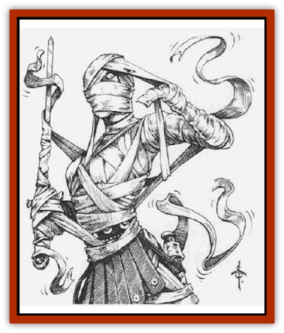

# Raggamoffyn

| Statistic | **Common Raggamoffyn** | **Gutterspite** | **Shrapnyl** | **Tatterdemanimal** |
| --- | --- | --- | --- | --- |
| **Activity Cycle:** | Night | Day | Any | Night |
| **Alignment:** | Chaotic neutral | Neutral | Chaotic evil | Neutral |
| **Armor Class:** | 5 | 0 | -5 | 10 |
| **Climate/Terrain:** | Temperate urban | Temperate urban | Temperate urban | Temperate urban |
| **Damage/Attack:** | 1d6 | 2d8 | 2d12 or 1d6 (&times;5) | 1d2 |
| **Diet:** | Carnivore | Carnivore | Carnivore | Carnivore |
| **Frequency:** | Uncommon | Rare | Very Rare | Uncommon |
| **Hit Dice:** | 3 | 5 | 7 | 1 |
| **Intelligence:** | Average (8-10) | Very (11-12) | High (13-14) | Low (5-7) |
| **Magic Resistance:** | Nil | Nil | Nil | Nil |
| **Morale:** | Steady (11) | Elite (14) | Champion (16) | Unsteady (6) |
| **Movement:** | 12, Fl 8 (E) | 6, Fl 6 (E) | 6, Fl 4 (E) | 18, Fl 12 (E) |
| **No. Appearing:** | 1-4 | 1-3 | 1-2 | 1-6 |
| **No. of Attacks:** | 1 | 1 | 1 or 5 | 1 |
| **Organization:** | Hive/colony | Hive/colony | Hive/colony | Hive/colony |
| **Size:** | M | M | L | S |
| **Special Attacks:** | Suffocation, control host | Blinding, control host | Control host, explode | Control host |
| **Special Defenses:** | Immune to mind-affecting spells | Immune to mind-affecting spells | Immune to mind-affecting spells | Immune to blunt weapons and mind-affecting spells |
| **THAC0:** | 17 | 15 | 13 | 20 |
| **Treasure:** | Nil (Q&times;3) | Nil (Q&times;3) | Nil (Q&times;3) | Nil |
| **XP Value:** | 270 | 1,400 | 3,000 | 120 |

These mysterious creatures are sentient scraps of cloth, leather, and metal of unknown origin. Some say that they are formed from the remnants of magical cloaks, boots, and weapons, when these are worn out and discarded. Others claim that a Rag Mage is creating these animated creatures using a cursed *manual of [[Golem_General_Information|golems]]*.

Raggamoffyns speak no known language, though they understand spoken common well enough.

**Combat:** Raggamoffyns all prefer to fight by possessing a host. They do this by physically wrapping up the victim, wrapping themselves around their target like cloth around a [[Mummy|mummy]]. To enfold a victim, the raggamoffyn must make a successful attack roll against the target's Armor Class counting only Dexterity and magical bonuses, no armor or shield bonuses. If they succeed, a raggamoffyn's cloud of scraps and tatters flows around the target and covers the victim in a skin-tight sheath from head to toe, including covering the eyes and ears. Most raggamoffyns also create a sort of hood or cowl over their host's head, to make it appear as if the host is simply bundled up.

Once they've covered the host, raggamoffyns can force the host body to do their collective bidding. Even when captured, intelligent creatures can throw off the effects by force of will; when entrapped by a raggamoffyn, characters need a successful saving throw vs. spell to resist the raggamoffyn's control. Successful saves usually cause most (but not all; see below) raggamoffyns to fly to another host. If failed, the character is under their control, but can make another saving throw at the start of each turn to break free. (Each Intelligence point above 15 subtracts one round from the time, allowing smarter characters to save more quickly.) The saving throws are made as normal against tatterdemanimals and common raggamoffyns, but are at -2 against gutterspites and -4 against a shrapnyl's control.

When removed from or rejected by their host, raggamoffyns can fly (poorly), like a swarm of scraps caught in a breeze. They can slip through small openings, such as beneath a door or through a portcullis, just by splitting into their component parts.

**Habitat/Society:** Raggamoffyns are currently found in dungeons, but are rumored to be popping up in urban settings as well, where they hide as cloaks and capes and piles of rags (the shrapnyl have only been seen in deep underground). They seem driven to create more of their own kind, but they must use others to do so, forcing their hosts to destroy enchanted clothing and perform a quick, silent rite that somehow creates another raggamoffyn. Whether or not the raggamoffyns serve the mage who may have created them is an open question; some say that their drive to create more of their kind is only a preparation for a silent conquest of avilized communities.

**Ecology:** In bright light, raggamoffyns are sometimes confused with mummies or [[Adherer|adherers]] and slain (along with their unfortunate hosts), but in most cases they can pass as human in poor light. Some say that the raggamoffyns are the nonliving variants of a race of [[Steel_Shadow|steel shadows]] that they serve, metal-animating creatures that dwell underground. Others suggest that the Rag Mage is an illusionist who dabbles in transmutation magics, creating the illusion of life in unliving cloth.

Raggamoffyns almost never harm their hosts directly. However, they do force their hosts to kill, to steal, or cause mischief (like the destruction of valuable magical items). Unfortunately, the hosts are always left to face the consequences (having been freed by the raggamoffyn) when things go wrong. Because their actions are planned and directed to a definite goal, some sages believe that raggamoffyns serve the ends of their creators.

Oddly, raggamoffyns (other than gutterspites) do not capture and control [[Gnome|gnomes]] or [[Dwarf_Duergar|duergar]]; their very natures could make them immune, or it could be a simple whim of the creator, but these creatures never attack these small races.

**Tatterdemanimals**

  This lesser form of raggamoffyn is the least dangerous, made of small, dirty, and tattered scraps of cloth and able to wrap itself around creatures of size T or S. A tatterdemanimal cannot control a host with more than 3 Hit Dice or a 4 Intelligence; its usual victims are [[Rat|rats]], [[Dog|dogs]], [[Cat_Small|cats]], birds, and pigs.

Tatterdemanimals often gather in small groups and control a group of similar animals, such as a pack of dogs or a flock of pigeons. Oddly, they can fly, although they cannot control the host accurately enough to imitate a bird's flapping wings.

Tatterdemanimals suffer double damage from fire, but are immune to damage from blunt weapons.

**Gutterspite**

  The gutterspite is a rare form of raggamoffyn, barely large enough to control creatures of up to dwarf-size (size S), but not quite large enough to engulf [[Elf|elves]] or humans. The host size is less important to gutterspites, as they almost always choose to stay with the host they bond with at birth. The gutterspites are the only form of raggamoffyn to cooperate with their hosts, rather than simply dominating them (though they can if the host doesn't cooperate with them). Some even daim that the Rag Mage himself is simply the powerful leader of the gutterspite race.

Compared to other raggamoffyns and their whirling scraps of wind and fury, the gutterspites are awkward, shambling masses, made of ropes, string, leather straps, and strips of unraveling cloth holding together a small mass of gems, glass, and glitter.

They can control creatures of up to 10 Intelligene and as much as 4 levels or Hit Dice. A gutterspite's preferred hosts are small, often [[Halfling|halflings]], [[Dwarf|dwarves]], and gnomes. Gutterspites are the only raggamoffyns that can control gnome and duergar.

Once a day, a gutterspite can create a sparkling burst of light that shines from its glitter and glass, blinding all opponents in a 20-foot radius who fail a saving throw vs. paralyzation. This blindness lasts for 1-4 rounds, giving the gutterspite and its host enough time to flee or attack. Blinded opponents gain no Dexterity bonus to their Armor Class, and the gutterspite gains an additional +2 bonwto attack rolls against blinded foes. Gutterspites are unaffected by *color spray*, *darkness*, *light*, *rainbow*, and *continual light* spells.

**Common Raggamoffyn**

  Usually just called raggamoffyns, these bits of leather cloaks, gloves, and armor are the most common (and most dangerous) raggamoffyn in urban areas. They thrive in rubbish heaps, alleys, and mortuaries, where they often include bits of burial shrouds. Common raggamoffyns can control size S or M creatures of up to 15 Intelligence and as much as 6 levels or Hit Dice.

Common raggamoffyns gather in roving packs on some nights, often controlling the actions of thieves, watchmen, bookkeepers, or other night owls in the city. In rare cases, they asphyxiate hosts who escape their control and might give away their presence to others - the only active attack raggamoffyns use against their own hosts. These strangling attacks are automatic once the raggamoffyn scores a single successful attack against the victim's head (Armor Class 10 without a full face helmet, AC2 with a great helm, Dexterity bonuses and magical rings and bracers apply). After the raggamoffyn plugs up the nose and mouth of the victim and begins to squeeze the throat, the victim must make a Constitution check each round until either the raggamoffyn or the victim is slain. (Spell attacks affect both, but can serve to move the rags born the host.) The first check is normal, but thereafter each additional check adds another -2 penalty. If the check fails, the victim dies of suffocation.

**Shrapnyl**

  These powerful creature are made of dozens or even hundreds of shards of metal of all varieties and colors, including bits of iron, brass, tin, and copper. The shrapnyl consist of good-sized bits of metal: entire horseshoes, swords, shields, lanterns, pans, knives, and tableware. They can control hosts up to size L with an 18 Intelligence and up to 9 HD or levels. Their prefered victims are [[Ogre|ogres]], mages, or (best of all) [[Ogre|ogre mages]]. When they seek to disguise themselves, shrapnyl raggamoffyns arrange their metal shards to resemble splint mail armor.

One of the benefits of this parasite is that the shrapnyl actually acts as armor, taking damage that might normally affect its host (spell effects affect both, except as listed below). If they are exposed to acids, those particular pieces of metal flip over and expose the host to the acid damage as well, dividing the damage of the acid between them (host and shrapnyl each take half damage).

Once per day, a shrapnyl can explode into a cloud of steel, inflicting 4d10 points of damage on any creature within 10 feet, half upon those that make a successful saving throw vs. breath weapon. The shrapnyl's host is unaffected by the explosion, but thereafter the shrapnyl can no longer control its host. The monster must rest and retreat before finding a new host, so it uses the exploding cloud of steel only in extreme situations.

Older shrapnyl sometimes include large chunks of gold, silver, or platinum among their scraps, and use them to lure potential hosts near. They may lie still for hours at a time, then suddenly rise up out of a chest or a pile of coins and surround a host. When in its loose metal form, without a host, a shrapnyl can attack five times a round.

Shrapnyl are vulnerable to *crystalbrittle*, *shatter*, and *heat metal* spells. *Shatter* causes 3d6 points of damage to a shrapnyl, *crystalbrittle* affects it without the benefit of a saving throw, and *heat metal* causes full normal damage to a shrapnyl.

---
## Discovery & Documentation

**Source Publication:** City of Splendors (1994)
**Campaign Setting:** Forgotten Realms
**Author(s):** Ed Greenwood, Elain Cunningham

### Other Creatures Found in This Source Book
   * [[Curst|Curst]]
   * [[Doppelganger_Greater|Doppelganger, Greater]]
   * [[Duhlarkin|Duhlarkin]]
   * [[Gulguthhydra|Gulguthhydra]]
   * [[Hakeashar|Hakeashar]]
   * [[Leucrotta_Greater|Leucrotta, Greater]]
   * [[Lycanthrope_Wereshark|Lycanthrope, Wereshark]]
   * [[Nyth|Nyth]]
   * [[Ooze_Slime_Jelly_Ghaunadan|Ooze/Slime/Jelly, Ghaunadan]]
   * [[Palimpsest|Palimpsest]]
   * [[Peltast|Peltast]]
   * [[Shadowrath|Shadowrath]]
   * [[Snake_Sewerm|Snake, Sewerm]]
   * [[Watchspider|Watchspider]]
