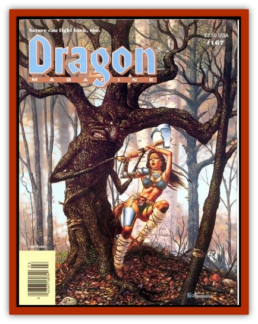

# Rainbow Plant - Giant

| Statistic | **Rainbow Plant, Giant** |
| --- | --- |
| **Activity Cycle:** | Day |
| **Alignment:** | Neutral |
| **Armor Class:** | 7 |
| **Climate/Terrain:** | Temperate and tropical forests and swamps |
| **Damage/Attack:** | See below |
| **Diet:** | Carnivore |
| **Frequency:** | Uncommon |
| **Hit Dice:** | 6 |
| **Intelligence:** | Semi- (2-4) |
| **Magic Resistance:** | Nil |
| **Morale:** | Elite (13) |
| **Movement:** | 0 |
| **No. Appearing:** | 1-4 |
| **No. of Attacks:** | See below |
| **Organization:** | Solitary |
| **Size:** | L |
| **Special Attacks:** | See below |
| **Special Defenses:** | Dazzling |
| **THAC0:** | 15 |
| **Treasure:** | Incidental (10% chance each of J,K,M; 5% chance each of Q and one small magical item) |
| **XP Value:** | 3,000 |

The giant rainbow plant has a woody, trunklike stem from which grow 5-20 branchlike leaves that each end in a knobby tip. The stem grows up to 10' in height, with each leaf half the height of the plant in length.

**Combat:** Like the [[Plant_Intelligent|giant sundew]], this plant has developed an awareness of its surroundings and is selective about its prey. It will not attack anything under 4' in height. The leaves and the stem are coated in a thick mucilage produced by glands throughout the plant. This mucilage gives the plant a shimmering appearance during the day, and under intense light causes a nonmagical dazzling effect on those who view and fail to save vs. petrification. The effect lasts for 1-4 rounds and makes the dazzled creature -2 on attack rolls.

Also like the giant sundew, the rainbow plant strikes with its leaves, with 1-6 branches lashing out at each victim within reach and striking for 1-2 hp damage from the knob at the end of each leaf. Each leaf adheres to the object struck, reducing the victim's ability attack by -1 for every four leaves adhering to him. If the plant rolls a natural 20, the plant's leaf struck the victim's head, clogging the victim's mouth and nostrils with mucilage. Suffocation results in 1-4 rounds unless the sap is dissolved with vinegar or alcohol, The leaves also produce a mild enzyme causing 1 hp damage per round per leaf unless the leaf is broken. The chance for breaking a leaf is the same as for opening doors, checking for each leaf separately. Fiery attacks and missiles do only half damage because of the plant's mucilage covering. Blunt weapons do no damage.

**Habitat/Society:** The plant favors sandy soils under moist conditions, though it may die back during drought seasons, going into a dormant state until conditions improve. A few druids and wizards are said to keep such plants as guardians, but this is a very rare practice.

---
## Discovery & Documentation

**Source Publication:** Dragon167 (1991)
**Campaign Setting:** Dragon Magazine
**Author(s):** David Howery, Gregg Chamberlain, 

### Other Creatures Found in This Source Book
   * [[Animal_Cenozoic|Animal, Cenozoic]]
   * [[Bladderwort_Giant|Bladderwort, Giant]]
   * [[Bloodflower|Bloodflower]]
   * [[Butterwort_Giant|Butterwort, Giant]]
   * [[Clubthorn|Clubthorn]]
   * [[Helborn|Helborn]]
   * [[Sword_Grass|Sword Grass]]
   * [[Waterwheel_Plant_Giant|Waterwheel Plant, Giant]]
