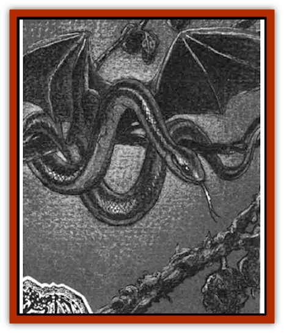

# Rainbow Serpent - The

| Statistic | **Rainbow Serpent, The** |
| --- | --- |
| **Activity Cycle:** | Night |
| **Alignment:** | Lawful evil |
| **Armor Class:** | 1 |
| **Climate/Terrain:** | The Nightmare Lands |
| **Damage/Attack:** | 1d4+1 |
| **Diet:** | Special |
| **Frequency:** | Unique |
| **Hit Dice:** | 10 |
| **Intelligence:** | Exceptional (16) |
| **Magic Resistance:** | 40% |
| **Morale:** | Steady (12) |
| **Movement:** | 9, Fl 6 (C) |
| **No. Appearing:** | 1 |
| **No. of Attacks:** | 1 |
| **Organization:** | Solitary |
| **Size:** | S (4' long) |
| **Special Attacks:** | Poison, suggestion |
| **Special Defenses:** | +1 or better to hit |
| **THAC0:** | 11 |
| **Treasure:** | C |
| **XP Value:** | 10,000 |

The Rainbow Serpent is perhaps the most enigmatic member of the [[Nightmare_Court_The|Nightmare Court]] simply because the creature wears a nonhumanoid form. It is a reclusive entity who sows the seeds of mistrust and suspicion among the dreamscapes it controls.

This [[Serpent_Winged|winged serpent]] is only four feet long, with brilliant red scales interrupted by bands of yellow, black, and deep blue. Its eyes are full of malevolent intelligence, and its mouth seems to be curled in a perpetual smile. If dreamers remember anything about this villain, it is this leering, mocking smile.

The Rainbow Serpent can speak any language it has ever encountered in the dreams of others. It does not actually speak, but instead projects the words and ideas it wishes to communicate directly into the minds of its audience. Within these minds, the listeners are never sure what ideas well up from their own subconscious and what comes from the seditious liar with the rainbow-hued scales.

**Combat:** This Court member rarely involves itself in direct physical confrontation. It prefers to let its [[Dream_Spawn_General_Information|dream spawn]] take on forms that inspire paranoia in any groups of wanderers who venture to close to its lair. While this occurs, the Rainbow Serpent watches from a nearby hiding place and waits for opportunities to whisper suggestions (as per the spell) into the minds of the wanderers.

If a confrontation cannot be avoided, the Rainbow Serpent strikes once with its venom-dripping fangs. The bite inflicts minimal damage (1d4+1 points), but the venom is powerful. The poison automatically renders the victim unconscious for 1d4 hours unless a save vs. poison is made. Those who make the save suffer a -4 penalty to all die rolls for 1d4 hours.

This villain can turn ordinary staves and pole arms into [[Shadow_Asp|shadow asps]] three times per day, using a power that is similar to the *sticks to snakes* spell. Magical staves and pole arms receive a saving throw vs. spell to resist the transformation, but normal items do not. Once transformed, an item is lost forever. Shadow asps are 1-foot-long coils of shadow. Their bite can turn victims into [[Shadow|shadows]].

The Rainbow Serpent's lair is protected by dream spawn, dangerous plants, and a variety of nightmare versions of common reptiles that all serve the master deceiver. The Serpent can summon these creatures with a quiet hiss that causes them to respond in 1d4 rounds. If it stops to issue the summons, it can do nothing else in that round.

**Habitat/Society:** The Rainbow Serpent inhabits the Park Primeval in the center of the City of Nod. It slithers through the lush jungle maze cavorting with its reptile servants or nests in the branches of the Tree of Suspicion, turning its gaze toward the dreamscapes it controls.

**Ecology:** Like the other members of the Nightmare Court, the Rainbow Serpent draws energy from the dreams of others. In the Serpent's case, the most hearty dreams are those which involve insecurity and paranoia, where mistrust is rampant and any loved one could be a betrayer.

---
## Discovery & Documentation

**Source Publication:** The Nightmare Lands (1995)
**Campaign Setting:** Ravenloft
**Author(s):** Shane Lacy Hensley

### Other Creatures Found in This Source Book
   * [[Arcane_Head|Arcane Head]]
   * [[Dreamweaver|Dreamweaver]]
   * [[Dream_Spawn_General_Information|Dream Spawn, General Information]]
   * [[Dream_Spawn_Greater_Ennui|Dream Spawn, Greater, Ennui]]
   * [[Dream_Spawn_Lesser_Morph|Dream Spawn, Lesser, Morph]]
   * [[Ghost_Dancer_The|Ghost Dancer, The]]
   * [[Human_Abber_Shaman|Human, Abber Shaman]]
   * [[Hypnos|Hypnos]]
   * [[Lost_Souls|Lost Souls]]
   * [[Morpheus|Morpheus]]
   * [[Mullonga|Mullonga]]
   * [[Nightmare_Court_The|Nightmare Court, The]]
   * [[Nightmare_Man_The|Nightmare Man, The]]
   * [[Night_Terror_Mandalain|Night Terror, Mandalain]]
