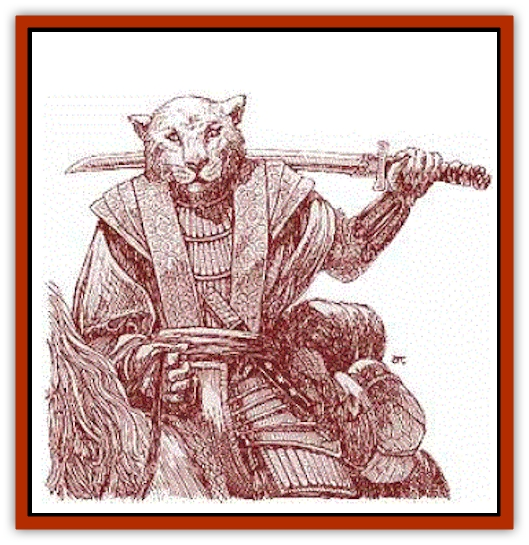

# Rakasta

| Statistic | **Rakasta** |
| --- | --- |
| **Activity Cycle:** | Any |
| **Alignment:** | Neutral |
| **Armor Class:** | 6 |
| **Climate/Terrain:** | Temperate to tropical plains and deserts |
| **Damage/Attack:** | 1d2 (claw)/1d2 (claw)/1d4 (bite) or 1d4 (kasa)/1d4 (kasa)/1d4 (bite) |
| **Diet:** | Omnivore |
| **Frequency:** | Rare |
| **Hit Dice:** | 2+1 |
| **Intelligence:** | Very (11-12) |
| **Magic Resistance:** | Nil |
| **Morale:** | Elite (14) |
| **Movement:** | 9 |
| **No. Appearing:** | 3d10 |
| **No. of Attacks:** | 3 |
| **Organization:** | Pride |
| **Size:** | M (5-7' tall) |
| **Special Attacks:** | Rear claws for 1d3 damage each |
| **Special Defenses:** | Nil |
| **THAC0:** | 19 |
| **Treasure:** | M |
| **XP Value:** | 65 / Hatra: 120 |

Rakasta are a race of intelligent, nomadic, catlike humanoids. They are a proud, barbaric race of warriors who, while not prone to initiating hostilities, quickly respond when provoked.

Rakasta walk upright, much like humans, with an agile, feline grace. They have feline heads and are covered with soft, tawny fur. Most fur coloration ranges from light tan to dark brown.

Rakasta have catlike eyes, most of which are brilliant green. A rakasta has a nonprehensile tail 4 to 6 feet long.

Rakasta speak Common and their own language. Some of the more primitive rakasta speak in a purring voice with many rolled r's and hissed s's.

**Combat:** Rakasta are fierce fighters who neither ask for nor give any quarter. Eschewing normal weapons, rakasta rely on their claws and bites. Since a rakasta's claws inflict only 1d2 points of damage, the creatures usually employ special metal war claws called *kasas*; worn on the paw like a glove, a kasa inflicts 1d4 points of damage on a successful attack.

A rakasta who strikes with both claws (or both kasas) in the same round can choose to rake with both rear claws. Rear claw attacks are rolled separately and cause 1d3 points of damage on a successful strike.

Certain rakasta ride [[Cat_Great|saber-toothed tigers]] into battle. These tiger riders, known as the *hatra*, are considered the bravest and strongest of the rakasta warriors, and only they can hold the respect of the saber-toothed tigers. Hatra have 3+1 Hit Dice, a minimum of 15 hit points, and +1 bonus to damage rolls.

The hatra use special saddles that enable them to leap as far as 20 feet from their mounts and still attack in the same round. The saddles allow the hatra to fight unhindered while mounted, using both hands for attacks yet still maintaining control of their sabertoothed mounts.

**Habitat/Society:** The nomadic rakasta are organized into prides of 6d10 adult rakasta plus an additional 25% of that number in noncombatant offspring. Each pride also has 1d12 saber-toothed tigers. When not on the move, each rakasta pride sets up its own temporary settlements, composed of many colorful tens and pavilions.

Rakasta possess excellent artisan skills. They typically own many bright rugs and silk tapestries of fine workmanship; artfully crafted bowls and drinking cups, and other items of value. Ihese items are found in place of gems and jewelry in the treasure of a pride of rakasta.

Each pride is led by a chief with at least 5+1 Hit Dice, a minimum of 24 hit points, and a +3 bonus to all damage rolls. The chief is always accompanied by six of the best hatra and their saber-toothed mounts. The chief's word is law, and is obeyed without question.

Each pride has a rakasta cleric of 4 Hit Dice who casts spells as a 4th-level priest. More powerful clerics are rumored to exist, as well as rakasta with wizard abilities, perhaps as high as 7th level.

The hatra, as the finest warriors in a pride, enjoy a special place in rakasta society. Hatra are held in high honor, since this culture values combat prowess over all else. Rakasta also value their code of conduct, known as the *Sri'raka*. This code dictates a warrior's behavior. Among the most noteworthy tenets:

<ul><li>No challenge to fight is ever refused.</li><li>Wounded are never left behind; carry them or kill them.</li><li>Better to die in battle than in one's sleep.</li><li>Give no mercy; never expect it.</li><li>Retreat is permissible only in order to regroup. A new attack must be launched against the other force within two sunrises.</li><li>Never surrender. Those who would exist as prisoners are not rakasta.</li></ul>**Ecology:** The rakasta make reliable trading partners when attention can be turned from battles. Rakasta are excellent hunters, and they keep the game herds from overpopulating.

---
## Discovery & Documentation

**Source Publication:** Mystara Appendix (1994)
**Campaign Setting:** Mystara
**Author(s):** John Nephew, Teeuwynn Woodruff, John Terra, Skip Williams

### Other Creatures Found in This Source Book
   * [[Actaeon|Actaeon]]
   * [[Agarat|Agarat]]
   * [[Ash_Crawler|Ash Crawler]]
   * [[Baldandar|Baldandar]]
   * [[Bargda|Bargda]]
   * [[Bhut|Bhut]]
   * [[Bird_Mystara|Bird (Mystara)]]
   * [[Blackball|Blackball]]
   * [[Choker|Choker]]
   * [[Coltpixie|Coltpixie]]
   * [[Crone_of_Chaos|Crone of Chaos]]
   * [[Darkhood|Darkhood]]
   * [[Darkwing|Darkwing]]
   * [[Decapus|Decapus]]
   * [[Deep_Glaurant|Deep Glaurant]]
   * [[Diabolus|Diabolus]]
   * [[Dimensional_Warper|Dimensional Warper]]
   * [[Dragon_Mystara_Crystalline|Dragon (Mystara), Crystalline]]
   * [[Dragon_Mystara_Jade|Dragon (Mystara), Jade]]
   * [[Dragon_Mystara_Onyx|Dragon (Mystara), Onyx]]
   * [[Dragon_Mystara_Ruby|Dragon (Mystara), Ruby]]
   * [[Drake_Mystara|Drake (Mystara)]]
   * [[Dragonfly|Dragonfly]]
   * [[Dusanu|Dusanu]]
   * [[Elemental_of_Chaos_Air_Earth|Elemental of Chaos, Air/Earth]]
   * [[Elemental_of_Chaos_Fire_Water|Elemental of Chaos, Fire/Water]]
   * [[Elemental_of_Law_Air_Earth|Elemental of Law, Air/Earth]]
   * [[Elemental_of_Law_Fire_Water|Elemental of Law, Fire/Water]]
   * [[Familiar_Mystara|Familiar (Mystara)]]
   * [[Frost_Salamander|Frost Salamander]]
   * [[Fundamental_Air_Earth|Fundamental, Air/Earth]]
   * [[Fundamental_Fire_Water|Fundamental, Fire/Water]]
   * [[Gargantua_Mystara|Gargantua (Mystara)]]
   * [[Geonid|Geonid]]
   * [[Ghostly_Horde|Ghostly Horde]]
   * [[Giant_Athach|Giant, Athach]]
   * [[Giant_Hephaeston|Giant, Hephaeston]]
   * [[Golem_Drolem|Golem, Drolem]]
   * [[Golem_Mystara_I|Golem (Mystara) I]]
   * [[Golem_Mystara_II|Golem (Mystara) II]]
   * [[Golem_Mystara_III|Golem (Mystara) III]]
   * [[Gray_Philosopher|Gray Philosopher]]
   * [[Guardian_Warrior|Guardian Warrior]]
   * [[Gyerian|Gyerian]]
   * [[Herex|Herex]]
   * [[Hivebrood|Hivebrood]]
   * [[Horde|Horde]]
   * [[Hsiao|Hsiao]]
   * [[Huptzeen|Huptzeen]]
   * [[Hutaakan|Hutaakan]]
   * [[Imp_Mystara|Imp (Mystara)]]
   * [[Jellyfish_Giant_Mystara|Jellyfish, Giant (Mystara)]]
   * [[Kna|Kna]]
   * [[Kopru|Kopru]]
   * [[Lizard_Mystara|Lizard (Mystara)]]
   * [[Lizard-kin_Mystara|Lizard-kin (Mystara)]]
   * [[Lupin|Lupin]]
   * [[Lycanthrope_Werejaguar_Mystara|Lycanthrope, Werejaguar (Mystara)]]
   * [[Lycanthrope_Wereswine|Lycanthrope, Wereswine]]
   * [[Magen|Magen]]
   * [[Manikin|Manikin]]
   * [[Mek|Mek]]
   * [[Mujina|Mujina]]
   * [[Nagpa|Nagpa]]
   * [[Neh-thalggu|Neh-thalggu]]
   * [[Nightshade_Mystara|Nightshade (Mystara)]]
   * [[Nuckalavee|Nuckalavee]]
   * [[Pegataur|Pegataur]]
   * [[Phanaton|Phanaton]]
   * [[Plant_Dangerous_Mystara|Plant, Dangerous (Mystara)]]
   * [[Plasm|Plasm]]
   * [[Rock_Man|Rock Man]]
   * [[Sabreclaw|Sabreclaw]]
   * [[Sacrol|Sacrol]]
   * [[Scamille|Scamille]]
   * [[Shapeshifter|Shapeshifter]]
   * [[Shargugh|Shargugh]]
   * [[Shark-kin|Shark-kin]]
   * [[Sollux|Sollux]]
   * [[Spectral_Death|Spectral Death]]
   * [[Spectral_Hound|Spectral Hound]]
   * [[Spider-kin|Spider-kin]]
   * [[Spirit_Mystara|Spirit (Mystara)]]
   * [[Statue_Living|Statue, Living]]
   * [[Surtaki|Surtaki]]
   * [[Tabi|Tabi]]
   * [[Thoul|Thoul]]
   * [[Thunderhead|Thunderhead]]
   * [[Tiger_Ebon|Tiger, Ebon]]
   * [[Topi|Topi]]
   * [[Tortle|Tortle]]
   * [[Vampire_Velya|Vampire, Velya]]
   * [[White_Fang|White Fang]]
   * [[Worm_Mystara|Worm (Mystara)]]
   * [[Wyrd|Wyrd]]
   * [[Yowler|Yowler]]
   * [[Zombie_Lightning|Zombie, Lightning]]
