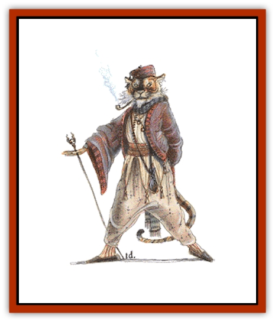

# Rakshasa

| Statistic | **Greater Rakshasa** | **Rakshasa** |
| --- | --- | --- |
| **Activity Cycle:** | Night | Night |
| **Alignment:** | Lawful evil | Lawful evil |
| **Armor Class:** | -5 | -4 |
| **Climate/Terrain:** | Tropical or subtropical forest, jungle, or swamp | Tropical or subtropical forest, jungle, or swamp |
| **Damage/Attack:** | 1-6/1-6/2-10 | 1-3/1-3/2-5 |
| **Diet:** | Carnivore | Carnivore |
| **Frequency:** | Very rare | Rare |
| **Hit Dice:** | 8+16 | 7 |
| **Intelligence:** | High (13-14) | Very (11-12) |
| **Magic Resistance:** | Special | Special |
| **Morale:** | Fanatic (17-18) | Champion (15-16) |
| **Movement:** | 18 | 15 |
| **No. Appearing:** | 1 | 1-4 |
| **No. of Attacks:** | 3 | 3 |
| **Organization:** | Solitary | Solitary |
| **Size:** | M (6½' tall) | M (6' tall) |
| **Special Attacks:** | Illusion | Illusion |
| **Special Defenses:** | +2 or better magical weapon to hit | +1 or better magical weapon to hit |
| **THAC0:** | 11 | 13 |
| **Treasure:** | B,F | F |
| **XP Value:** | Ruhk 7,000 / Rajah 7,000 / Maharajah 11,000 | 3,000 |

Rakshasas are a race of malevolent spirits encased in flesh that hunt and torment humanity. No one knows where these creatures originate; some say they are the embodiment of nightmares.

Rakshasas stand 6 to 7 feet tall and weigh between 250 and 300 pounds. They have no uniform appearance but appear as humanoid creatures with the bodily features of various beasts (most commonly [[Cat_Great|tigers]] and apes). Hands whose palms curve backward, away from the body, seem to be common. Rakshasas of the highest standing sometimes have several heads. All rakshasas wear human clothing of the highest quality.

**Combat:** Rakshasas savor fresh human meat and use illusions to get it. They have a limited form of *ESP* which allows them to disguise themselves as someone the victim trusts; the rakshasa uses this illusion as a lure and strikes when the victim is most unprepared. The rakshasa must drop the illusion when it attacks. Normally rakshasas can have magical abilities, up to the following limits: four 1st level wizard spells, three 2nd level wizard spells, two 3rd level wizard spells, and three 1st level priest spells. These are cast at 7th level ability. Rakshasas are immune to all spells lower than 8th level. An attacker needs at least a +1 magical weapon to harm a rakshasa; any weapon below +3 inflicts only half damage. However, a hit by any blessed crossbow bolt kills a rakshasa instantly.

**Habitat/Society:** Rakshasa society is bound by rigid castes. Each rakshasa is born into a particular role in life and cannot advance. Females (known as rakshasi) are fit to be consorts, honored only by their faithfulness and the fighting ability of their children. There are 1-3 females per male.

Rakshasa society is led by a rajah or maharajah, whose commands are to be obeyed without question.

Rakshasas wage war on humanity constantly, not only to feed themselves but because they believe that battle is the only way to gain honor. If confronted by humans who recognize their true appearance, they are insufferably arrogant.

A rakshasa's life varies in cycles of wild self-indulgence in times of prosperity and strict fasting and sacrifice in times of trouble or before battle. They are honorable creatures but will twist the wording of an agreement to suit their purposes. They prefer to deal with humanity by using their illusion powers to deceive and manipulate them, but are brave and forthright in battle.

**Ecology:** As spirits, rakshasas are virtually immortal. They produce a new generation every century to replace the rakshasas that have been slain in battle. No creatures prey on rakshasas except those who would avenge their victims. Rakshasa essence can be an ingredient in a potion of delusion.

**Rakshasa Ruhks**

  About 15% of all rakshasas are greater rakashasas or ruhks, (knights). These warriors are the guardians of a rakshasa community. They are hit only by magical weapons of +2 or better; any weapon below +4 inflicts only half damage against them. Their spells are cast at 9th level of ability.

**Rakshasa Rajahs**

  About 15% of all rakshasa ruhks are rakshasa rajahs, or lords. Each rajah is the leader (patriarch) of his local clan. These rulers of rakshasadom have the same abilities as a ruhk, but also have the spell casting abilities of both a 6th level priest and an 8th level wizard, cast at 11th level of ability.

**Rakshasa Maharajahs**

  About 5% of all rakshasa rajahs are rakshasa maharajahs, or dukes. Maharajahs have the same abilities as a ruhk, but have 13+39 Hit Dice, and the spell casting abilities of a 13th level wizard and 9th level priest. A maharajah is the leader of either several small, related clans, or a single powerful clan. Maharajahs reside on the outer planes, where they rule island communities of hundreds of rakshasas, and serve as minions to even greater powers.

---
## Discovery & Documentation

**Source Publication:** MC1 Volume I (w/binder #1) (1991)
**Campaign Setting:** Advanced Dungeons & Dragons 2nd Edition
**Author(s):** Jay Batista, Scott Bennie, Grant Boucher, William W. Connors, Steve Gilbert, Heike Kubasch, James Lowder, David Edward Martin, Bruce Nesmith, Jean Rabe, Rick Swan, John J. Terra, Gary L. Thomas

### Other Creatures Found in This Source Book
   * [[Bat|Bat]]
   * [[Bear|Bear]]
   * [[Behir|Behir]]
   * [[Boar|Boar]]
   * [[Bookworm|Bookworm]]
   * [[Brownie|Brownie]]
   * [[Bugbear|Bugbear]]
   * [[Carrion_Crawler|Carrion Crawler]]
   * [[Cat_Great|Cat, Great]]
   * [[Catoblepas|Catoblepas]]
   * [[Dragon_General_Information|Dragon, General Information]]
   * [[Dragonfish|Dragonfish]]
   * [[Elemental_Air_Kin_Aerial_Servant|Elemental, Air Kin, Aerial Servant]]
   * [[Elemental_Earth_Kin_Sandling|Elemental, Earth Kin, Sandling]]
   * [[Elephant|Elephant]]
   * [[Gnoll|Gnoll]]
   * [[Hobgoblin|Hobgoblin]]
   * [[Homunculus|Homunculus]]
   * [[Hornet_Giant|Hornet, Giant]]
   * [[Horse|Horse]]
   * [[Hyena|Hyena]]
   * [[Jackal|Jackal]]
   * [[Jackalwere|Jackalwere]]
   * [[Korred|Korred]]
   * [[Lich|Lich]]
   * [[Lizard|Lizard]]
   * [[Lizard_Man|Lizard Man]]
   * [[Lycanthrope_General_Information|Lycanthrope, General Information]]
   * [[Lycanthrope_Seawolf|Lycanthrope, Seawolf]]
   * [[Lycanthrope_Werebear|Lycanthrope, Werebear]]
   * [[Lycanthrope_Weretiger|Lycanthrope, Weretiger]]
   * [[Lycanthrope_Werewolf|Lycanthrope, Werewolf]]
   * [[Manticore|Manticore]]
   * [[Medusa|Medusa]]
   * [[Mind_Flayer|Mind Flayer]]
   * [[Minotaur|Minotaur]]
   * [[Mudman|Mudman]]
   * [[Mummy|Mummy]]
   * [[Nixie|Nixie]]
   * [[Nymph|Nymph]]
   * [[Ogre|Ogre]]
   * [[Ooze_Slime_Jelly_I|Ooze/Slime/Jelly I]]
   * [[Ooze_Slime_Jelly_II|Ooze/Slime/Jelly II]]
   * [[Orc|Orc]]
   * [[Owl|Owl]]
   * [[Owlbear_I|Owlbear I]]
   * [[Pegasus|Pegasus]]
   * [[Piercer|Piercer]]
   * [[Pudding_Deadly|Pudding, Deadly]]
   * [[Rat|Rat]]
   * [[Ray|Ray]]
   * [[Remorhaz|Remorhaz]]
   * [[Satyr|Satyr]]
   * [[Scorpion|Scorpion]]
   * [[Selkie|Selkie]]
   * [[Shadow|Shadow]]
   * [[Skeleton|Skeleton]]
   * [[Skunk|Skunk]]
   * [[Snake|Snake]]
   * [[Spectre|Spectre]]
   * [[Spider|Spider]]
   * [[Sprite|Sprite]]
   * [[Toad_Giant|Toad, Giant]]
   * [[Treant|Treant]]
   * [[Troll|Troll]]
   * [[Umber_Hulk|Umber Hulk]]
   * [[Unicorn|Unicorn]]
   * [[Vampire|Vampire]]
   * [[Wight|Wight]]
   * [[Will_O'Wisp|Will O'Wisp]]
   * [[Wolf|Wolf]]
   * [[Wolfwere|Wolfwere]]
   * [[Wraith|Wraith]]
   * [[Wyvern|Wyvern]]
   * [[Yeti|Yeti]]
   * [[Yuan-ti|Yuan-ti]]
   * [[Zombie|Zombie]]
