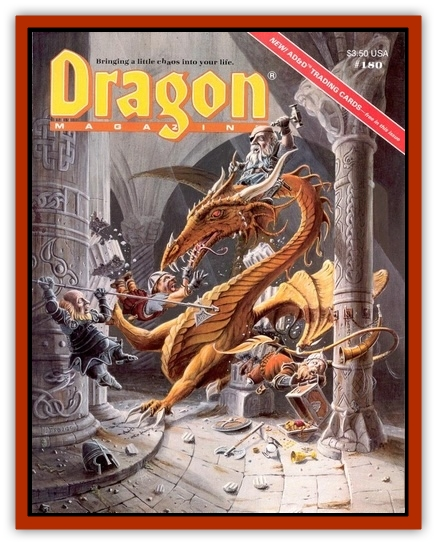

# Ram - Battering

| Statistic | **Ram, Battering** |
| --- | --- |
| **Activity Cycle:** | Day |
| **Alignment:** | Neutral |
| **Armor Class:** | 0 (head), 6 (body) |
| **Climate/Terrain:** | Subarctic to temperate/Hills and mountains |
| **Damage/Attack:** | 2d8 |
| **Diet:** | Herbivore |
| **Frequency:** | Rare |
| **Hit Dice:** | 5 |
| **Intelligence:** | Animal (1) |
| **Magic Resistance:** | Nil |
| **Morale:** | Steady (11); see below |
| **Movement:** | 18 |
| **No. Appearing:** | 1 (30%) or 2d8 (70%) |
| **No. of Attacks:** | 1 butt |
| **Organization:** | Flock |
| **Size:** | L (6' at shoulder) |
| **Special Attacks:** | Charge |
| **Special Defenses:** | Immune to <i>slow</i> and <i>hold</i> spells; +4 save vs. fear |
| **THAC0:** | 15 |
| **Treasure:** | Nil |
| **XP Value:** | 975 |

The term "battering rams" is often applied to an entire flock of these sheep - rams, ewes, and lambs alike. These creatures appear to be giant-sized, mountain-dwelling sheep with obviously enlarged horns. In most respects, they are identical to their smaller cousins, coming in a variety of colors. Ewes of this species possess much smaller horns, have an overall armor class of 6, and have four hit dice.

**Combat:** Battering rams are normally unaggressive; the morale score applies to all events except those in which a male (here simply called a ram) sees a creature attacking its flock. In the latter case, the ram immediately charges and makes no further morale checks until it or its opponent is slain. In combat, this creature rams victims with its horns, gaining a +2 to hit and doing double damage if it has 30' of straight running space to speed up to a charge. In addition, its head has an improved armor class, thanks to its thick horns and skull, that allows it to butt solid objects like walls without harm to itself. Doors, gates, portcullises, and the like must save vs. crushing blow at -4 or be destroyed; walls must make a structural saving throw against a small catapult (see the *2nd Edition Dungeon Master's Guide*, page 76). Defensively, battering rams of either sex are immune to all *hold* and *slow* spells, although *charm* spells have normal effects on them.

**Habitat/Society:** Normally unaggressive, these sheep usually travel in flocks of 2d4 sheep: one ram and 3-4 ewes, the remainder being lambs (AC 8, MV 12, HD 1, #ATT nil). Lambs are born in the spring and achieve adulthood after two years; only one out of every three births is male. Rams tend to wander off on their own from time to time, but ewes have a piercing bleat that a ram can hear up to two miles away under good conditions (even farther in the mountains if the bleating echoes). Once a ram hears this bleating, it will stop at nothing to return to its flock and defend it while the flock flees.

Battering rams prefer rocky grasslands in hills and mountains, avoiding forests.

**Ecology:** These creatures are found in the roughest mountains in the wild, in areas where other sheep would be in danger from ettins or other large monsters. They are sometimes found in the possession of wizards, who *charm* them to rent them out as military weapons (with mixed results). Some mountain-dwelling folk have managed to domesticate these sheep, but they cannot keep them penned as the rams like to butt down the fences and gates.

---
## Discovery & Documentation

**Source Publication:** Dragon180 (1992)
**Campaign Setting:** Dragon Magazine
**Author(s):** 

### Other Creatures Found in This Source Book
   * [[Faerie_Petty_Gorse|Faerie, Petty, Gorse]]
   * [[Quakedancer|Quakedancer]]
