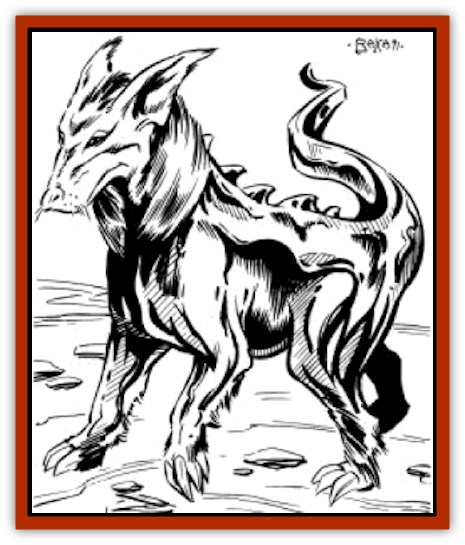

# Rasclinn

| Statistic | **Rasclinn** |
| --- | --- |
| **Activity Cycle:** | Night |
| **Alignment:** | Neutral |
| **Armor Class:** | 2 |
| **Climate/Terrain:** | Rocky badlands |
| **Damage/Attack:** | 1-4 |
| **Diet:** | Vegetarian |
| **Frequency:** | Rare |
| **Hit Dice:** | 4 |
| **Intelligence:** | Animal (1) |
| **Magic Resistance:** | Nil |
| **Morale:** | Average (8-10) |
| **Movement:** | 36 |
| **No. Appearing:** | 1-12 |
| **No. of Attacks:** | 1 |
| **Organization:** | Pack |
| **Size:** | S (3' at the shoulder) |
| **Special Attacks:** | Rage |
| **Special Defenses:** | Poison immunity, <i>tower of iron will</i> |
| **THAC0:** | 17 |
| **Treasure:** | Nil |
| **XP Value:** | 120 |

The rasclinn is a small [[Dog|dog]]-like creature that feeds on almost any vegetation that grows in the Athasian badlands. They extract trace metals from the plants, which gives them an almost metallic hide. They are avidly hunted for their hides, but they are tough to kill.

The rasclinn is a small animal, growing only 3 feet at the shoulder and weighing up to 50 pounds. Its metallic hide gives it a silvery color, although the pups are usually brown, white, or a combination of the two.

Rasclinn have no language of their own, but they do communicate by barks and yelps. These warn the young to flee or indicate if a rasclinn has found food or water.

**Combat:** Rasclinn fight only to defend their young and only if they cannot flee. A rasclinn leader makes full use of its cunning, and a rasclinn pack is quite likely to hide in a patch of spider or sand cacti, if one is available.

If cornered, the adult rasclinn attack with their bite. Their teeth are especially hard, so rasclinn receive a +1 attack bonus with their bite. This bonus does not apply against an opponent wearing metal armor. If a rasclinn young is hurt, all of the adults become enraged, and receive a +2 bonus on their attack and damage rolls. This lasts only as long as the young are being hurt or threatened.

Because of their diet, rasclinn are immune to all poisons derived from plants. They also receive a bonus of +4 to their saving throws versus all other poisons. Adults also project a continual *tower of iron will*, with a power score of 14. This makes them almost immune to psionics.

Rasclinn have very sharp hearing and are surprised only on a 2 or less on a d10. If a rasclinn pack surprises a party, the pack flees as fast as it can. They have a fox-like cunning when it comes to losing a pursuer. The metallic pads on their feet allow them to run through terrain and vegetation that can rip up a pursuer's feet.

Young rasclinn have 1 Hit Die, a THAC0 of 20 and inflict 1d3 points of damage with their bite.

**Habitat/Society:** The rasclinn is a family animal. When found, a pack of rasclinn always consists of one male and up to five females. If more than six are found, the extras will be pups. Pups fight only to defend themselves and are trained to run away at the first yelp of danger from an adult. Rasclinn know that the male is necessary to the pack, and the females are the ones to drop back and fight first. Only if the pack is cornered does the male attack. Otherwise, all but one of the females drop back to defend the pack, while the rest flee. It is not easy to corner a rasclinn, since its speed and cunning allow it to outrun or outwit most foes.

A rasclinn female gives birth to 1d3 live young every spring. Most rasclinn puppies are female (90%), so the rare male is protected even more than the females. When the pups reach maturity, at about one year of age, most of the females are taken into the pack, and the males leave with at least one female. If two rasclinn are encountered they are always a young male and female. A single rasclinn encountered is usually a male that has lost his mate. Such creatures can actually be tamed, but they must be captured first.

**Ecology:** Rasclinn are the natural enemy of almost all plant life. They can eat any type of vegetation; even cactus needles are a scrumptious snack for a rasclinn. Few animals hunt them, since their metallic hide makes them unpalatable for most creatures. They are the only creature known that can get the traces of metal from the plants that they consume. The rasclinn's only natural enemies are humans and demi-humans.

The rasclinn is avidly hunted for its hide. A person skilled in armor making and tanning can make a set of hide armor from two adult rasclinn skins. This armor gives AC 4 (normal hide armor is AC 6), although it does weigh about 20 pounds.

It is even possible to smelt out actual iron from the hide, but the forge required is only possessed by a few of the more powerful merchant houses. Should access to such a forge be gained, up to 5 coins weight of iron (worth 50 cp) can be smelted from a single hide.

---
## Discovery & Documentation

**Source Publication:** MC12 Dark Sun Appendix I - Terrors of the Desert (1991)
**Campaign Setting:** Dark Sun
**Author(s):** Tom Prusa, Louis J. Prosperi, Walter M. Baas

### Other Creatures Found in This Source Book
   * [[Animal_Herd_Athas|Animal, Herd (Athas)]]
   * [[Animal_Household_Athas|Animal, Household (Athas)]]
   * [[Antloid_Desert|Antloid, Desert]]
   * [[Banshee_Dwarf|Banshee, Dwarf]]
   * [[Beetle_Agony|Beetle, Agony]]
   * [[Bog_Wader|Bog Wader]]
   * [[Brambleweed|Brambleweed]]
   * [[B'rohg|B'rohg]]
   * [[Burnflower|Burnflower]]
   * [[Cat_Psionic|Cat, Psionic]]
   * [[Cha'thrang|Cha'thrang]]
   * [[Cistern_Fiend|Cistern Fiend]]
   * [[Clam_Giant|Clam, Giant]]
   * [[Cloud_Ray|Cloud Ray]]
   * [[Drake_Athas_Air|Drake (Athas), Air]]
   * [[Drake_Athas_Earth|Drake (Athas), Earth]]
   * [[Drake_Athas_Fire|Drake (Athas), Fire]]
   * [[Drake_Athas_Water|Drake (Athas), Water]]
   * [[Dune_Runner|Dune Runner]]
   * [[Dune_Trapper|Dune Trapper]]
   * [[Elemental_Athas_Greater_Air|Elemental (Athas), Greater, Air]]
   * [[Elemental_Athas_Greater_Earth|Elemental (Athas), Greater, Earth]]
   * [[Elemental_Athas_Greater_Fire|Elemental (Athas), Greater, Fire]]
   * [[Elemental_Athas_Greater_Water|Elemental (Athas), Greater, Water]]
   * [[Elemental_Athas_Lesser_Air_Earth|Elemental (Athas), Lesser, Air/Earth]]
   * [[Elemental_Athas_Lesser_Fire_Water|Elemental (Athas), Lesser, Fire/Water]]
   * [[Elemental_Athas_General_Information|Elemental (Athas), General Information]]
   * [[Erdland|Erdland]]
   * [[Esperweed|Esperweed]]
   * [[Flailer|Flailer]]
   * [[Floater|Floater]]
   * [[Giant_Athas|Giant (Athas)]]
   * [[Golem_Athas_I|Golem (Athas) I]]
   * [[Golem_Athas_II|Golem (Athas) II]]
   * [[Golem_Athas_III|Golem (Athas) III]]
   * [[Golem_Athas_General_Information|Golem (Athas), General Information]]
   * [[Halfling_Renegade|Halfling, Renegade]]
   * [[Hej-kin|Hej-kin]]
   * [[Id_Fiend|Id Fiend]]
   * [[Insect_Swarm_Athas|Insect Swarm (Athas)]]
   * [[Kank_Wild|Kank, Wild]]
   * [[Kirre|Kirre]]
   * [[Megapede|Megapede]]
   * [[Mul_Wild|Mul, Wild]]
   * [[Nightmare_Beast|Nightmare Beast]]
   * [[Plant_Carnivorous_Athas|Plant, Carnivorous (Athas)]]
   * [[Pterran|Pterran]]
   * [[Pterrax|Pterrax]]
   * [[Pulp_Bee|Pulp Bee]]
   * [[Pyreen|Pyreen]]
   * [[Razorwing|Razorwing]]
   * [[Roc_Athas|Roc (Athas)]]
   * [[Sand_Bride|Sand Bride]]
   * [[Sand_Cactus|Sand Cactus]]
   * [[Sand_Vortex|Sand Vortex]]
   * [[Scrab|Scrab]]
   * [[Silt_Horror|Silt Horror]]
   * [[Silt_Runner|Silt Runner]]
   * [[Sink_Worm|Sink Worm]]
   * [[Sloth_Athas|Sloth (Athas)]]
   * [[So-ut|So-ut]]
   * [[Spider_Cactus|Spider Cactus]]
   * [[Spider_Crystal|Spider, Crystal]]
   * [[Spirit_of_the_Land|Spirit of the Land]]
   * [[T'Chowb|T'Chowb]]
   * [[Thrax|Thrax]]
   * [[Tohr-kreen_I|Tohr-kreen I]]
   * [[Villichi|Villichi]]
   * [[Zhackal|Zhackal]]
   * [[Zombie_Plant|Zombie Plant]]
