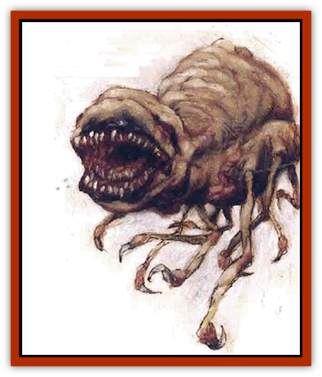

# Rast

| Statistic | **Rast** |
| --- | --- |
| **Activity Cycle:** | Any |
| **Alignment:** | Neutral |
| **Armor Class:** | 5 |
| **Climate/Terrain:** | Quasiplane of Ash |
| **Damage/Attack:** | 1d4/1d4/1d4/1d4 or 1d8+3 |
| **Diet:** | Carnivore |
| **Frequency:** | Uncommon |
| **Hit Dice:** | 4+2 |
| **Intelligence:** | Animal to semi (1-3) |
| **Magic Resistance:** | Nil |
| **Morale:** | Elite (13-14) |
| **Movement:** | Fl 18 (B) |
| **No. Appearing:** | 1d6+1 (rarely, 1) |
| **No. of Attacks:** | 4 or 1 |
| **Organization:** | Pack |
| **Size:** | M (5' across) |
| **Special Attacks:** | Paralyzation, blood drain |
| **Special Defenses:** | Immune to fire and heat |
| **THAC0:** | 17 |
| **Treasure:** | Nil |
| **XP Value:** | 975 |

Amid the cinders and soot of the Quasiplane of Ash, amid the choking clouds and wisps of smoke, the rast makes its home. The main body of the creature is fairly small - just big enough to hold its stomach and heart, really. Radiating outward are 10 to 12 spindly limbs (the creatures don't seem to have a standard number), each ending in a barbed claw for tearing apart meat or digging through the soft ash. The limbs don't flap or act in any way like wings, yet somehow the rast flies (perhaps in a manner similar to that of [[Beholder_and_Beholder-kin_I|beholders]]). The rast's head sits atop a flexible neck, its mouth huge and obscenely full of teeth. Narrow red eyes peer out through the dark, sooty air of the plane.

**Combat:** The piercing gaze of the rast strikes a chord deep within all creatures. Those who meet the monster's stare must make a successful saving throw versus paralyzation or freeze in place for 1d6 rounds out of primal fear. No creature is immune to this effect, and magic resistance offers no protection against it. Fortunately, if a basher makes his saving throw, he's safe from the rast's gaze for the rest of the encounter. ('Course, he's subject to the effect again the *next* time he runs into a rast&hellip;)

Rasts enjoy attacking those held motionless in fear, but they're canny enough to strike first at those *not* frozen. Once they've put any active foes in the dead-book, they tear into the paralyzed berks.

Given that rasts have 10 to 12 limbs each, it's no surprise that they usually attack with multiple claws. Fact is, in a single round they can make up to four claw attacks (inflicting 1d4 points of damage each), on either one or two foes. This flurry of raking blows often weakens even the toughest of enemies. Yet a rast has one other weapon in its natural arsenal - its savage jaws.

If a rast elects to bite a foe rather than use its claws, it can make only one attack per round, but that single assault'll cause a lot more pain. The bite of the creature inflicts 1d8+3 points of damage, and once it's made a successful hit, the rast continues to grip the victim in its jaws, draining blood from the wound it created. The victim loses blood quite rapidly, suffering 1d4+4 points of damage per round. With its strong jaws, nothing can force the rest to release its prey unless it's slain or subdued - or until the victim dies. Physically tearing the rast away from its target always results in the death of the poor sod to whom it's attached.

As natives of the Quasiplane of Ash, rasts are - in some way or another - creatures of cinder. They breathe ash, even consuming it when they can find no meat (though it won't sustain them for long). And, being immune to fire and heat, they cannot burn.

Rasts are canny combatants, using stealth and misdirection to ambush their victims. The Quasiplane of Ash is a harsh place with little prey, so they must be efficient hunters to survive.

**Habitat/Society:** Rasts lair within the ash of their home plane, hollowing out small caves to house an entire pack. When not asleep, they fly out and hunt. The pack almost always operates as a unit, instinctively working together. Because prey is scarce, they must spend almost all their time on the hunt. Likewise, they must succeed in bringing down their quarry - a missed opportunity could lead to starvation.

Rasts of a particular pack never resort to cannibalism, though they will attack and eat members of other packs. Rast pack wars are quick, bloody, and merciless. After all, when one rast kills another, it not only gains food but also eliminates a competitor.

**Ecology:** Rast young are born in litters of 10 or more and must immediately fend for themselves as members of the pack. Those that become unable to take on their share of the hunting duties - the old, the sick, the feeble, and so on - are sent away, probably to become food for another hungry rast pack.

---
## Discovery & Documentation

**Source Publication:** Planescape III (1996)
**Campaign Setting:** Planescape
**Author(s):** Monte Cook

### Other Creatures Found in This Source Book
   * [[Animental|Animental]]
   * [[Archomental_Evil|Archomental, Evil]]
   * [[Archomental_Good|Archomental, Good]]
   * [[Belker|Belker]]
   * [[Bzastra|Bzastra]]
   * [[Chososion|Chososion]]
   * [[Darklight|Darklight]]
   * [[Devete|Devete]]
   * [[Devourer_Planescape|Devourer (Planescape)]]
   * [[Dharum_Suhn|Dharum Suhn]]
   * [[Egarus|Egarus]]
   * [[Elemental_Athas_Lesser_Air_Earth|Elemental (Athas), Lesser, Air/Earth]]
   * [[Elemental_Athas_Lesser_Fire_Water|Elemental (Athas), Lesser, Fire/Water]]
   * [[Elemental_Fire_Kin_Salamander_II|Elemental, Fire Kin, Salamander II]]
   * [[Entrope|Entrope]]
   * [[Facet|Facet]]
   * [[Frost_Salamander|Frost Salamander]]
   * [[Fundamental_Air_Earth|Fundamental, Air/Earth]]
   * [[Fundamental_Fire_Water|Fundamental, Fire/Water]]
   * [[Fundamental_All_Elements|Fundamental, All Elements]]
   * [[Garmorm|Garmorm]]
   * [[Homunculus_Elemental|Homunculus, Elemental]]
   * [[Immoth|Immoth]]
   * [[Khargra|Khargra]]
   * [[Klyndes|Klyndes]]
   * [[Magran|Magran]]
   * [[Menglis|Menglis]]
   * [[Nathri|Nathri]]
   * [[Ooze_Sprite|Ooze Sprite]]
   * [[Paraelemental|Paraelemental]]
   * [[Phirblas|Phirblas]]
   * [[Psurlon|Psurlon]]
   * [[Quasielemental_Negative|Quasielemental, Negative]]
   * [[Quasielemental_Positive|Quasielemental, Positive]]
   * [[Ravid|Ravid]]
   * [[Ruvoka|Ruvoka]]
   * [[Scile|Scile]]
   * [[Shad|Shad]]
   * [[Shocker|Shocker]]
   * [[Sislan|Sislan]]
   * [[Suisseen|Suisseen]]
   * [[Terithran|Terithran]]
   * [[Thoqqua|Thoqqua]]
   * [[Trilloch|Trilloch]]
   * [[Tsnng|Tsnng]]
   * [[Ungulosin|Ungulosin]]
   * [[Vacuous|Vacuous]]
   * [[Wavefire|Wavefire]]
   * [[Xag-Ya_Xeg-Yi|Xag-Ya/Xeg-Yi]]
   * [[Xill|Xill]]
