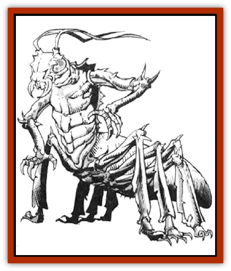

# Rastipede

| Statistic | **Rastipede** |
| --- | --- |
| **Activity Cycle:** | Any |
| **Alignment:** | Neutral |
| **Armor Class:** | 3 |
| **Climate/Terrain:** | Any space |
| **Damage/Attack:** | 1-10 |
| **Diet:** | Carnivore |
| **Frequency:** | Uncommon |
| **Hit Dice:** | 5 |
| **Intelligence:** | Very (11-12) |
| **Magic Resistance:** | Nil |
| **Morale:** | Steady (12) |
| **Movement:** | 15 |
| **No. Appearing:** | 1-6 |
| **No. of Attacks:** | 2 |
| **Organization:** | Nest |
| **Size:** | M (6' long) |
| **Special Attacks:** | Nil |
| **Special Defenses:** | Nil |
| **THAC0:** | 15 |
| **Treasure:** | G (R,U) |
| **XP Value:** | 270 |

The rastipede is an insect-like creature that can be encountered virtually anywhere, usually accompanying a wide variety of other creatures. A rastipede has a hard shell covering its body, which accounts for its low Armor Class. This is fortunate, since their odd body shape makes it impossible for them to wear any standard type of armor protection.

Rastipedes have long lower bodies, Their eight legs enable them to scoot around very quickly. They also have a vaguely humanoid torso and one pair of arms. They strike spacefarers as a kind of insectoid [[Centaur|centaur]].

The rastipede has a pair of antennae on its head that provide it with a very keen sense of smell. This sense is so keen that the rastipede cannot be surprised by a creature behind it, as long as that creature exudes any odor whatsoever. Also, the rastipede is ambidextrous and fully double-jointed.

**Combat:** Rastipedes can use the full range of weapons available to humans. Their specialty is a long bow designed and used specifically by their race. This long bow has ranges of 10/20/30, and it inflicts 1d12 points of damage on a successful hit.

Rastipedes are inherently peaceful, however. This accounts for their preference for a missile weapon in combat. Also, the speed of the insectoids enables them to avoid many an unpleasant encounter.

**Habitat/Society:** Rastipedes are born from eggs, which are laid by a queen that reputedly lives deep within ground in a secluded cavern, wherever they creatures have nests. Rastipedes grow up with a strong sense of duty and responsibility to the nest and the community. AIl rastipedes are well taught in the literature of their own race, which is quite extensive, and mathematics.

A nest of rastipedes might contain anywhere frown 100-600 individuals, half of which are immature, incapable of combat. The adults, however, are fanatically committed to the defense of the nest above all else.

Many rastipedes study the magical arts. About 1 in 6 rastipedes encountered is a mage of 1st through 4th level. Though no rastipede has ever been known to learn a spell higher than 2nd level, they have sufficient skill to operate a spelljammer helm. In fact, a helm operated by a rastipede performs as if operated by a mage of three times the rastipede's spellcasting level. Thus, a rastipede who casts as a 4th-level mage can operate a spelljammer helm as a 12th-level mage!

The primary interest of rastipedes, however, is trade. They commonly employ crews and hire ships to transport goods back and forth across wildspace, usually turning a profit with every voyage. Rastipedes engage in selling and buying of virtually any product, though most of them adhere rigidly to laws against smuggling or slave trafficking.

Rastipedes are favored henchmen of the [[Arcane|arcane]]. Very often, characters who seek an arcane find themselves dealing with a rastipede go-between. One reason for this is the well known bargaining skill of the rastipedes. Rumors suggest a darker, more sinister connection between the two races, but there is no evidence to indicate that any such association exists.

**Ecology:** Rastipedes can survive on virtually any kind of food. They need lots of water, but sunlight is apparently not a requirement of the race. Young rastipedes, born in the nest, might spend their first decade underground.

---
## Discovery & Documentation

**Source Publication:** MC7 Spelljammer Appendix I (1990)
**Campaign Setting:** Advanced Dungeons & Dragons 2nd Edition
**Author(s):** various

### Other Creatures Found in This Source Book
   * [[Aartuk|Aartuk]]
   * [[Albari|Albari]]
   * [[Ancient_Mariner|Ancient Mariner]]
   * [[Argos|Argos]]
   * [[Beholder_Abomination_Astereater|Beholder (Abomination), Astereater]]
   * [[Blazozoid|Blazozoid]]
   * [[Chattur|Chattur]]
   * [[Chevall|Chevall]]
   * [[Clockwork_Horror|Clockwork Horror]]
   * [[Colossus|Colossus]]
   * [[Delphinid|Delphinid]]
   * [[Dizantar|Dizantar]]
   * [[Dog|Dog]]
   * [[Dog_Bog_Hound|Dog, Bog Hound]]
   * [[Esthetic|Esthetic]]
   * [[Focoid|Focoid]]
   * [[Fractine|Fractine]]
   * [[Giant_Spacesea|Giant, Spacesea]]
   * [[Golem_Furnace|Golem, Furnace]]
   * [[Golem_Radiant|Golem, Radiant]]
   * [[Gravislayer|Gravislayer]]
   * [[Grommam|Grommam]]
   * [[Hadozee|Hadozee]]
   * [[Hamster_Giant_Space|Hamster, Giant Space]]
   * [[Jammer_Leech|Jammer Leech]]
   * [[Lakshu|Lakshu]]
   * [[Lumineaux|Lumineaux]]
   * [[Lutum|Lutum]]
   * [[Mimic_Space|Mimic, Space]]
   * [[Misi|Misi]]
   * [[Moon_Rogue|Moon, Rogue]]
   * [[Mortiss|Mortiss]]
   * [[Murderoid|Murderoid]]
   * [[Nay-Churr|Nay-Churr]]
   * [[Phlog-Crawler|Phlog-Crawler]]
   * [[Plasman|Plasman]]
   * [[Plasmoid_DeGleash|Plasmoid, DeGleash]]
   * [[Plasmoid_DelNoric|Plasmoid, DelNoric]]
   * [[Plasmoid_General_Information|Plasmoid, General Information]]
   * [[Plasmoid_Ontalak|Plasmoid, Ontalak]]
   * [[Puffer|Puffer]]
   * [[Q'nidar|Q'nidar]]
   * [[Reigar|Reigar]]
   * [[Rock_Hopper|Rock Hopper]]
   * [[Slinker|Slinker]]
   * [[Spider_Asteroid|Spider, Asteroid]]
   * [[Spiritjam|Spiritjam]]
   * [[Survivor|Survivor]]
   * [[Syllix|Syllix]]
   * [[Symbiont_Power|Symbiont, Power]]
   * [[Vine_Infinity|Vine, Infinity]]
   * [[Wiggle|Wiggle]]
   * [[Wizshade|Wizshade]]
   * [[Wryback|Wryback]]
   * [[Zard|Zard]]
   * [[Zodar|Zodar]]
