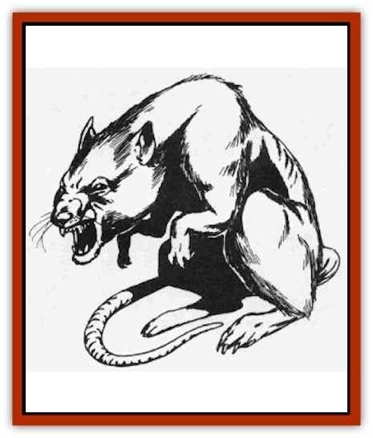
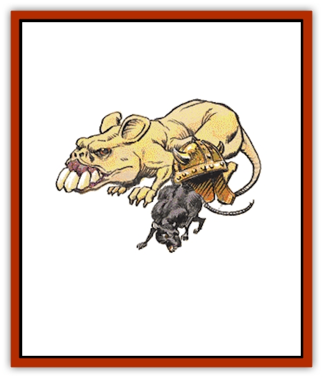

# Rat

| Statistic | **Common** | **Giant** | **Osquip** |
| --- | --- | --- | --- |
| **Activity Cycle:** | Night | Night | Night |
| **Alignment:** | Neutral | Neutral evil | Neutral |
| **Armor Class:** | 7 | 7 | 7 |
| **Climate/Terrain:** | Any | Any | Subterranean |
| **Damage/Attack:** | 1 | 1-3 | 2-12 |
| **Diet:** | Scavenger | Scavenger | Carnivore |
| **Frequency:** | Common | Common | Uncommon |
| **Hit Dice:** | � | ½ | 3+1 |
| **Intelligence:** | Animal (1) | Semi- (2-4) | Animal (1) |
| **Magic Resistance:** | Nil | Nil | Nil |
| **Morale:** | Unreliable (2-4) | Unsteady (5-7) | Unsteady (7) |
| **Movement:** | 15 | 12, Sw 6 | 12, Br ½ |
| **No. Appearing:** | 1-100 | 5-50 | 2-24 |
| **No. of Attacks:** | 1 | 1 | 1 |
| **Organization:** | Pack | Pack | Pack |
| **Size:** | T (1' long) | T (2' long) | S (2' at shoulder) |
| **Special Attacks:** | Disease | Disease | Nil |
| **Special Defenses:** | Nil | Nil | Nil |
| **THAC0:** | 20 | 20 | 16 |
| **Treasure:** | Nil | (C) | (D) |
| **XP Value:** | 7 | 15 | 120 |

Rats are long-tailed rodents 5-12 inches long. They are aggressive, omnivorous, and adaptable, and they often carry diseases.

The black rat is about 8 inches long, with a tail at least that long, a lean body, pointed nose, and long ears. The "black" rat is dark gray with brownish patches, and a gray or white belly. It is a good climber (climb 3) and jumper, but cannot swim.

The brown rat, also known as the sewer rat or the wharf rat, is 5-10 inches long, and its tail is shorter than the black rat's. Its eyes and ears are also smaller, but it has a larger, fatter body. Brown rats may be gray, white, black, or piebald in color. They cannot climb, but are excellent swimmers (swim 3) and burrowers. If rats infest a building, black rats inhabit the upper floors, and brown rats occupy the lower floor and the cellars.

**Combat:** Rats normally flee anything bigger than themselves, but a trapped rat will do anything to survive and a pack of starving rats will attack anything in order to feed. Rats attack with their sharp front teeth and often carry diseases, so that a rat bite has a 5% chance of infecting its victim with a serious disease unless the victim makes a successful saving throw vs. poison. Normal rats fear fire, but brave it when very hungry.

A swarm of rats can be treated as a single monster having an assigned number of Hit Dice and automatically causing damage each round to small creatures in the swarm's area. A typical pack might cover a 10x10-foot area, have 4 HD, and inflict 4 points of damage per round. Weapons have little effect on a pack, but area effect spells and some other attacks (such as flaming oil) are effective. When the pack has lost its hit points, it is considered dispersed and unable to inflict mass damage.

**Habitat/Society:** The chief purpose of rats is to find food. Packs often burrow into and eat food stores. Rats nest almost anywhere, chewing cloth, paper, or wood to make a nest.

**Ecology:** Rats are very prolific, breeding three to five times a year. Brown rats produce 2d4+6 young per litter, while a black rat litter contains only 5-6 young. Both types of rats are omnivorous. Brown rats are considered to be more aggressive than black rats. Their teeth are extremely powerful; they have been known to gnaw holes in lead pipes. Rats have a lifespan of two to four years.

**Brush Rats**

  Brush rats (also known as trade rats and pack rats) belong to a much less aggressive family of rats known as wood rats. They are slate gray above and white on their underbellies. They are nearly the size of brown rats. Brush rats build nests or burrows in forested areas. They are attracted to small, shiny objects and sometimes steal them and carry them to their hoard. Pack rats are herbivores and will not attack humans. They do not carry diseases. Brush rats can be trained.

**Giant Rats**

  

These vile beasts plague underground areas such as crypts and dungeons. Their burrows honeycomb many graveyards, where they cheat [[Ghoul|ghouls]] of their prizes by tunneling to newly interred corpses. Giant rats are brown/black in color with white underbellies, and are related to the brown rat, with fatter bodies and shorter tails. As with normal rats, any creature bitten by a giant rat has a 5% chance per wound of catching a debilitating disease; a successful saving throw vs. poison prevents catching the disease. Giant rats avoid attacking strong parties unless driven by hunger or commanded by creatures such as [[Vampire_General_Information|vampires]] and [[Lycanthrope_Wererat|wererats]]. Giant rats are fearful of fire and flee from it except if driven by hunger or magic. They are excellent swimmers and can attack in water as well as on land.

**Osquip**

  The [[Rat_Osquip|osquip]] is a multi-legged rodent the size of a small [[Dog|dog]]. It is hairless, with a huge head and large teeth. Most have six legs, but some (25%) have eight, and a few (5%) have 10. The creatures' leathery hides are pale yellow in color.

Osquips build small, carefully hidden tunnels, and their teeth are sharp enough to dig through stone. If someone enters an area in which there are osquip tunnels, the creatures can emerge quickly, and opponents receive a -5 to surprise rolls. The osquip are territorial and attack fearlessly and ferociously.Osquips are not afraid of fire, but are poor swimmers (50% drown, 50% paddle with a movement rate of 1).

Osquips are difficult to domesticate, but [[Gremlin_Jermlaine|jermlaine]] and a few wizards have succeeded by giving the creatures gems, for they collect shiny objects. Osquip leather is soft and water-resistant, and their teeth can be used in digging magic.

---
## Discovery & Documentation

**Source Publication:** MC1 Volume I (w/binder #1) (1991)
**Campaign Setting:** Advanced Dungeons & Dragons 2nd Edition
**Author(s):** Jay Batista, Scott Bennie, Grant Boucher, William W. Connors, Steve Gilbert, Heike Kubasch, James Lowder, David Edward Martin, Bruce Nesmith, Jean Rabe, Rick Swan, John J. Terra, Gary L. Thomas

### Other Creatures Found in This Source Book
   * [[Bat|Bat]]
   * [[Bear|Bear]]
   * [[Behir|Behir]]
   * [[Boar|Boar]]
   * [[Bookworm|Bookworm]]
   * [[Brownie|Brownie]]
   * [[Bugbear|Bugbear]]
   * [[Carrion_Crawler|Carrion Crawler]]
   * [[Cat_Great|Cat, Great]]
   * [[Catoblepas|Catoblepas]]
   * [[Dragon_General_Information|Dragon, General Information]]
   * [[Dragonfish|Dragonfish]]
   * [[Elemental_Air_Kin_Aerial_Servant|Elemental, Air Kin, Aerial Servant]]
   * [[Elemental_Earth_Kin_Sandling|Elemental, Earth Kin, Sandling]]
   * [[Elephant|Elephant]]
   * [[Gnoll|Gnoll]]
   * [[Hobgoblin|Hobgoblin]]
   * [[Homunculus|Homunculus]]
   * [[Hornet_Giant|Hornet, Giant]]
   * [[Horse|Horse]]
   * [[Hyena|Hyena]]
   * [[Jackal|Jackal]]
   * [[Jackalwere|Jackalwere]]
   * [[Korred|Korred]]
   * [[Lich|Lich]]
   * [[Lizard|Lizard]]
   * [[Lizard_Man|Lizard Man]]
   * [[Lycanthrope_General_Information|Lycanthrope, General Information]]
   * [[Lycanthrope_Seawolf|Lycanthrope, Seawolf]]
   * [[Lycanthrope_Werebear|Lycanthrope, Werebear]]
   * [[Lycanthrope_Weretiger|Lycanthrope, Weretiger]]
   * [[Lycanthrope_Werewolf|Lycanthrope, Werewolf]]
   * [[Manticore|Manticore]]
   * [[Medusa|Medusa]]
   * [[Mind_Flayer|Mind Flayer]]
   * [[Minotaur|Minotaur]]
   * [[Mudman|Mudman]]
   * [[Mummy|Mummy]]
   * [[Nixie|Nixie]]
   * [[Nymph|Nymph]]
   * [[Ogre|Ogre]]
   * [[Ooze_Slime_Jelly_I|Ooze/Slime/Jelly I]]
   * [[Ooze_Slime_Jelly_II|Ooze/Slime/Jelly II]]
   * [[Orc|Orc]]
   * [[Owl|Owl]]
   * [[Owlbear_I|Owlbear I]]
   * [[Pegasus|Pegasus]]
   * [[Piercer|Piercer]]
   * [[Pudding_Deadly|Pudding, Deadly]]
   * [[Rakshasa|Rakshasa]]
   * [[Ray|Ray]]
   * [[Remorhaz|Remorhaz]]
   * [[Satyr|Satyr]]
   * [[Scorpion|Scorpion]]
   * [[Selkie|Selkie]]
   * [[Shadow|Shadow]]
   * [[Skeleton|Skeleton]]
   * [[Skunk|Skunk]]
   * [[Snake|Snake]]
   * [[Spectre|Spectre]]
   * [[Spider|Spider]]
   * [[Sprite|Sprite]]
   * [[Toad_Giant|Toad, Giant]]
   * [[Treant|Treant]]
   * [[Troll|Troll]]
   * [[Umber_Hulk|Umber Hulk]]
   * [[Unicorn|Unicorn]]
   * [[Vampire|Vampire]]
   * [[Wight|Wight]]
   * [[Will_O'Wisp|Will O'Wisp]]
   * [[Wolf|Wolf]]
   * [[Wolfwere|Wolfwere]]
   * [[Wraith|Wraith]]
   * [[Wyvern|Wyvern]]
   * [[Yeti|Yeti]]
   * [[Yuan-ti|Yuan-ti]]
   * [[Zombie|Zombie]]
