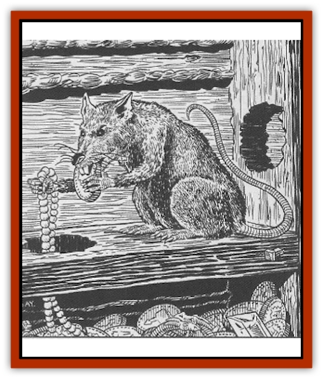

# Rat - Burglar

| Statistic | **Rat, Burglar** |
| --- | --- |
| **Activity Cycle:** | Night |
| **Alignment:** | Chaotic evil |
| **Armor Class:** | 7 |
| **Climate/Terrain:** | Any |
| **Damage/Attack:** | 1 |
| **Diet:** | Omnivore |
| **Frequency:** | Very rare |
| **Hit Dice:** | 1 |
| **Intelligence:** | Average (8-10) |
| **Magic Resistance:** | Nil |
| **Morale:** | Unsteady (5-7) |
| **Movement:** | 15, Climb 3 |
| **No. Appearing:** | 1 (plus rat pack) |
| **No. of Attacks:** | 1 |
| **Organization:** | Leader of a rat pack |
| **Size:** | T (1' long) |
| **Special Attacks:** | Disease |
| **Special Defenses:** | See below |
| **THAC0:** | 19 |
| **Treasure:** | R (in 2-8 lairs throughout the city) |
| **XP Value:** | 120 |

Rat burglars are magically-enhanced [[Rat|rats]], usually dirty gray or black, with beady red eyes. They appear to be no different from the ordinary black rat, but appearances are definitely deceiving. As the name suggests, rat burglars specialize in sneaking into dwellings and making off with small valuabies, which they stash in hidden lairs. Their front paws are dextrous, allowing them to grasp items such as jewelry and loose gems or coins, and they can move as quickly on three legs with one front leg clasping loot as they can on all fours. They are fairly good climbers even without using their magical abilities.

**Combat:** Rat burglars disdain combat, preferring to stick to the shadows unseen, sending others out into battle if the need arises. When combat is necessary, a rat burglar bites for a single point of damage. As rat burglars are no more hygienic than ordinary rats, the bite carries a 5% chance of infecting the victim with a serious disease.

Rat burglars have a variety of magical abilities with which they avoid combat. Once per day they can cast a version of *charm monster* that affects only rats (including giant rats). These *charmed* allies are used to attack the rat burglar's enemies or to create a distraction during which the rat burglar escapes. The *charm* effect lasts for 12 hours. In addition, rat burglars can *spider climb* once per day. They understand and speak the Common tongue, and their ability to use *ventriloquism* twice/day often allows them to avoid trouble or lure intelligent enemies away. Occasionally, a rat burglar might use its ventritoquism to lure someone into an ambush, but generally the rat burglar shies away from direct confrontations.

**Habitat/Society:** Rat burglars spend much of their time with packs of ordinary and giant rats, often making their homes in the sewers or back alleys of large cities. However, they also duck out of "rat society" and go off on their own at frequent intervals. Every rat burglar keeps several individual lairs at various places throughout a city; this gives the creature several places in which to store his "loot". These lairs are seen as private property to the rat burglar, and he permits no other creatures to enter. Mating and child-rearing is done in areas inhabited by an entire pack of rats; the loot storage lairs are for the rat burglar alone, and he often spends many hours in one of his hidden dens, admiring his small cache of treasure.

**Ecology:** All rat burglars trace their lineage to Slinky, the black rat who served as a familiar to a dual-classed wizard/thief named Durgan Shadowspell. Durgan invested much of his rime "upgrading" his beloved familiar with magical abilities, the better to serve him in his work - mainly, making off with other people's property. Slinky served admirably in this capacity, up until Durgan's death.

Finding himself on his own, Slinky reverted to form and found a mate in the sewers of the city in which he lived. He sired many offspring. About 5% of these had Slinky's magical abilities, and these he took aside, taught to speak, and trained in the arts of burglary. The tradition continues today, with rat burglars training their young and stashing away stolen valuables in numerous hiding places all through the city.

Because of their magical abilities, rat burglars make excellent familiars, especially to those wizards with a greedy nature. Several thieves' guilds have discovered rat burglar abilities, but so far all attempts to train them or keep them as pets have failed. Some thieves' guilds have therefore tried exterminating the creatures, because the guilds often get blamed for burglaries committed by the rats, and if they can't get the rat burglars "playing on their team" as it were, they'd just as soon not have the competition.

---
## Discovery & Documentation

**Source Publication:** Dragon Magazine Annual 3 - 1998 (1998)
**Campaign Setting:** Dragon Magazine
**Author(s):** Johnathan M. Richards, David Day

### Other Creatures Found in This Source Book
   * [[Ant_Piranha|Ant, Piranha]]
   * [[Pigeon_Acid|Pigeon, Acid]]
