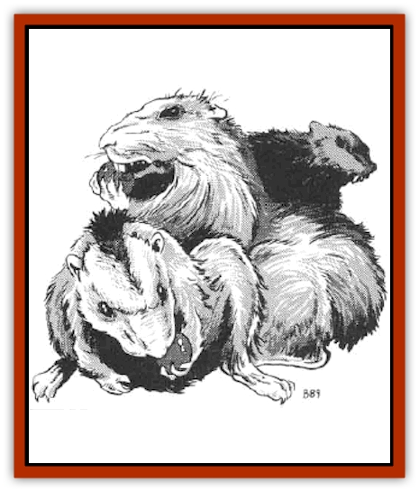

# Rat - Oerth

| Statistic | **Camprat** | **Vapor Rat** |
| --- | --- | --- |
| **Activity Cycle:** | Night | Any |
| **Alignment:** | Neutral | Chaotic neutral |
| **Armor Class:** | 6 | 6 (or special) |
| **Climate/Terrain:** | Any/Barrens and hills | Any/Cloud islands |
| **Damage/Attack:** | 1 | 1-2 |
| **Diet:** | Omnivore | Omnivore |
| **Frequency:** | Common | Rare |
| **Hit Dice:** | 1-2 hp | 2 |
| **Intelligence:** | Animal (1) | Low (5-7) |
| **Magic Resistance:** | Nil | Nil |
| **Morale:** | Unsteady (5-7) | Unsteady (5-7) |
| **Movement:** | 15 | 12, Fl 6 (Gaseous 1) |
| **No. Appearing:** | 11-30 | 2-16 |
| **No. of Attacks:** | 1 | 1 |
| **Organization:** | Pack | Pack |
| **Size:** | T (8&rdquo; long) | T (1' long) |
| **Special Attacks:** | Nil | Nil |
| **Special Defenses:** | Nil | Stinking cloud |
| **THAC0:** | 20 | 19 |
| **Treasure:** | Nil | Incidental |
| **XP Value:** | 7 | 35 |

Camprats are rodents with voracious appetites that belie their small size. They're generally harmless, but their ability to get their teeth into anything edible is aggravating to travelers.

Camprats are similar in appearance to prairie dogs or small gophers. Their fur is light, sandy brown, shading to dark brown or even black in a streak down their spine. They have a tiny stub of a tail. Their eyes are small and beady, and their front teeth are long and exceedingly sharp. The creatures move very quickly, and can climb just about anything.

**Combat:** Camprats are timid creatures, and fight only if cornered. If they must fight however, their razor-sharp front teeth can pierce leather as easily as thin cloth. The creatures would much rather flee than fight - climbing, jumping over, or gnawing through obstacles. Unlike normal [[Rat|rats]], camprats are clean and carry no significant risk of disease. Because they can move so swiftly, they�re difficult to hit (thus their relatively high Armor Class).

**Habitat/Society:** Like rats, camprats live in loosely-bonded packs, with males and females in roughly equal numbers. There is no pack leader and no organization to speak of.

Camprats are fast-moving and can make astounding leaps; up to eight feet horizontally and three feet vertically. They can climb any surface that offers the slightest purchase to their tiny claws. Their front teeth grow constantly, and the creatures must gnaw on things to prevent them from growing too long. This gnawing also keeps the teeth sharp. Camprats can chew through thick cloth (for example, a sack in five seconds, thin leather in 15 seconds, and thick leather in 30 seconds). Even wood presents little problem: they can gnaw through one inch of wood in 60 seconds (soft wood) to 90 seconds (hard wood).

The camprat's diet is simple: they eat anything that's not on fire. They're continuously scavenging, and go to great lengths to steal food. Typical precautions taken by travelers - storing food overnight in thick leather sacks or hanging it from tree branches - won't deter camprats, making them a major irritant for people traveling through barrens and hills.

Knowledgeable travelers are often warned of the presence of camprats by dead tress in the area; the creatures gnaw on the bark, frequently to the extent of banding and killing the trees. Camprats are imtatingly common in most hills and barrens, including the Hestmark Highlands, the Abbor-Alz, and the Kron Hills. In fact, there are tales that a [[Gnome|gnomish]] king of centuries ago spent a decade trying to rid the Kron Hills of camprats (with no success, of course).

**Ecology:** Camprats are pure scavengers; they eat anything they can find, but they don't hunt. They have reason to be timid: Many large carnivores consider camprats to be delicacies. [[Ogre|Ogres]] love live camprats, and young [[Dragon_Chromatic_Red|red dragons]] often breathe fire into camprat holes, then dig out the cooked appetizers within.

**Vapor Rats**

  Vapor rats appear to be nothing more than large, gray, [[Rat|giant rats]]. Their habitat, however, includes areas not common to giant rats, for these creatures also dwell in and on the substantial cloud islands that frequently serve as the abode of [[Giant_Cloud|cloud giants]] and [[Dragon_Cloud|cloud dragons]].

If angry, hungry, or cornered, vapor rats attack by scurrying in and delivering a sharp bite. Whenever one is killed, it gives off a small puff of noxious fumes. This gaseous release is the equivalent of the *stinking cloud* spell, but it affects only one individual within eight feet of the vapor rat. The rat always directs its release toward its opponent, and the gas dissipates to harmlessness beyond eight feet. Thus, while it is safe to slay these creatures at a distance, they are particularly dangerous in close proximity.

It is possible for vapor rats to alter the substance of their bodies and assume a gaseous form. In this condition they appear to be wisps of cloud or similar vapors. In their vaporous condition they are able to direct their movements much as a ship would steer before the wind, and they are thus able to move from cloud to cloud around the sky.

Wounded or seriously threatened vapor rats always assume gaseous form. In such a state they can be harmed only by attack forms that cause their vapors to be destroyed. These include very hot or magical fire, lightning, and exceptionally strong winds (see the *potion of gaseous form* for more details).

---
## Discovery & Documentation

**Source Publication:** MC5 Greyhawk Appendix (1989)
**Campaign Setting:** Advanced Dungeons & Dragons 2nd Edition
**Author(s):** Grant Boucher, William W. Connors, Steve Gilbert, Bruce Nesmith, Chris Mortika, Skip Williams

### Other Creatures Found in This Source Book
   * [[Aspis|Aspis]]
   * [[Beastman|Beastman]]
   * [[Bonesnapper|Bonesnapper]]
   * [[Booka|Booka]]
   * [[Brownie_Buckawn|Brownie, Buckawn]]
   * [[Brownie_Quickling|Brownie, Quickling]]
   * [[Crystalmist|Crystalmist]]
   * [[Dragon_Cloud|Dragon, Cloud]]
   * [[Dragon_Oerth_Greyhawk|Dragon (Oerth), Greyhawk]]
   * [[Dragonfly_Giant|Dragonfly, Giant]]
   * [[Dragonnel|Dragonnel]]
   * [[Elf_Grugach|Elf, Grugach]]
   * [[Elf_Valley|Elf, Valley]]
   * [[Golem_Necrophidius|Golem, Necrophidius]]
   * [[Grell_Wild|Grell, Wild]]
   * [[Grung|Grung]]
   * [[Hobgoblin_Norker|Hobgoblin, Norker]]
   * [[Hook_Horror|Hook Horror]]
   * [[Horgar|Horgar]]
   * [[Hound_Yeth|Hound, Yeth]]
   * [[Iguana_Giant|Iguana, Giant]]
   * [[Ingundi|Ingundi]]
   * [[Kech|Kech]]
   * [[Kyuss_Son_of|Kyuss, Son of]]
   * [[Mite|Mite]]
   * [[Needleman|Needleman]]
   * [[Plant_Carnivorous_Oerth|Plant, Carnivorous (Oerth)]]
   * [[Plant_Carnivorous_Vampire_Cactus|Plant, Carnivorous, Vampire Cactus]]
   * [[Plasmoid_General_Information|Plasmoid, General Information]]
   * [[Raven_Crow|Raven/Crow]]
   * [[Scarecrow|Scarecrow]]
   * [[Shadow_Slow|Shadow, Slow]]
   * [[Skulk|Skulk]]
   * [[Snail|Snail]]
   * [[Sprite|Sprite]]
   * [[Taer|Taer]]
   * [[Tentamort|Tentamort]]
   * [[Turtle_Giant|Turtle, Giant]]
   * [[Tyrg|Tyrg]]
   * [[Wolf_Mist|Wolf, Mist]]
   * [[Wraith_Oerth|Wraith (Oerth)]]
   * [[Zygom|Zygom]]
