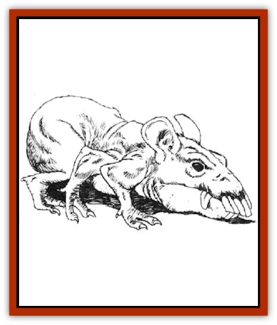

# Rat - Osquip

| Statistic | **Rat, Osquip** |
| --- | --- |
| **Activity Cycle:** | Night |
| **Alignment:** | Neutral |
| **Armor Class:** | 7 |
| **Climate/Terrain:** | Subterranean |
| **Damage/Attack:** | 2-12 |
| **Diet:** | Carnivore |
| **Frequency:** | Uncommon |
| **Hit Dice:** | 3+1 |
| **Intelligence:** | Animal (1) |
| **Magic Resistance:** | Nil |
| **Morale:** | Unsteady (7) |
| **Movement:** | 12, Br ½ |
| **No. Appearing:** | 2-24 |
| **No. of Attacks:** | 1 |
| **Organization:** | Pack |
| **Size:** | S (2' at shoulder) |
| **Special Attacks:** | Nil |
| **Special Defenses:** | Nil |
| **THAC0:** | 16 |
| **Treasure:** | (D) |
| **XP Value:** | 120 |

Not all monsters are fearsome [[Dragon_General_Information|dragons]] and giants. The osquip is a multi-legged giant rodent native to dungeon corridors and cellars.

The osquip is the size of a small dog. It is a rodent, distantly related to [[Mammal_Small|beavers]]; it is hairless, with a huge head and large spade-like teeth. Most specimens have six legs, but some (25%) have eight, and there a few rare creatures (5%) have ten. The creature's hide is a very light yellow - almost colorless - and resembles very pliable leather. Its brown eyes are very small and set close together, each being heavily protected by surrounding ridges of bone. Its jaws are unusually large, the entire bony structure projecting several inches forward of the flesh. Osquips are of animal intelligence.

**Combat:** The osquip is ferocious and will attack without fear, sometimes emerging from one of its hidden tunnels to get a surprise attack (-5 penalty to opponents' surprise rolls if it is within its tunnel complex). It attacks with its powerful jaws, which inflict 2d6 points of damage on a successful bite. It has a high Dexterity (its hide is AC 9). If battle goes against it, it tries to flee into its tunnels; if cornered, it uses its teeth to dig an escape tunnel. Its teeth are sharp enough to dig through stone.

**Habitat/Society:** The creature often has its lair in the midst of a complex of tunnels beneath the basements of buildings or dungeons. The tunnel system is quite extensive and the entrances to it, which are too small to permit the comfortable passage of a human or other man-sized creature, are carefully hidden (the chance of finding them is the same as the chance of finding a secret door).

Osquips have the same mentality as a [[Rat|packrat]]; they travel in large groups (the largest recorded is 24) and are attracted to bright shiny objects, which constitutes their treasure. It is not easy to domesticate an osquip. Some wizards have successfully done so, using magic. Some subterranean creatures such as [[Gremlin_Jermlaine|jermlaine]] have also tried with limited success; osquips sometimes (10% chance) can be controlled with judicious bribes of food, but they do not like to let go of their shiny treasures and react angrily if someone tries to take treasure away from them.

Osquips are extremely terrirorial and attack creatures that invade their tunnels. If they encounter new tunnels while burrowing, they get very aggressive, exploring every nook of the tunnel and attacking whatever they find, particularly [[Rat|giant rats]] and jermlaine. They treat larger (human-sized) creatures with caution, but attack them if the intruders get too far into their territory. Sometimes they try to ward invaders away with a warning hiss, but they will attack without warning if they have a good chance to surprise.

Osquips have above-average cunning. They are not afraid of fire but are not very good swimmers (50% of them will drown. while 50% paddle along slowly at a movement rate of 1).

**Ecology:** Osquips feed on [[Rat|rats]], mice, and other small rodents, sometimes even other packs of osquips. Like all rodents, they are mammalian, with three to five osquips produced per litter. They have a life expectancy of nine years. Osquip leather is soft and well-insulated against cold and rainy weather; it is used by tanners and tailors to make purses and coats.

Some osquips have been domesticated by certain wizards with a liking for unusual pets. Some wizards have trained packs of osquips and let them loose at stone fortresses during sieges: this tactic hasn't worked as well as the wizards hoped, chiefly because the tunnels dug by the osquips are almost always too small, and the osquips don't always move in the desired direction. Some wizards use osquip teeth as a component in magic involving digging.

---
## Discovery & Documentation

**Source Publication:** MC2 Volume II (1993)
**Campaign Setting:** Advanced Dungeons & Dragons 2nd Edition
**Author(s):** Jay Batista, Scott Bennie, Grant Boucher, William W. Connors, Steve Gilbert, Heike Kubasch, James Lowder, David Edward Martin, Bruce Nesmith, Jean Rabe, Rick Swan, John J. Terra, Gary L. Thomas

### Other Creatures Found in This Source Book
   * [[Ant|Ant]]
   * [[Ant_Lion_Giant|Ant Lion, Giant]]
   * [[Ape_Carnivorous|Ape, Carnivorous]]
   * [[Baboon|Baboon]]
   * [[Badger|Badger]]
   * [[Barracuda|Barracuda]]
   * [[Beetle_Giant|Beetle, Giant]]
   * [[Bulette|Bulette]]
   * [[Bullywug|Bullywug]]
   * [[Dwarf_Duergar|Dwarf, Duergar]]
   * [[Dwarf_Gully|Dwarf, Gully]]
   * [[Eagle|Eagle]]
   * [[Eel|Eel]]
   * [[Elemental_Air_Kin|Elemental, Air Kin]]
   * [[Elemental_Water_Kin|Elemental, Water Kin]]
   * [[Elemental_Water_Kin_Water_Weird|Elemental, Water Kin, Water Weird]]
   * [[Firestar|Firestar]]
   * [[Firetail|Firetail]]
   * [[Fish_Giant|Fish, Giant]]
   * [[Frog|Frog]]
   * [[Gorgon|Gorgon]]
   * [[Hawk|Hawk]]
   * [[Heucuva|Heucuva]]
   * [[Hippocampus|Hippocampus]]
   * [[Hippogriff|Hippogriff]]
   * [[Kelpie|Kelpie]]
   * [[Kenku|Kenku]]
   * [[Killmoulis|Killmoulis]]
   * [[Kuo-Toa|Kuo-Toa]]
   * [[Lamia|Lamia]]
   * [[Lammasu|Lammasu]]
   * [[Lamprey|Lamprey]]
   * [[Leech|Leech]]
   * [[Leprechaun|Leprechaun]]
   * [[Leucrotta|Leucrotta]]
   * [[Locathah|Locathah]]
   * [[Lycanthrope_Wereboar|Lycanthrope, Wereboar]]
   * [[Lycanthrope_Werefox|Lycanthrope, Werefox]]
   * [[Mammal_Minimal|Mammal, Minimal]]
   * [[Mammal_Small|Mammal, Small]]
   * [[Mimic|Mimic]]
   * [[Morkoth|Morkoth]]
   * [[Muckdweller|Muckdweller]]
   * [[Myconid|Myconid]]
   * [[Naga|Naga]]
   * [[Obliviax|Obliviax]]
   * [[Octopus_Giant|Octopus, Giant]]
   * [[Otyugh|Otyugh]]
   * [[Piranha|Piranha]]
   * [[Plant_Dangerous_I|Plant, Dangerous I]]
   * [[Plant_Intelligent|Plant, Intelligent]]
   * [[Poltergeist|Poltergeist]]
   * [[Porcupine|Porcupine]]
   * [[Roc|Roc]]
   * [[Roper|Roper]]
   * [[Rot_Grub|Rot Grub]]
   * [[Rust_Monster|Rust Monster]]
   * [[Sahuagin|Sahuagin]]
   * [[Sea_Lion|Sea Lion]]
   * [[Sea_Horse_Giant|Sea Horse, Giant]]
   * [[Shambling_Mound|Shambling Mound]]
   * [[Shark|Shark]]
   * [[Sphinx|Sphinx]]
   * [[Squid_Giant|Squid, Giant]]
   * [[Stirge|Stirge]]
   * [[Swanmay|Swanmay]]
   * [[Tarrasque|Tarrasque]]
   * [[Tasloi|Tasloi]]
   * [[Triton|Triton]]
   * [[Troglodyte|Troglodyte]]
   * [[Urchin|Urchin]]
   * [[Urd|Urd]]
   * [[Weasel|Weasel]]
   * [[Wolverine|Wolverine]]
   * [[Yellow_Musk_Creeper|Yellow Musk Creeper]]
