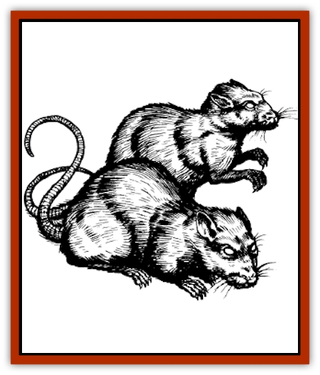

# Rat - Zhentish Sewer

| Statistic | **Rat, Zhentish Sewer** |
| --- | --- |
| **Activity Cycle:** | Night |
| **Alignment:** | Neutral evil |
| **Armor Class:** | 6 |
| **Climate/Terrain:** | Subterranean |
| **Damage/Attack:** | 1d4+1 |
| **Diet:** | Omnivore |
| **Frequency:** | Uncommon |
| **Hit Dice:** | 2 |
| **Intelligence:** | Low (5-7) |
| **Magic Resistance:** | 10% |
| **Morale:** | Steady (11-12) |
| **Movement:** | 12, Sw 18 |
| **No. Appearing:** | 3d8 |
| **No. of Attacks:** | 1 |
| **Organization:** | Pack |
| **Size:** | S (2' long) |
| **Special Attacks:** | Blood drain |
| **Special Defenses:** | Displacement |
| **THAC0:** | 19 |
| **Treasure:** | W |
| **XP Value:** | 175 / Ratling: 120 / Leader: 270 |

The sewers of Zhentil Keep are the breeding ground of all sorts of horrors. There is perhaps no other single place in all the Realms where so much evil magical fallout is to be found. In this environment the Zhentish sewer [[Rat|rat]] was born.

Zhentish sewer rats appear as large specimens of common [[Rat|sewer rats]], except that their eyes glow bright yellow and their faces appear slightly human. Their coarse, bristly hair is glossy black, and they carry a smell of mildew and sewer waste. Some scholars suggest that these malevolent rodents even have a rudimentary language.

**Combat:** Zhentish sewer rats attack in packs of no fewer than three. The rats make every attempt at remaining unseen if there are only one or two of them. Despite their abilities being far beyond those of a normal rat, they still find their courage only in numbers. The rats live and travel in packs, each led by a sewer rat with a full 8 hit points per Hit Die. Death of the leader necessitates a morale check by the remainder of the pack.

The rats attack with large, sharp incisor teeth. If the DM rolls a natural 20 for a rat's attack, the rat has fastened itself onto its victim and inflicts an extra 1d4+1 points of damage from blood drain per round of attachment. In order to remove the rat, the victim must make a successful open doors roll. It takes one round to remove the rat, and the victim cannot do anything else that round (except perhaps scream and thrash), although DMs may allow the victim to move half his or her movement rate.

The magical nature of the rats manifests itself in the form of an ability similar to the effect of a *cloak of displacement*, in that the first attack on a Zhentish sewer rat always misses.

The rats hate extremely bright light, and receive a -2 penalty to attacks in daylight or continual light.

**Habitat/Society:** Although these rats are called sewer rats, they can be found any place near Zhentil Keep that has subterranean recesses and a large quantity of water and rotting vegetation. Swamps, marshes, flooded basements, even graveyards located in areas with a high water table or nearby water runoff are other likely habitats. These rodents never venture out in daylight, however, even on overcast days.

The typical lair of a Zhentish sewer rat has 6d6 mature rats and 50% more immature rats. Each young rat has half the Hit Dice and inflicts half the damage of an adult. These lairs are always in a moist, dark place, out of the way of traffic. Often, they contain items left from previous victims.

**Ecology:** Zhentish sewer rats are exceedingly mean, even for rats. Some scholars say half jokingly that Bane did not die completely, that his temper found its way into the sewer rats. Zhentish sewer rats are never found among their lesser brethren, nor with most creatures that usually summon or associate with rats. In fact, Zhentish sewer rats find [[Gremlin_Jermlaine|jermlaine]] a delicacy.

The only beings that can deal with Zhentish sewer rats are [[Vampire_General_Information|vampires]], [[Tanar'ri_General_Information|tanar'ri]], and [[Baatezu_General_Information|baatezu]]. Even then the furry beasts are difficult to control or organize.

Some Moonsea-area wizards who find the prospect of using [[Displacer_Beast|displacer beast]] hides in the manufacture of *cloaks of displacement* a dangerous proposition have experimented on using the furry hides of Zhentish sewer rats. Thus far, the only result has been wizards running around in cloaks that look like sewn-together, flattened, driedout rat hides.

However, there are whisperings that certain alchemists are working on a potion or salve that would duplicate the rats' displacement ability. To such people (and they are hard to find, if they even exist), a freshly killed sewer rat would command a price of 500 gold pieces. Freshly killed, in this case, is defined as dead for no longer than 48 hours.

---
## Discovery & Documentation

**Source Publication:** Ruins of Zhentil Keep (1995)
**Campaign Setting:** Forgotten Realms
**Author(s):** John Terra and Kevin Melka

### Other Creatures Found in This Source Book
   * [[Banedead|Banedead]]
   * [[Banelich|Banelich]]
   * [[Burnbones|Burnbones]]
   * [[Elemental_Nature|Elemental, Nature]]
   * [[Gargoyle_Guardgoyle|Gargoyle, Guardgoyle]]
   * [[Golem_Magic|Golem, Magic]]
   * [[Golem_Vault_Guardian|Golem, Vault Guardian]]
   * [[Hybsil|Hybsil]]
   * [[Magedoom|Magedoom]]
   * [[Mist_Scarlet_Dancer|Mist, Scarlet Dancer]]
   * [[Orc_Ondonti|Orc, Ondonti]]
   * [[Render|Render]]
   * [[Sacaanti|Sacaanti]]
   * [[Snake_Messenger|Snake, Messenger]]
   * [[Zhentarim_Spirit|Zhentarim Spirit]]
