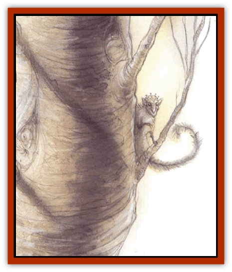
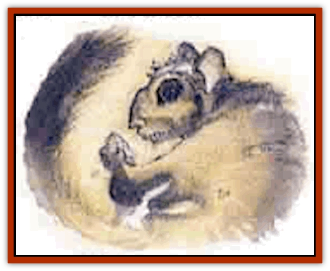
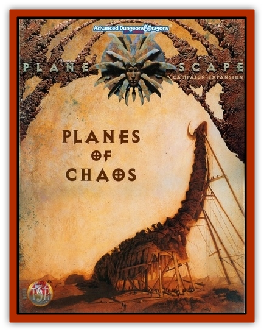

# Ratatosk

| Statistic | **Ratatosk** |
| --- | --- |
| **Activity Cycle:** | Day |
| **Alignment:** | Chaotic good |
| **Armor Class:** | 6 |
| **Climate/Terrain:** | Arborea, Yggdrasil, sylvan woodlands |
| **Damage/Attack:** | 1d4/1d4 or by weapon |
| **Diet:** | Omnivore |
| **Frequency:** | Common |
| **Hit Dice:** | 2 |
| **Intelligence:** | Low to average (5-10) |
| **Magic Resistance:** | Nil |
| **Morale:** | Unsteady (6) |
| **Movement:** | 9, Fl 15 (D), Cl 12 |
| **No. Appearing:** | 4d6 |
| **No. of Attacks:** | 2 or 1 |
| **Organization:** | Pack |
| **Size:** | S-M (4-5' tall) |
| **Special Attacks:** | Swoop |
| **Special Defenses:** | Dodge |
| **THAC0:** | 19 |
| **Treasure:** | B,Q&times;4 |
| **XP Value:** | 175 / Fireholder: 270 / Priest 1-4: 270 / Priest 5-7: 650 |

Ratatosk are tree-dwtlling gliders, able to leap wide chasms from branch to branch of Yggdrasil with sure-fooled ease. Ratatosk serve the World Ash as a sort of messenger system, but they are also very antagonistic to anything they feel doesn't belong in their home tree, such as most planars, especially [[Tiefling|tieflings]], [[Dwarf|dwarves]], and [[Githzerai|githzerai]]. They tolerate [[Elf|elves]], most Ysgardians, and [[Bariaur|bariaur]], though only just.

The ratatosk steal the goods left for the spirits and the gods, and have little regard for anyone or anything but themselves. If properly bribed, they carry messages to or from any plane connected by Yggdrasil. These bribes usually take the form of the enormous, sterile seed pods of Yggdrasil.

Ratatosk look like humanoid [[Mammal_Small|flying squirrels]], with furry membranes between their arms and legs and a large, flattened tail that they use to direct their gliding. They wear no clothing other than harnesses for gear and protective hats. Their fur is thick enough to keep them comfortable in all but the coldest winter freezes. Their color varies from black to gray to brown to red, though each pack has almost entirely the same coloring. Thelr tails are uniformly darker than the rest of their fur, usually matching the bark or the nears trees.

Ratatosk speak their own language, the language of [[Bird|birds]], and the Ysgardian common tongue.

**Combat:** Ratatosk are panicky fighters, more willing to attack en masse than risk single combat. They are careless of their own lives, but they lash out violently when their children are threatened. Even then, their strength comes from panic rather than bloodlust. Their sharp claws strike for 1d4 points of damage each.

When they are forced to fight, ratatosk prefer to swoop out of a tall tree's branches to attack. From the dive, they strike with their clawed hands and feet for double damage, then climb up Yggdrasil to dive again.

All ratatosk are excellent cursers, and their insults act as a *taunt* spell on any opponent who fails a saving throw versus spell. This ability is partly magical, and the ratatosk need not be able to speak the language of their target for their taunts to be effective. However, only creatures of low intelligence or greater are affected.

Many groups of ratatosk have adopted iron weapons as well as their natural claws, but these are all imported or stolen, since the ratatosk have no skill at forgecraft. In any given group, 30% of the ratatosk are unarmed, 20% have slings, 5% have staff slings, 10% carry spears, 20% carry hand axes, and 15% carry whatever weapons they have scavenged, such as swords, axes, polearms, and bows. The ratatosk steal or loot more weapons whenever they can.

While gliding, ratatosk can twist and dodge quickly enough to avoid missiles fired at them. A ratatosk can avoid a missile that would normally hit by rolling its current hit points or less on 1d20. This also applies to magical missiles that require an attack roll, such as *Melf's acid arrow* or *minute meteors*.

**Habitat/Society:** Each pack has a ruling male and female who are the absolute rulers of the pack, a mated pair called the fireholders. The fireholders have 3 Hit Die and do 1d6 points of claw damage, but are otherwise identical to their followers. Any pack member can challenge the rulers, but those who lose a challenge are exiled or reduced to the lowest rung of the pack's social ladder. The two leaders are the only ratatosk who mate and bear litter; all other pack mumblers are prevented from mating by the pack leaders. The only exceptions are the priests of Yggdrasil, who can reach 7th-level of ability and gain 1 additional Hit Die after reaching 5th level. Only 1 in 4 packs has a priest, but those that do always ask the priests for their counsel in any major decision.

The reaction of ratatosk packs to outsiders varies widely. Some packs are tricksters, others are very solemn - their personality is dependent on their leaders. All the ratatosk strive to be like their pack leaders, imitating their habits and behavior. Some pack leaders imitate powerful creatures that they meet, admire, and then "adopt", and the poor adoptive parent is followed around for weeks or months by dozens of bright-eyed ratatosk that do whatever he does.

Ratatosk use fire sparingly, with only a single firepot held by the two leaders. Most food is eaten cold, and fire is used for light at night and for heat in winter. They fear the effects of fire on Yggdrasil and discourage others who use it. For them, burning Yggdrasil's wood is a sacred act, and others who casually toss a few logs on the fire often wake up to find their mounts are loose, their food is scattered, and their tent has collapsed around them.

When the young males reach their full growth they are thrown out of the pack to survive on their own. They must steal brides away from an established pack to start their own group. Those that fail must join as lesser members with little status, never to become leaders. Young females are never thrown out of the pack and are protected by all other members of the pack, who know that she is the target of raiders.

Yggdrasil itself is the god of all ratatosk, and they fight to the death to protect her (in their eyes, Yggdrasil is a female tree). The legends of the ratatosk say that they were hatched from a huge nut at the top of the tree, and that they are therefore both the children and the chosen - the protectors or Yggdrasil. It's useless to argue this point with the creatures: no story of Nidhogg or the eagles of Yggdrasil will convince them that the tree doesn't love them best, and arguments about their origins can quickly lead to bloodshed. Whether Yggdrasil wants them to protect her doesn't seem to be a question that occurs to them.

The ratatosk can't seem to decide on where they like to live. A few packs of ratatosk are wanderers, nomads that range Yggdrasil from roots to crown. Each night, they weave tree nests from branches and leaves, as a way to avoid unwanted guests. The nests are built to just hold their weight, so that heavier creatures cannot reach them. When cold weather threatens, these ratatosk often migrate to Arborea for its mild winters.

Most ratatosk live in small lairs gnawed out of the wood of the World Ash or other impressively gigantic trees. Each burrow is large enough for a single adult and one young ratatosk. The entrance is sealed with the ratatosk's own tail when it is sleeping, simply but effectively camouflaging the entryway. If the pack grows large enough, these small burrows are expanded, but most packs are dispersed or kept small by predators and famine.

A few tribes of ratatosk live in large hollows and dens dug deep into the tree's living wood. In winter, the settlements are hibernation dens, small hollows that can hold the entire pack in tightly curled, dreamless slumber. Nearby, the ratatosk always hoard winter food in dozens of specially prepared nut storage caches.

The ratatosk love riddles and sometimes tease and taunt Yggdrasil's travelers with them until the squirrel-folk get an answer. Some bloods have even gained the respect and aid of the ratatosk with riddles of their own. The following are a few of the more common ratatosk riddles:

Falling to earth, rising to the sky,
Before I fall again, years must go by. [A nut.]

Shivering but fearing flame,
Wanting sun but needing rain. [A leaf.]

Never an acorn, Taller than stars,
His fingers hold us, Our fingers hold him. [Yggdrasil.]

Ever moving under trees, Startled by the slightest breeze,
We need the sun to join our play, And hide ourselves on rainy days. [Shadows in the forest.]

**Ecology:** Ratatosk eat nuts, roots, berries, fruits, insects, growing bark, and tender leaves. They also eat the eggs of the eagles nesting in Yggdrasil's branches - one or the few foods they bother to cook. In the spring, they eat the young shoots and branches that Yggdrasil offers. A few groups of ratatosk have moved along Yggdrasil's branches into the largest and most ancient woodlands of Arborea and Ysgard, where they are prey for [[Eagle|giant eagles]], giant [[Wolf|wolves]], [[Wolf|giant owls]] and giants, who don't seem to realize that the squirrel-folk are sentient creatures and spit them like rabbits.

---
## Discovery & Documentation

**Source Publication:** Planes of Chaos (1994)
**Campaign Setting:** Planescape
**Author(s):** Wolfgang Baur, L. W. Smith

### Other Creatures Found in This Source Book
   * [[Asrai|Asrai]]
   * [[Astral_Dreadnought|Astral Dreadnought]]
   * [[Bacchae|Bacchae]]
   * [[Chaos_Beast|Chaos Beast]]
   * [[Fensir|Fensir]]
   * [[Abyssal_Lord|Abyssal Lord]]
   * [[Howler|Howler]]
   * [[Imp_Chaos|Imp, Chaos]]
   * [[Lillend|Lillend]]
   * [[Murska|Murska]]
   * [[Oread|Oread]]
   * [[Tanar'ri_Greater_Goristro|Tanar'ri, Greater, Goristro]]
   * [[Tanar'ri_Lesser_Armanite|Tanar'ri, Lesser, Armanite]]
   * [[Varrangoin|Varrangoin]]
   * [[Viper_Tree|Viper Tree]]
