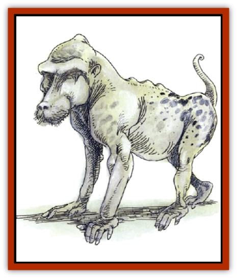
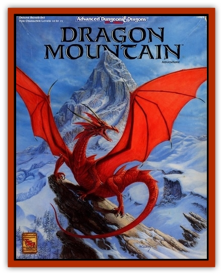

# Rautym

| Statistic | **Rautym** |
| --- | --- |
| **Activity Cycle:** | Any |
| **Alignment:** | Neutral evil |
| **Armor Class:** | 3 |
| **Climate/Terrain:** | Underground |
| **Damage/Attack:** | 1d6 (&times;2)/1d8 |
| **Diet:** | Omnivore |
| **Frequency:** | Rare |
| **Hit Dice:** | 4+4 |
| **Intelligence:** | Average (8-10) |
| **Magic Resistance:** | Nil |
| **Morale:** | Champion (15-16) |
| **Movement:** | 15 |
| **No. Appearing:** | 4d10 |
| **No. of Attacks:** | 3 |
| **Organization:** | Pack |
| **Size:** | S (4' tall) |
| **Special Attacks:** | See below |
| **Special Defenses:** | See below |
| **THAC0:** | 15 |
| **Treasure:** | Nil |
| **XP Value:** | 1,400 |

**Psionics Summary**

| Level | Dis/Sci/Dev | Attack/Defense | Score | PSPs |
| --- | --- | --- | --- | --- |
| 5 | 2/1/6 | Nil | 13 | 70 |

**Clairsentience -** *Sciences:* nil; *Devotions:* danger sense, feel sound, hear light.

**Psychometabolism -** *Science:* shadow form; *Devotions:* adrenaline control, aging, chameleon power.

The rautym resembles a small, eyeless, hairless, freckle-backed [[Mammal_Small|monkey]]. It is never found far from its companions, not because it is fearful, but because rautym gain power by being together.

Although rautym have no eyes, they nonetheless have little trouble existing in the dark. This is because two of their psionic powers, feel sound and hear light, are always active, and without cost in PSPs. They maintain small quantities of faintly phosphorescent rocks all about their lairs, or on their persons if traveling, which they use for psionic beacons, aiding in navigation. If plunged into magical darkness and silence, the rautym panic and attempt to flee. Opponents can use these spells to defeat the rautym easily; this is an option few have tried, however, as it is not at all obvious upon meeting these eyeless creatures.

**Combat:** The rautym have exceptional control over their psionic abilities and use them to great effect during combat. When they encounter danger, they use their adrenalin control to boost their Strength (they already have a natural Strength of 15), so they gain attack and damage bonuses. If necessary, they use shadow-form to sneak up on their enemies, at which point they employ aging or simply leap out upon their enemies to engage them in fierce hand-to-hand combat.

In addition to their arsenal of psionic powers, the rautym also have a power that is unduplicated in any other known race: they can dance magic, that is, they can summon magical energies by dancing in a certain way. There must be at least two rautym for this to work: One acts as the dancer while the other acts as the focus. A lone rautym dancer must dance five hours to produce a single 1st-level spell, while the focus is the one who casts the actual spell. The focus must have heard of the spell to cast it, and there must be at least twice as many dancers as there are spell levels for spells past 5th level (e.g., a 6th-level spell requires 12 dancers). The focus need not decide on the spell until the time comes to cast it, and there have been cases where the rautym dance for days, building the magical energies to an unheard-of level.

Additional rautym reduce the casting time or increase the spell level. The specific amount of time depends on the number of dancers: five hours divided by the number of dancers. The increase in spell level is one level per rautym until 5th level, at which point they must be two rautym per level. For example, two rautym dancers can enable a focus to cast a 2nd-level spell after five hours of dancing or can enable it to cast a 1st-level spell in two and a half hour. Likewise, five rautym can cast a 5th-level spell after five hours of dancing, or can decrease the casting time of a 1st-level spell to one hour.

If possible, the rautym dancers post sentries who use their chameleon power and danger sense. Since the rautym cannot defend themselves while they dance (although their dancing reverie is broken when the circle is broken), they prefer to have sentries rather than the extra power.

**Habitat/Society:** Rautym have a traditional focus, usually their elder, who leads them through the darkness. There is at least one elder per group of four. If the previous elder is killed, a new one is created to take its place. The rautym are never without a focus.

**Ecology:** The rautym are an anomaly. No one is sure of their origins, but most know that disturbing a circle of dancing rautym is a sure way to invite destruction.

---
## Discovery & Documentation

**Source Publication:** Dragon Mountain (1993)
**Campaign Setting:** Advanced Dungeons & Dragons 2nd Edition
**Author(s):** Colin McComb, Paul Arden Lidberg

### Other Creatures Found in This Source Book
   * [[Dragon-kin|Dragon-kin]]
   * [[Elemental_Earth_Kin_Earth_Weird|Elemental, Earth Kin, Earth Weird]]
   * [[Gnasher|Gnasher]]
   * [[Gnasher_Winged|Gnasher, Winged]]
   * [[Kobold_Dragon_Mountain|Kobold, Dragon Mountain]]
   * [[Living_Steel|Living Steel]]
   * [[Noran|Noran]]
   * [[Ophidian|Ophidian]]
   * [[Spider_Brain|Spider, Brain]]
   * [[Squeaker|Squeaker]]
   * [[Stone_Snake|Stone Snake]]
   * [[Suwyze|Suwyze]]
   * [[Tanar'ri_Greater_Wastrilith|Tanar'ri, Greater, Wastrilith]]
   * [[Undead_Dwarf|Undead Dwarf]]
