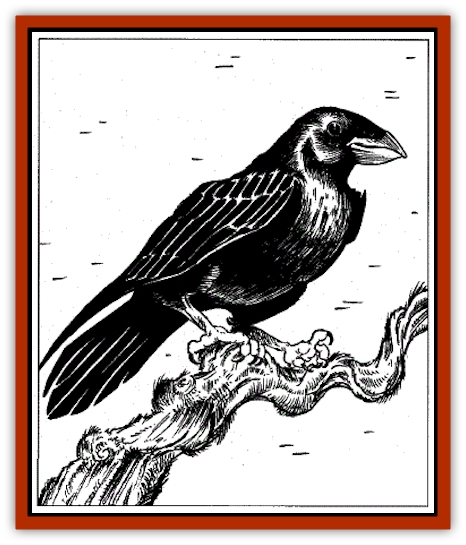

# Raven - Greater

| Statistic | **Raven, Greater** |
| --- | --- |
| **Activity Cycle:** | Any |
| **Alignment:** | Neutral, chaotic neutral, or neutral evil |
| **Armor Class:** | 7 |
| **Climate/Terrain:** | Any |
| **Damage/Attack:** | 1d2 (peck) |
| **Diet:** | Omnivore, Carrion-eater |
| **Frequency:** | Uncommon |
| **Hit Dice:** | 1 |
| **Intelligence:** | Very (11-12) |
| **Magic Resistance:** | 50% |
| **Morale:** | Fearless (20) |
| **Movement:** | 6, Fl 12 (A) |
| **No. Appearing:** | 1 |
| **No. of Attacks:** | 1 |
| **Organization:** | Solitary, mated pair, or flock |
| **Size:** | S (4' wingspan) |
| **Special Attacks:** | Curse |
| **Special Defenses:** | Immune to charm |
| **THAC0:** | 9 |
| **Treasure:** | Nil |
| **XP Value:** | 120 |

Many believe (correctly) that Ravens Bluff is named for these avians, who dwell almost exclusively in the area. These large, glossy black [[Bird|birds]] are locally renowned for their ability to speak and foretell the future. In Ravens Bluff, these birds can be found just about anywhere (as can normal [[Raven_Crow|crows and ravens]]).

**Combat:** Greater ravens love to single out and accompany an intelligent, active being, such as an adventurer. Some beings so favored find the raven's presence irritating and toss a stone in the bird's general direction. This may (70% chance) drive the creature off; otherwise it decides the being is going to be truly interesting to watch and determines to stay, remaining for d100 days (or even permanently if the "host" provides enough entertainment).

These Ravens are easy to kill but have the power to curse their slayers. Such curses will always be in the form of a rhyming prophecy foretelling some kind of punishment or misfortune to the offender or someone close to him or her. A greater raven slain by a crossbow bolt, for example, might with its final breath tell its slayer: "As my blood is drunk by the ground/Yours likewise soon will be found." Typical prophecies foretell the receiving of a grievous wound, being slain, or being bested in battle or a swindle. They often warn of the impending loss of some prized possession, such as a mage's favorite wand or a warrior's enchanted dagger. Even if the raven is tom apart, crisped to ashes, or otherwise rendered incapable of speech, the curse will be heard as clearly audible, hauntingly chanted words issuing from the empty air near the site of its death. Magical silence can prevent the prophecy's being heard but not the curse from taking effect.

**Habitat/Society:** Greater ravens are usually solitary when encountered, but mated pairs may also be seen, and flocks of up to forty birds have been reported. Such flocks are highly territorial and may swarm intruders, causing results similar to a double-strength *summon insects* spell (damage is either 4 or 8 points, depending on whether the targets defend themselves; the attack penalty is -4, and the Armor Class penalty is +4).

For reasons of their own, greater ravens are fond of attaching themselves to individuals or adventuring band to observe their doings. They fly from tree to tree or rock to rock (or balcony to balcony) to perch with a good view and watch, keeping a curious eye on the object of their interest. Not surprisingly, these creatures tend to be shunned as bringers of bad luck, though they rarely harm anyone directly. Instead, greater ravens seem to derive some satisfaction from watching the troubles of others. Some delight in continually uttering sarcastic comments, though they rarely make actual jokes; others enjoy hinting at secrets their host wants kept secret.

Most greater ravens, however, speak little.and when such closemouthed individuals do, it's usually to offer some sort of poetic prophecy of what the future holds. Raven prophecies almost always entail woe to those addressed, whether insignificant or catastrophic.

On rare occasions, a lone greater raven has been known to attach itself to a neutral or evil wizard, becoming a familiar of sorts (although none of the usual benefits derive from the relationship). The bird will perform a type of *commune* spell up to thirteen times a year, whenever its "master" desires. Queried formally on these occasions with respect to plans or events, the raven will offer cryptic advice (in its harsh, cackling voice) on the best course of action to rake or about the intentions of an enemy. In like manner, the raven can be asked to foretell the future. Those seeking such advice should be certain they want to hear the answer, for, as has been noted, raven prophecies almost always foretell someone - quite possibly the "master" - meeting harm or ill luck.

**Ecology:** Greater ravens devour small rodents, the eggs of other birds, small birds, carrion of all sorts, insects, lizards, berries, flowers, and growing shoots. They also have a liking for wax (even strongly-scented candle wax), butter, and cheese (the more strongly flavored and moldy the better). Given the opportunity, they'll sample any food eaten by humans, preferring salty viands to all other materials. Greater ravens can hold bones in their craw for long periods, spitting them out polished clean whenever they desire (usually to make a point or impression on someone to whom they're speaking).

*"Well," quote the raven, "you could wait." He tossed his head and spat something thoughtfully onto a rock at Glauren's feet. Something small, white, and gleaming. A bone. "- forever."*

*Glauren stared down at the bone, and then, slowly, back up at the raven. He swallowed.*

*The raven cocked its head to one side. One dark eye met his squarely and knowingly for a moment - then feathers flapped, and it was gone.*

*Glauren looked down at the bone with a chill. The bird, he knew, would be back.*

---
## Discovery & Documentation

**Source Publication:** The City of Ravens Bluff (1998)
**Campaign Setting:** Forgotten Realms
**Author(s):** Ed Greenwood

### Other Creatures Found in This Source Book
   * [[Dragon_Eormennoth|Dragon, Eormennoth]]
   * [[Dragger|Dragger]]
   * [[Hag_Sea_Greater|Hag, Sea, Greater]]
