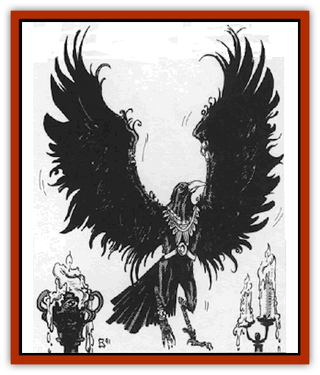

# Ravenkin

| Statistic | **Ravenkin** |
| --- | --- |
| **Activity Cycle:** | Day |
| **Alignment:** | Neutral good |
| **Armor Class:** | 6 |
| **Climate/Terrain:** | Temperate lands |
| **Damage/Attack:** | 1d3 |
| **Diet:** | Omnivore |
| **Frequency:** | Very rare |
| **Hit Dice:** | 1 |
| **Intelligence:** | Exceptional (15-16) |
| **Magic Resistance:** | Nil |
| **Morale:** | Elite (13-14) |
| **Movement:** | 3, Fl 27 (C) |
| **No. Appearing:** | 3-12 (3d4) |
| **No. of Attacks:** | 1 |
| **Organization:** | Flock |
| **Size:** | M (5' span) |
| **Special Attacks:** | Eye peck, spells |
| **Special Defenses:** | Not surprised |
| **THAC0:** | 19 |
| **Treasure:** | U (Communal), I (individual) |
| **XP Value:** | 175 |

The ravenkin are an avian race that have been trapped within the misty confines of Ravenloft. They are on of the few forces for good in this otherwise dark land of evil.

Ravenkin look much like huge versions of the common [[Raven_Crow|raven or crow]] with a wingspan that averages five feet in width. They are shrouded in black feathers and have long, straight beaks. To set themselves apart from normal ravens, they often wear small items of sparkling jewelry.

The ravenkin speak their own language, which sounds like a collection of squawks and shrieks to those who do not know it. Most (fully 80%) of these creatures will also speak the common language in use by the human or demihuman inhabitants of their lands.

**Combat:** The ravenkin will always try to flutter around a victim's head in combat, waiting for a chance to strike at his eyes. They will often land briefly on a would-be target before striking, using their talons to stay in place while they peck with their beaks. But, as the small talons inflict no damage, the creatures have only one pecking attack that inflicts but 1d3 points of damage. On any natural attack roll of 19 or 20, however, the ravenkin has scored a hit on one of the victim's eyes (assuming they are not wholly protected.) Such an injury will blind that eye, imposing a -2 penalty on all attack rolls made by the character. A second such hit indicates loss of the other eye and, thus, total blindness. Injuries of this nature cannot be cured save by spells like *heal* or *regeneration*.

All ravenkin have a limited spell casting ability. Most (75%) are able to employ any three first-level spells per day. They need neither material or somatic components, but always cast their spells verbally. Ravenkin are required to memorize their spells ahead of time, just as human casters. An additional 20% of these creatures have the ability to employ two second-level spells per day in addition to their first-level spells. Lastly, 5% of the ravenkin population can invoke one third-level spell per day.

**Habitat/Society:** The ravenkin are a long-lived race with many of their elders claiming to be "a hundred winters" old. As a rule, an individual's name includes his age, so a recently hatched chick might be "Kareeka Twomoons" and a wise old elder might be known as "Shreeaka Fiftyautumns".

Ravenkin are slow breeders. It is believed that the evil of Ravenloft has been corrupting their eggs and making them sterile. Whether this is the case or not, fully 8 In 10 ravenkin eggs fail to hatch. A ravenkin community generally consists of 155 to 200 individuals (150+5d10). Of these, half will be females (who fight just as if they were males), and 10% will be young (who do not fight). They will nest in family groups, each claiming a copse of trees as their own territory. In addition, the area around a ravenkin community tends to be filled with mundane crows, generally about 500 in number. While the ravenkin cannot directly command them, they are able to train the crows with great effectiveness and employ them as sentries and hunting animals.

Ravenkin tend to ignore travellers unless these actively seek out contact with the avians. In the latter case, they are wary and untrusting until the strangers prove themselves to be friends. Once someone has earned the trust of the ravenkin, though, they have won a great prize, for these creatures are able to provide a wealth of information about the evils of Ravenloft. The [[Human_Vistana|Vistani]] say that ravenkin can see through the eyes of every raven in the land; from the vast knowledge these folk seem to be able to amass on even the shortest notice, that seems to be only a minor exaggeration.

**Ecology:** The ravenkin exist on a diet of insects, beeries, and carrion. In short, they will eat almost anything put before them - truly proving themselves to be omnivorous. They find the act of hunting bothersome, however, and delight in the taste of slightly rotted meat, making carrion the main element of their diet.

---
## Discovery & Documentation

**Source Publication:** MC10 Ravenloft Appendix I (1989)
**Campaign Setting:** Planescape
**Author(s):** William W. Connors

### Other Creatures Found in This Source Book
   * [[Bastellus|Bastellus]]
   * [[Bat_Ravenloft|Bat (Ravenloft)]]
   * [[Bowlyn|Bowlyn]]
   * [[Broken_One|Broken One]]
   * [[Bussengeist|Bussengeist]]
   * [[Darkling|Darkling]]
   * [[Doom_Guard|Doom Guard]]
   * [[Doppelganger_Plant|Doppelganger Plant]]
   * [[Elemental_Ravenloft|Elemental (Ravenloft)]]
   * [[Ermordenung|Ermordenung]]
   * [[Ghoul_Lord|Ghoul Lord]]
   * [[Goblyn|Goblyn]]
   * [[Golem_III|Golem III]]
   * [[Golem_IV|Golem IV]]
   * [[Golem_Ravenloft|Golem (Ravenloft)]]
   * [[Grim_Reaper|Grim Reaper]]
   * [[Human_Abber_Nomad|Human, Abber Nomad]]
   * [[Human_Ravenloft|Human (Ravenloft)]]
   * [[Imp_Assassin|Imp, Assassin]]
   * [[Impersonator|Impersonator]]
   * [[Lycanthrope_Werebat|Lycanthrope, Werebat]]
   * [[Lycanthrope_Wereraven|Lycanthrope, Wereraven]]
   * [[Mist_Horror|Mist Horror]]
   * [[Mummy_Greater|Mummy, Greater]]
   * [[Quevari|Quevari]]
   * [[Quickwood|Quickwood]]
   * [[Reaver|Reaver]]
   * [[Scarecrow_Ravenloft|Scarecrow (Ravenloft)]]
   * [[Shadow_Fiend|Shadow Fiend]]
   * [[Skeleton_Giant|Skeleton, Giant]]
   * [[Strahd's_Skeletal_Steed|Strahd's Skeletal Steed]]
   * [[Treant_Evil|Treant, Evil]]
   * [[Treant_Undead|Treant, Undead]]
   * [[Valpurgeist|Valpurgeist]]
   * [[Vampire_Dwarf|Vampire, Dwarf]]
   * [[Vampire_Elf|Vampire, Elf]]
   * [[Vampire_Gnome|Vampire, Gnome]]
   * [[Vampire_Halfling|Vampire, Halfling]]
   * [[Vampire_General_Information|Vampire, General Information]]
   * [[Vampire_Kender|Vampire, Kender]]
   * [[Vampyre|Vampyre]]
   * [[Widow_Red|Widow, Red]]
   * [[Wolfwere_Greater|Wolfwere, Greater]]
   * [[Zombie_Lord|Zombie Lord]]
