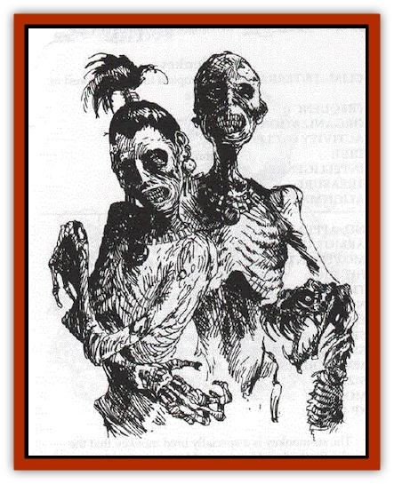

# Ravenous

| Statistic | **Ravenous** |
| --- | --- |
| **Activity Cycle:** | any |
| **Alignment:** | Neutral Evil |
| **Armor Class:** | 8 |
| **Climate/Terrain:** | tropical jungle |
| **Damage/Attack:** | 1d3 + special |
| **Diet:** | living tissue |
| **Frequency:** | very rare |
| **Hit Dice:** | see below |
| **Intelligence:** | Low (5-7) |
| **Magic Resistance:** | See below |
| **Morale:** | Fearless (20) |
| **Movement:** | 9 |
| **No. Appearing:** | 2d6 |
| **No. of Attacks:** | 1 |
| **Organization:** | pack |
| **Size:** | M or see below |
| **Special Attacks:** | Constitution drain |
| **Special Defenses:** | Spell immunity |
| **THAC0:** | see below |
| **Treasure:** | Nil |
| **XP Value:** | 65 |

The ravenous are [[Zombie|zombie]]-like creatures created by Meyanok's famine in the city-state of Tolanok. They appear to be normal [[Human|humans]] or mundane [[Snake|snakes]] that move with a slight stiffness and look emaciated as if from starvation. Most of their minds are gone, and their only thought is of satisfying the hungering ache in their stomachs and bones.

**Combat:** Ravenous attack with their natural weapon - nails for humans, bites or constriction for snakes. In addition to this damage, the touch of a ravenous draws vitality from the victim, resulting in a loss of one point of Constitution; this does not cause an adjustment in the victim's hit points due to a change in bonus hit points per level. A creature brought to 0 Constitution dies and rises as a ravenous within 24 hours unless the corpse is blessed or buried with a full meal. Only a human, humanoid, demihuman or a snake may be turned into a ravenous; a creature that rises as a ravenous has its original hit dice and THAC0; humans and demihumans become 1-HD ravenous. Lost Constitution is regained at a rate of 1 point per day in which the victim eats three full meals.

Like all undead, ravenous are immune to *sleep*, *charm* and *hold* spells. They are turned by clerics according to their hit dice. A ravenous can be distracted by throwing food to it - normal rations are preferred to dried ones - or the use of spells such as *create food and water* or *hero's feast*.

**Habitat/Society:** Formerly the inhabitants of a small, prosperous city and its outlying farms, the ravenous still gather in groups as their living counterparts had. A group may be all human-like or it may include some snakes. They hunt in packs to more easily bring down their victims, which are not eaten but drained of their life-giving properties. They have no concern for treasure.

**Ecology:** Ravenous take from their environment and give nothing back to it. When destroyed, their bodies collapse into dust and bone fragments. Ravenous can draw sustenance from plant life, but they quickly deplete their environment of this resource and therefore live in barren areas with dead and withered vegetation.

---
## Discovery & Documentation

**Source Publication:** The Scarlet Brotherhood (1999)
**Campaign Setting:** Greyhawk
**Author(s):** Sean Reynolds, Kij Johnson, Chris McKitterick, Lisa Stevens, Erik Mona, Roger Moore, Steve Wilson, Sam Wood, Dawn Murin

### Other Creatures Found in This Source Book
   * [[Gibbering_Mouther_Greater|Gibbering Mouther, Greater]]
   * [[Onco|Onco]]
   * [[Su-Monster|Su-Monster]]
   * [[Thousandtooth|Thousandtooth]]
   * [[Tlokasazotz_Olman_Bat-Vampire|Tlokasazotz (Olman Bat-Vampire)]]
