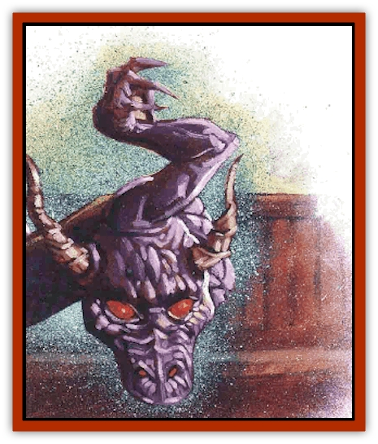

# Ravid

| Statistic | **Ravid** |
| --- | --- |
| **Activity Cycle:** | Any |
| **Alignment:** | Neutral |
| **Armor Class:** | -4 |
| **Climate/Terrain:** | Any (Positive Energy Plane) |
| **Damage/Attack:** | 1d4/1d6 |
| **Diet:** | Special |
| **Frequency:** | Very rare (common) |
| **Hit Dice:** | 3 |
| **Intelligence:** | Low (5-7) |
| **Magic Resistance:** | 20% |
| **Morale:** | Unsteady (5-7) |
| **Movement:** | Fl 24 (A) |
| **No. Appearing:** | 1 |
| **No. of Attacks:** | 2 |
| **Organization:** | Solitary |
| **Size:** | M (6' long) |
| **Special Attacks:** | Energy jolt, animation |
| **Special Defenses:** | Animation |
| **THAC0:** | 17 |
| **Treasure:** | Nil |
| **XP Value:** | 1,400 |

The ravid is a creature native to the Positive Energy Plane. That alone makes it a rare beast, since very little life hails from that brilliant place. And that's a bit odd in itself - shouldn't a plane full of life-giving energy spawn all manner of beings? A good many bashers think so, but it just ain't true. See, the plane has too *much* energy. Some graybeards even believe that life springs up all over the plane, but that it's instantly destroyed by the sheer overwhelming vitality, its own esence going to create something else - an infinite cycle.

By all accounts, the ravid's a strange exception to this idea. It exist on the Positive Energy Plane, but no one's ever going to notice. It's just a part of the natural life force there and is even considered "common". Only when the ravid somehow leaves the plane of its origin will anyone even tumble to the fact that it exists. And tumbe they will - the ravid, composed of life-giving energy, is creation incarnate. In its wake, things simply come to life. That makes it one of the most volatile and dangerous creatures a body's likely to come across.

In appearance, a ravid resembles a 6-foot-long serpent with no mouth and a single, spindly arm. It glows brightly with a golden light, illuminating whatever area it currently occupies with the force of a *continual light* spell.

**Combat:** A ravid's not likely to fight unless threatened, in which case it strikes with its single limb (causing 1d4 points of damage) and whipping tail (causing 1d6 points). Each of these attacks also carries with it an energy jolt. Victims struck must make saving throws versus paralyzation or feel the effect of the jolt. Note that it's possible for the rabid to strike a sod with both its limb and its tail, thus delivering two separate jolts. The Dungeon Master should determine the effect(s) on the victim by the following roll:

| 1d6 | Effect |
| --- | --- |
| 1-3 | The victim gains 2d4 hit points. If the new total places him over his normal maximum, he suffers burnout, and loses 1d4 hit points permanently. |
| 4-5 | The victim is hasted for 2d4 rounds, and then ages 1d2 years from burnout. |
| 6 | The victim receives the benefits of a strength spell, but then loses a point of Strength from burnout. |

Ironically, a jolt may heal the damage inflicted by the attack that delivered it. Such is the nature of positive energy.

'Course, a ravid's unconscious ability to grant life isn't nearly so welcome. Once per round, an object or portion of an object within 10 feet of the ravid is permanently imbued with life, Intelligence, and mobility. The DM should treat these items as if affected by an *animate object* spell, but should also roll 3d6-2 to determine each object's new Intelligence.

If the ravid is not within 10 feet of an object in any given round, the ground or air (or whatever does surround the beast on that particular plane) will churn to life as a minor elemental creature, similar to an [[Animental|animental]]. Each creature thus formed has a 30% chance of being hostile to those around it. However, the situation modifies that percentage chance - for example, a living weapon is more likely to show aggression than a living chair.

In all cases, though, the new life forms consider the ravid their creator. They're never hostile to it, and they even defend their sire if it's threatened. The ravid, on the other hand, hardly pays its creations any notice at all. It doesn't have the brain-box or the motivation to "command" them. Sometimes, the animated objects follow the ravid around, and sometimes they just wander off on their own.

Another point worth noting: While a ravid passing by a dead creature may imbue it with life, the deceased being is not resurrected. That is, a planewalker's corpse might be animated, but the original spirit won't return from wherever it's gone to rejoin the body.

An *energy drain* spell or the touch or a life-draining creature like a [[Spectre|spectre]] or a [[Wight|wight]] automatically slays a ravid. In the case of an undead creature, however, it is destroyed by the ravid in turn.

**Habitat/Society:** As mentioned above, the very idea of a ravid has no real meaning in its native environment. The creature becomes significant only when it makes its way to another plane by being summoned, passing through a portal, or just tagging along behind a group of careless planewalkers.

Once on another plane, the ravid timidly begins to explore its new surroundings. Most of them see the multiverse as a sad, lonely expanse that needs to be filled with life, and they take it upon themselves to bestow that great gift upon as many objects as they can. (For this reason, they often avoid creatures that're already alive - especially other ravids.) Folks encountering a ravid might never actually see the creature itself, but instead find themselves in a desolate area where *everything* is alive. The energy beast might have long since departed, or it might be in hiding from the bashers.

Ravids are terrified of undead creatures and flee from them on sight. Intelligent undead despise the life-giving ravids and try to kill them, even if it means their own destruction.

**Ecology:** The ravid, by its very nature, doesn't "feed" on anything. Its diet, rather, consists of giving energy to other objects rather than taking something away.

Ravids are spontaneously generated on the Positive Energy Plane, and have no way of creating more of their kind on their own.

---
## Discovery & Documentation

**Source Publication:** Planescape III (1996)
**Campaign Setting:** Planescape
**Author(s):** Monte Cook

### Other Creatures Found in This Source Book
   * [[Animental|Animental]]
   * [[Archomental_Evil|Archomental, Evil]]
   * [[Archomental_Good|Archomental, Good]]
   * [[Belker|Belker]]
   * [[Bzastra|Bzastra]]
   * [[Chososion|Chososion]]
   * [[Darklight|Darklight]]
   * [[Devete|Devete]]
   * [[Devourer_Planescape|Devourer (Planescape)]]
   * [[Dharum_Suhn|Dharum Suhn]]
   * [[Egarus|Egarus]]
   * [[Elemental_Athas_Lesser_Air_Earth|Elemental (Athas), Lesser, Air/Earth]]
   * [[Elemental_Athas_Lesser_Fire_Water|Elemental (Athas), Lesser, Fire/Water]]
   * [[Elemental_Fire_Kin_Salamander_II|Elemental, Fire Kin, Salamander II]]
   * [[Entrope|Entrope]]
   * [[Facet|Facet]]
   * [[Frost_Salamander|Frost Salamander]]
   * [[Fundamental_Air_Earth|Fundamental, Air/Earth]]
   * [[Fundamental_Fire_Water|Fundamental, Fire/Water]]
   * [[Fundamental_All_Elements|Fundamental, All Elements]]
   * [[Garmorm|Garmorm]]
   * [[Homunculus_Elemental|Homunculus, Elemental]]
   * [[Immoth|Immoth]]
   * [[Khargra|Khargra]]
   * [[Klyndes|Klyndes]]
   * [[Magran|Magran]]
   * [[Menglis|Menglis]]
   * [[Nathri|Nathri]]
   * [[Ooze_Sprite|Ooze Sprite]]
   * [[Paraelemental|Paraelemental]]
   * [[Phirblas|Phirblas]]
   * [[Psurlon|Psurlon]]
   * [[Quasielemental_Negative|Quasielemental, Negative]]
   * [[Quasielemental_Positive|Quasielemental, Positive]]
   * [[Rast|Rast]]
   * [[Ruvoka|Ruvoka]]
   * [[Scile|Scile]]
   * [[Shad|Shad]]
   * [[Shocker|Shocker]]
   * [[Sislan|Sislan]]
   * [[Suisseen|Suisseen]]
   * [[Terithran|Terithran]]
   * [[Thoqqua|Thoqqua]]
   * [[Trilloch|Trilloch]]
   * [[Tsnng|Tsnng]]
   * [[Ungulosin|Ungulosin]]
   * [[Vacuous|Vacuous]]
   * [[Wavefire|Wavefire]]
   * [[Xag-Ya_Xeg-Yi|Xag-Ya/Xeg-Yi]]
   * [[Xill|Xill]]
