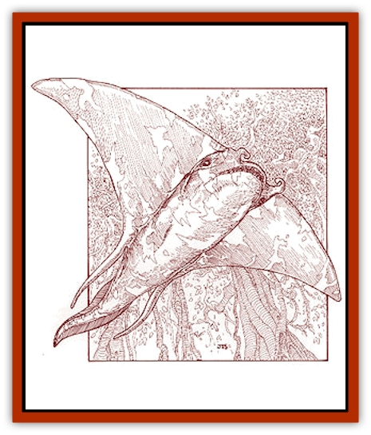

# Ray - Forest

| Statistic | **Ray, Forest** |
| --- | --- |
| **Activity Cycle:** | Any |
| **Alignment:** | Neutral |
| **Armor Class:** | 6 |
| **Climate/Terrain:** | Any forest |
| **Damage/Attack:** | 3d4 (bite) or 2d10 (sting) |
| **Diet:** | Carnivore |
| **Frequency:** | Rare |
| **Hit Dice:** | 8-11 |
| **Intelligence:** | Non- (0) |
| **Magic Resistance:** | Nil |
| **Morale:** | Elite (13-14) |
| **Movement:** | Fl 18 (E) |
| **No. Appearing:** | 1 |
| **No. of Attacks:** | 1 (sting or bite) |
| **Organization:** | Solitary |
| **Size:** | G (16-20' wingspan) |
| **Special Attacks:** | Swallow, stun |
| **Special Defenses:** | Nil |
| **THAC0:** | 8 HD: 13 / 9-10 HD: 11 / 11 HD: 9 |
| **Treasure:** | J-N&times;10,Q&times;5,X |
| **XP Value:** | 8 HD: 3,000 / 9 HD: 4,000 / 10 HD: 5,000 / 11 HD: 6,000 |

The forest ray, also known as the "forest devil", is a dark green creature that looks like a flying [[Ray|manta-ray]]. They live in forests, jungles, or other areas of heavy undergrowth, such as the forested areas of the Orc's Head Peninsula and Herath. These clumsy fliers can fly no higher than the treetops, but they can turn sideways to fly between the trees.

A forest ray can weigh as much as 3,000 pounds. Its eyes are on the upper surface of its body. The underbelly has a mouth and a second set of eyes. The upper surface is dark and mottled to match the forest floor, but its underbelly is colored to match the sky and the treetops. The forest ray can change its color to provide better camouflage, but this change takes several days to complete. Their pectoral fins are huge, which gives them a [[Bat|bat]]like appearance, and they use their short tails as a rudder.

**Combat:** Forest rays bury themselves and wait for victims to arrive. This gives them a +2 bonus to surprise opponents.

The forest ray has a giant maw that can totally engulf any creature man-sized or smaller in a single bite. If the ray's attack roll succeeds by more than 2 (e.g., it rolls a 16 or better when it needed to roll only a 14), then it swallows its prey. Swallowed creatures die at the end of six rounds. Any creature swallowed can attack from inside the ray with a dagger or a short sword at a -4 attack penalty; the ray's AC remains the same.

The forest ray's stomach may contain treasure, indigestible remnants of its past victims.

Alternatively, the forest devil can attack with its stinger. If the stinger successfully strikes, the victim suffers 2d10 points of damage and must make a successful saving throw vs. paralyzation or be stunned for 2d4 rounds.

**Habitat/Society:** Forest rays are solitary predators and have no society. They gather only to mate.

A forest ray typically ranges over an area of several square miles. It is an opportunistic feeder, so it seldom actively hunts. A forest ray needs surprisingly little food. It has a slow metabolism and goes into a state of hibernation when it has buried itself to wait for prey.

**Ecology:** Unlike its cousin the manta ray, the forest devil has sharp, pointed teeth suitable to a carnivore. The forest ray is a fearsome predator. Even jaguars and other large predators avoid it.

The skin of a forest ray can be cured into a very fine and supple leather. This leather is useful in the manufacture of various magical cloaks and can also be used to make superior book covers.

---
## Discovery & Documentation

**Source Publication:** Monstrous Compendium Savage Coast Appendix (Online Exclusive) (1995)
**Campaign Setting:** Mystara
**Author(s):** Loren L Coleman, Ted James, Thomas Zuvich, Cindi M. Rice

### Other Creatures Found in This Source Book
   * [[Aranea_Savage_Coast|Aranea (Savage Coast)]]
   * [[Arashaeem|Arashaeem]]
   * [[Batracine|Batracine]]
   * [[Cat_Marine|Cat, Marine]]
   * [[Cinnavixen|Cinnavixen]]
   * [[Clockwork_Swordsman|Clockwork Swordsman]]
   * [[Critter_Temple|Critter, Temple]]
   * [[Cursed_One|Cursed One]]
   * [[Deathmare|Deathmare]]
   * [[Dragon_Savage_Coast_Crimson|Dragon (Savage Coast), Crimson]]
   * [[Dragon_Savage_Coast_Red_Hawk|Dragon (Savage Coast), Red Hawk]]
   * [[Echyan|Echyan]]
   * [[Ee'aar|Ee'aar]]
   * [[Enduk|Enduk]]
   * [[Fachan_Savage_Coast|Fachan (Savage Coast)]]
   * [[Feliquine|Feliquine]]
   * [[Fiend_Narvaezan|Fiend, Narvaezan]]
   * [[Frelôn|Frelôn]]
   * [[Ghriest|Ghriest]]
   * [[Glutton_Sea|Glutton, Sea]]
   * [[Goatman|Goatman]]
   * [[Golem_Naâruk|Golem, Naâruk]]
   * [[Golem_Savage_Coast|Golem (Savage Coast)]]
   * [[Grudgling|Grudgling]]
   * [[Heraldic_Servant_I|Heraldic Servant I]]
   * [[Heraldic_Servant_II|Heraldic Servant II]]
   * [[Heraldic_Servant_III|Heraldic Servant III]]
   * [[Heraldic_Servant_IV|Heraldic Servant IV]]
   * [[Heraldic_Servant_V|Heraldic Servant V]]
   * [[Heraldic_Servant_General_Information|Heraldic Servant, General Information]]
   * [[Hermit_Sea|Hermit, Sea]]
   * [[Jorri|Jorri]]
   * [[Juhrion|Juhrion]]
   * [[Kla'a-tah|Kla'a-tah]]
   * [[Leech_Legacy|Leech, Legacy]]
   * [[Lich_Inheritor|Lich, Inheritor]]
   * [[Lizard_Kin_Savage_Coast|Lizard Kin (Savage Coast)]]
   * [[Lupasus|Lupasus]]
   * [[Lupin|Lupin]]
   * [[Lyra_Bird_Saragón|Lyra Bird, Saragón]]
   * [[Malfera|Malfera]]
   * [[Manscorpion_Nimmurian|Manscorpion, Nimmurian]]
   * [[Mythuínn_Folk|Mythuínn Folk]]
   * [[Neshezu|Neshezu]]
   * [[Nikt'oo|Nikt'oo]]
   * [[Nosferatu|Nosferatu]]
   * [[Omm-wa|Omm-wa]]
   * [[Omshirim|Omshirim]]
   * [[Parasite_Savage_Coast|Parasite (Savage Coast)]]
   * [[Phanaton|Phanaton]]
   * [[Plant_Savage_Coast|Plant (Savage Coast)]]
   * [[Pudding_Vermilion|Pudding, Vermilion]]
   * [[Rakasta|Rakasta]]
   * [[Shedu_Greater_Savage_Coast|Shedu, Greater (Savage Coast)]]
   * [[Shimmerfish|Shimmerfish]]
   * [[Skinwing|Skinwing]]
   * [[Spawn_of_Nimmur|Spawn of Nimmur]]
   * [[Spider-spy|Spider-spy]]
   * [[Spirit_Heroic|Spirit, Heroic]]
   * [[Spirit_Walleran|Spirit, Walleran]]
   * [[Succulus|Succulus]]
   * [[Swampmare|Swampmare]]
   * [[Symbiont_Shadow|Symbiont, Shadow]]
   * [[Tortle|Tortle]]
   * [[Troll_Legacy|Troll, Legacy]]
   * [[Trosip|Trosip]]
   * [[Tyminid|Tyminid]]
   * [[Utukku|Utukku]]
   * [[Voat|Voat]]
   * [[Voat_Herathian|Voat, Herathian]]
   * [[Vulturehound|Vulturehound]]
   * [[Wallara|Wallara]]
   * [[Wurmling|Wurmling]]
   * [[Wynzet|Wynzet]]
   * [[Yeshom|Yeshom]]
   * [[Zombie_Red|Zombie, Red]]
