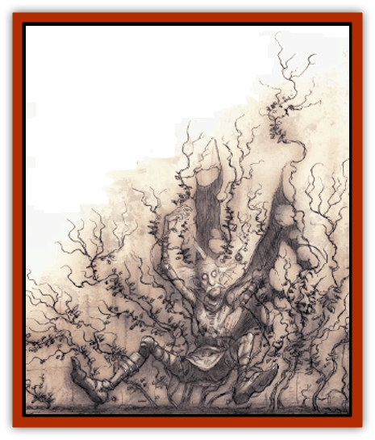

# Razorvine

| Statistic | **Razorvine** |
| --- | --- |
| **Activity Cycle:** | None |
| **Alignment:** | Neutral |
| **Armor Class:** | 5 |
| **Climate/Terrain:** | Any |
| **Damage/Attack:** | 1d3, 1d4, or 1d6 + special |
| **Diet:** | Sun, soil |
| **Frequency:** | Common |
| **Hit Dice:** | 5 hp per vine |
| **Intelligence:** | Non- (0) |
| **Magic Resistance:** | None |
| **Morale:** | None |
| **Movement:** | 0 |
| **No. Appearing:** | 2-20 vines |
| **No. of Attacks:** | Special |
| **Organization:** | Patch |
| **Size:** | M (12-20' long) |
| **Special Attacks:** | None |
| **Special Defenses:** | None |
| **THAC0:** | 20 |
| **Treasure:** | None |
| **XP Value:** | 35 per vine |

Razorvine's a fact of life in Sigil and on some of the Lower Planes. It's a black-leaved creeper or ivy with an exceptionally sharp-edged stem hidden under the lush foliage. The plant's capable of surviving almost any conditions, and flourishes in most environments - regardless of the quality of soil, atmosphere, rainfall, or light. Razorvine can grow several feet in a single day, and can cover a small building or untended wall in a week. There are few creatures as can stomach razorvine, so its growth is often unimpeded by natural means.

A single razorvine plant can have anywhere from 2 to 20 separate vines, all linked to a common root system. The vines twist and intertwine in diabolical knots, so it's nearly impossible to tell how many vines a body'd have to cut to actually get through a patch. Normally, any vines on one surface all belong to one plant, but a very big area like a castle or mountainside might be home to several dozen distinct patches of razorvine, whose edges intermingle with each other.

The razorvine's leaves are small, heart-shaped, and so dark as to be nearly black. They grow in dense clumps near the stem on short, wiry sprigs. The leaf-edges are serrated, but they're actually completely harmless - the stems are the real peril. A razorvine stem is triangular in cross-section, with three elevated, iron-hard ridges like sword-blades running along the stem. These ridges are the weapons of the razorvine, and they'll lay a sod's arm open from wrist to elbow if he's not careful with the stuff.

**Combat:** Razorvine don't move, it's not intelligent, and any berk can avoid the stuff simply by giving a patch a wide berth. So why's it so dangerous? Because a basher who falls into the stuff without good steel between him and the razors'll probably bleed to death from dozens of long, deep cuts before he pulls himself free of the patch.

Generally, razorvine can inflict damage in one of three ways. First, bashers trying to handle the stuff or brush past it're likely to get cut; second, bashers trying to slash through or cut back the vines might get cut; and last, sods falling into a patch bodily will definitely get slashed.

Handling razorvine includes trying to carefully wade through a patch, reaching into a plant to retrieve something, or trying to climb a section of wall covered by the stuff. Each round that the berk keeps at it, he has to make a successful saving throw versus death magic or Dexterity check (DM's choice, whichever is more appropriate to the situation) or suffer 1d3 points of damage, plus his base Armor Class.

Hacking through razorvine's almost as dangerous, because he tightly-twisted vines are under tension - when a vine's cut, it recoils and might slash the basher who just severed it. Each vine a character severs with a hand-held tool or weapon gets a single attack versus the berk�s normal AC. If it hits, the basher takes 1d4 points of damage plus his base AC, with no saving throw allowed. Anybody caught in the razorvine takes damage, too.

Last but not least, falling into a patch of razorvine inflicts 1d6 points of damage plus the sods base AC, with no saving throw or attack roll needed. ('Course, the sod might've had a saving throw to avoid falling in the first place, but that depends on the situation.) Once a basher's in a patch of razorvine, he takes no more damage unless he moves. Each round that he tries to maneuver or extricate himself, he suffers full falling-in damage all over again. Normally, it'll take a basher 1 to 3 rounds to get himself out of a razorvine patch.

A basher's base AC is his armor without Dexterity adjustments, shield, or magical adjustments that don't actually cover his whole body or rely on misdirection. For example, casting *blur* spell on some sod won't help him at all in a razorvine patch, but casting an *armor* spell will. A *ring* or *cloak of protection* helps prevent damage, but *bracers of defense* or *boots of striding and springing* don't.

Each vine has 5 hp and is AC 5. Only Type S weapons damage it. Cutting half the plant's vines can clear a path or free a comrade; cutting all the vines clears the plant from whatever it's growing over. It'll return in a few days unless the roots are pulled up and destroyed.

Razorvine is unusually resistant to fire and burns very poorly. Most normal fires blacken and harden the stems while burning off the leaves, which doesn't help to get rid of the stuff. Only magical fire can actually damage the stems.

**Habitat/Society:** Razorvine seems to grow everywhere. As noted before, it's especially common in the Cage and in some of the infernal regions of the Outlands or the Lower Planes. Razorvine's actually got a few uses. First of all, patches of razorvine are as good as sentries for keeping unwanted intruders out of places they're not welcome. A new razorvine plant can be started with a few small cuttings from a healthy vine, and with a little training the stuff can cover walls or seal off doorways.

Razorvine's generally inedible to humanoid life, but some animals such as [[Fhorge|fhorges]] or [[Quill|quills]] can actually chew, swallow, and digest the stuff. Therefore, it can he used as forage for specialized livestock. Razorvine leaves can also be made into heartwine, but so far the process is a closely-guarded secret of the vineyads of Curst.

Razorvine cuttings can he dried and used as firewood (once the branches die, they become brittle and more inflammable) or, with a treatment of oil, be preserved as flexible, razor-sharp ropes, whips, or cords. Binding someone with razorvine cord inflicts damage as noted under handling razorvine, but as long as the victim doesn't struggle he takes the damage just once. Trying to wiggle out of the bonds causes another damage check. A razorvine garrote is a particularly nasty device, which adds razorvine damage to the normal damage inflicted hy a garrote.

**Ecology:** No one knows for certain where razorvine came from or how it can grow so fast under any conditions, but it seems clear that the stuffs got an infernal look to it. Razorvine was probably brought to Sigil from some toxic jungle in the Abyss, and it just took. Merchants and other cutters interested in extra security have been bringing razorvine cuttings with them to the Outlands, planting the vines on whatever they wanted kept safe, and then learning just how virulent razorvine growth really is. Chant is they recently had a sod drawn and quartered in Ribcage for trying to smuggle cuttings in after they'd just finished clearing the town of the stuff.

---
## Discovery & Documentation

**Source Publication:** Planescape II (1996)
**Campaign Setting:** Planescape
**Author(s):** Rich Baker, Karen S. Boomgarden

### Other Creatures Found in This Source Book
   * [[Aasimar|Aasimar]]
   * [[Abrian|Abrian]]
   * [[Arcane|Arcane]]
   * [[Balaena|Balaena]]
   * [[Beholder-kin_Observer|Beholder-kin, Observer]]
   * [[Bloodthorn|Bloodthorn]]
   * [[Bonespear|Bonespear]]
   * [[Darkweaver|Darkweaver]]
   * [[Demarax|Demarax]]
   * [[Dhour|Dhour]]
   * [[Eater_of_Knowledge|Eater of Knowledge]]
   * [[Eladrin_Greater_Firre|Eladrin, Greater, Firre]]
   * [[Eladrin_Greater_Ghaele|Eladrin, Greater, Ghaele]]
   * [[Eladrin_Greater_Tulani|Eladrin, Greater, Tulani]]
   * [[Eladrin_Lesser_Bralani|Eladrin, Lesser, Bralani]]
   * [[Eladrin_Lesser_Coure|Eladrin, Lesser, Coure]]
   * [[Eladrin_Lesser_Noviere|Eladrin, Lesser, Noviere]]
   * [[Eladrin_Lesser_Shiere|Eladrin, Lesser, Shiere]]
   * [[Fhorge|Fhorge]]
   * [[Ghostlight|Ghostlight]]
   * [[Guardinal_Avoral|Guardinal, Avoral]]
   * [[Guardinal_Cervidal|Guardinal, Cervidal]]
   * [[Guardinal_General_Information|Guardinal, General Information]]
   * [[Guardinal_Equinal|Guardinal, Equinal]]
   * [[Guardinal_Leonal|Guardinal, Leonal]]
   * [[Guardinal_Lupinal|Guardinal, Lupinal]]
   * [[Guardinal_Ursinal|Guardinal, Ursinal]]
   * [[Hollyphant|Hollyphant]]
   * [[Incantifer|Incantifer]]
   * [[Ironmaw|Ironmaw]]
   * [[Keeper|Keeper]]
   * [[Khaasta|Khaasta]]
   * [[Leomarh|Leomarh]]
   * [[Monster_of_Legend|Monster of Legend]]
   * [[Mortai|Mortai]]
   * [[Noctral|Noctral]]
   * [[Quill|Quill]]
   * [[Reave|Reave]]
   * [[Retriever|Retriever]]
   * [[Rilmani_Abiorach|Rilmani, Abiorach]]
   * [[Rilmani_General_Information|Rilmani, General Information]]
   * [[Rilmani_Argenach|Rilmani, Argenach]]
   * [[Rilmani_Aurumach|Rilmani, Aurumach]]
   * [[Rilmani_Cuprilach|Rilmani, Cuprilach]]
   * [[Rilmani_Ferrumach|Rilmani, Ferrumach]]
   * [[Rilmani_Plumach|Rilmani, Plumach]]
   * [[Shadowdrake|Shadowdrake]]
   * [[Spellhaunt|Spellhaunt]]
   * [[Spider_Hook|Spider, Hook]]
   * [[Sunfly|Sunfly]]
   * [[Sword_Spirit|Sword Spirit]]
   * [[Tanar'ri_Lesser_Bulezau|Tanar'ri, Lesser, Bulezau]]
   * [[Tanar'ri_Lesser_Maurezhi|Tanar'ri, Lesser, Maurezhi]]
   * [[Tanar'ri_Lesser_Yochlol|Tanar'ri, Lesser, Yochlol]]
   * [[Tanar'ri_General_Information|Tanar'ri, General Information]]
   * [[Tanar'ri_True_Alkilith|Tanar'ri, True, Alkilith]]
   * [[Terlen|Terlen]]
   * [[Tso|Tso]]
   * [[T'uen-rin|T'uen-rin]]
   * [[Vaporighu|Vaporighu]]
   * [[Vorr|Vorr]]
   * [[Wastrel|Wastrel]]
   * [[Wraithworm|Wraithworm]]
   * [[Yugoloth_Lesser_Canoloth|Yugoloth, Lesser, Canoloth]]
   * [[Zoveri|Zoveri]]
