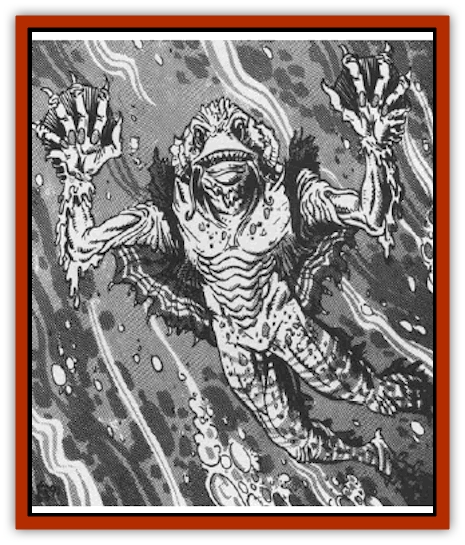

# Reaver

| Statistic | **Reaver** |
| --- | --- |
| **Activity Cycle:** | Any |
| **Alignment:** | Chaotic evil |
| **Armor Class:** | 4 |
| **Climate/Terrain:** | Sea of Sorrows |
| **Damage/Attack:** | 2d6/2d6/2d4 |
| **Diet:** | Carnivore |
| **Frequency:** | Rare |
| **Hit Dice:** | 4+3 |
| **Intelligence:** | Low (5-7) |
| **Magic Resistance:** | Nil |
| **Morale:** | Steady (11-12) |
| **Movement:** | 6, Sw 18 |
| **No. Appearing:** | 2-12 (2d6) |
| **No. of Attacks:** | 3 |
| **Organization:** | School |
| **Size:** | M (7' tall) |
| **Special Attacks:** | Grapple |
| **Special Defenses:** | Cutting scales |
| **THAC0:** | 15 |
| **Treasure:** | (A) |
| **XP Value:** | 420 |

The race of reavers are an evil and dark people who live beneath the waves on Ravenloft's western shore. Here, they lurk in hopes of attacking swimmers, fishermen, and small ships. Few indeed are the coastal communities in Lamordia, Mordent, Dementlieu, and Darkon that do not have stories of past encounters with these foul aquatic creatures.

Individual reavers look like tall humanoid creatures covered with scales. They have large, fish-like eyes and webbed hands and feet. Their fingers end in short but deadly sharp claws that can rip through flesh and tissue with ease. Their mouths are wide and filled with rows of needle-like teeth.

Reavers speak with a lisping, hissing language that is very difficult for other creatures to match. In addition, many of the sounds they use to communicate are ultrasonic, so men cannot even hear them. No reaver has ever been known to speak a human tongue.

**Combat:** The reaver is not noted for clever tactics and intricate strategies. As a rule, it is a brutal and savage opponent that tears its victims into pieces.

In melee, a reaver strikes three times: twice with its claws and once with its deadly bite. The former attack mode, which combines the great strength of the monster with the cutting edge of its claws, inflicts 2d6 points of damage. The latter attack combines the crushing might of the creature's jaws with its deadly, piercing teeth and inflicts 2d4 points of damage.

If both of the claw attacks hit, the reaver has managed to grapple its opponent and drag him along its scales. The edges of these small, natural plates are razor sharp, however, making such close physical contact with the reaver very dangerous. Attackers who grapple with or are grappled by a reaver will take 1d6 points of damage each round. Attempting to escape from the grip of the creature requires a 3d6 ability check against the victim's Strength. Failure to escape indicates that an additional 1d6 points of damage is taken while a successful escape reduces the damage to 1d4 points. Anyone who enters into unarmed combat will take 1d3 points of damage for each blow he lands on the reaver. Attacks from weapons that are unusually soft, like whips, will result in the breaking of the weapon on a natural attack roll of 1, 2, or 3.

**Habitat/Society:** Reavers tend to gather in schools of a dozen or so individuals. They are territorial in the extreme and will often regard any human settlement near their lairs (even those that predate the lair's establishment) as an intrusion upon their territory. Such "violations" are rewarded with nightly raids on the homes of the humans, each of these raids is marked by violent acts of terror targeted at individual households. In this way, the reavers hope to drive the "invaders" from the lands that border on their ocean realms.

A reaver lair is often hidden beneath a coral reef or at the heart of a thick forest of sea weed. In such isolated regions, the reavers are masters of stealth and hunting. Those who stumble upon these evil places seldom have time to see the creatures as they seem to spring out of nowhere to attack and destroy all intruders.

**Ecology:** Reavers feed on the raw flesh of their victims. They are strictly carnivorous and, oddly enough, feed only on land-dwelling creatures and sea mammals. Reavers look upon intelligent prey as far more worthy than simple animal life. Thus, they will often pass up other targets to strike at a wandering band of humans or demihumans. After they have feasted on the bodies of their victims, they often leave behind a grisly scene of blood and death - to mark their successful hunt and warn off those who might seek to hunt them down in a quest for vengeance.

**Outcasts**

  From time to time, an individual reaver is exiled from his people for one reason or another (usually failure in an important task). These outcasts leave the salty sea water behind and find a fresh water lake or river in which to live. Thus, even inland communities are not always safe from these evil creatures. Outcasts have the same statistics as other reavers.

---
## Discovery & Documentation

**Source Publication:** MC10 Ravenloft Appendix I (1989)
**Campaign Setting:** Planescape
**Author(s):** William W. Connors

### Other Creatures Found in This Source Book
   * [[Bastellus|Bastellus]]
   * [[Bat_Ravenloft|Bat (Ravenloft)]]
   * [[Bowlyn|Bowlyn]]
   * [[Broken_One|Broken One]]
   * [[Bussengeist|Bussengeist]]
   * [[Darkling|Darkling]]
   * [[Doom_Guard|Doom Guard]]
   * [[Doppelganger_Plant|Doppelganger Plant]]
   * [[Elemental_Ravenloft|Elemental (Ravenloft)]]
   * [[Ermordenung|Ermordenung]]
   * [[Ghoul_Lord|Ghoul Lord]]
   * [[Goblyn|Goblyn]]
   * [[Golem_III|Golem III]]
   * [[Golem_IV|Golem IV]]
   * [[Golem_Ravenloft|Golem (Ravenloft)]]
   * [[Grim_Reaper|Grim Reaper]]
   * [[Human_Abber_Nomad|Human, Abber Nomad]]
   * [[Human_Ravenloft|Human (Ravenloft)]]
   * [[Imp_Assassin|Imp, Assassin]]
   * [[Impersonator|Impersonator]]
   * [[Lycanthrope_Werebat|Lycanthrope, Werebat]]
   * [[Lycanthrope_Wereraven|Lycanthrope, Wereraven]]
   * [[Mist_Horror|Mist Horror]]
   * [[Mummy_Greater|Mummy, Greater]]
   * [[Quevari|Quevari]]
   * [[Quickwood|Quickwood]]
   * [[Ravenkin|Ravenkin]]
   * [[Scarecrow_Ravenloft|Scarecrow (Ravenloft)]]
   * [[Shadow_Fiend|Shadow Fiend]]
   * [[Skeleton_Giant|Skeleton, Giant]]
   * [[Strahd's_Skeletal_Steed|Strahd's Skeletal Steed]]
   * [[Treant_Evil|Treant, Evil]]
   * [[Treant_Undead|Treant, Undead]]
   * [[Valpurgeist|Valpurgeist]]
   * [[Vampire_Dwarf|Vampire, Dwarf]]
   * [[Vampire_Elf|Vampire, Elf]]
   * [[Vampire_Gnome|Vampire, Gnome]]
   * [[Vampire_Halfling|Vampire, Halfling]]
   * [[Vampire_General_Information|Vampire, General Information]]
   * [[Vampire_Kender|Vampire, Kender]]
   * [[Vampyre|Vampyre]]
   * [[Widow_Red|Widow, Red]]
   * [[Wolfwere_Greater|Wolfwere, Greater]]
   * [[Zombie_Lord|Zombie Lord]]
