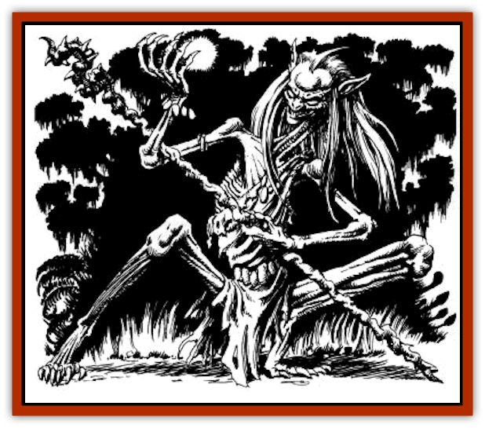

# Reggelid

| Statistic | **Reggelid** |
| --- | --- |
| **Activity Cycle:** | Nocturnal |
| **Alignment:** | Neutral evil |
| **Armor Class:** | 7 |
| **Climate/Terrain:** | Lower Jagged Cliffs, Swamp |
| **Damage/Attack:** | 1d6 (weapon) |
| **Diet:** | Omnivore |
| **Frequency:** | Very Rare |
| **Hit Dice:** | 3 (Varies) |
| **Intelligence:** | Genius (17-18) |
| **Magic Resistance:** | Nil |
| **Morale:** | Steady (11-12) |
| **Movement:** | 12 |
| **No. Appearing:** | 1d8+2 |
| **No. of Attacks:** | 1 or as level and class |
| **Organization:** | Bands |
| **Size:** | M (7' tall) |
| **Special Attacks:** | Spells |
| **Special Defenses:** | Nil |
| **THAC0:** | 19 |
| **Treasure:** | V |
| **XP Value:** | 175 |

Reggelids are tall and angular, looking something like ugly [[Elf_Athas|elves]] with flat faces and an extra finger on each hand. Their origin is unknown, even to them, but they seem unconcerned about preserving their past or their heritage. Their only passion is magic.

**Combat:** Each reggelid is a defiler wizard or a fighter/wizard of at least 3rd level. Those of higher levels have correspondingly higher Hit Dice. They are born with magical abilities and strive to expand and increase them throughout their lives. They normally use staves in melee combat, although using magical items�even weapons of all sorts is also very common for reggelids.

When reggelids use magical items, there is a 75% chance that they can use their innate abilities and acquired knowledge to use the items even more effectively than it was designed to be used. If successful, the devices' power is increased by 25%. This means that a wand of fire that can fire 6d6 fireballs in the hands of a reggelid can potentially inflict 2d6 (1.5 rounded up) more damage.

In combat, reggelids respect only wizards (and to a lesser degree, other characters with spells or inherent magical abilities) and focus their attacks upon them. When in battle, the reggelids use their spells in conjunction to complement each other. Often, while one is throwing an offensive spell, another is casting a defensive spell that aids both.

**Habitat/Society:** Reggelid communities comprise little more than wooden lean-tos or shallow caves. They remain uninterested in any sort of luxury or creature comfort, providing for themselves only enough to survive and continue their magic studies. Lore is kept on stone tablets guarded by the young males of the community.

Magical power and knowledge determine leadership among the reggelids. This being the case, in any band of reggelids, a defiler wizard leader is encountered whose level is at least equal to the number of individuals in the group. Reggelid communities are commonly lead by individuals of 15th to 20th level, regardless of size.

Ten percent of any reggelid group are of a level of 4-9 (1d6+3), 30% of the band are fighter/wizards levels 3-8 (1d6+2) wielding broadswords rather than staves and using magical items tailored for fighters.

Like the [[Bvanen|bvanen]], the reggelids keep to areas on the lower portions of the cliffs. They seem to search forever for Rajaat's magical legacies within the swamp.

**Ecology:** Some [[Halfling_Athas|halfling]] scholars believe the reggelids to be the result of some of Rajaat's strange activities or victims of the curse (they do not understand magic, but what they are postulating is the idea that they are somehow some leftover creations of Rajaat's - a very plausible idea).

There is never any conflict among the reggelids themselves. They instantly recognize members of their race that are more magically adept or skilled than themselves and defer to them automatically. Their lust for all things magical is not to promote themselves within their own society but to advance themselves on a general level. It is the means that interest them more than the end.

Though they bear only ill will for all other races, reggelids despise the halflings of the Jagged Cliffs and their life-shaped creations most of all. The reggelids developed the following spell specifically to combat the halflings and destroy their shaped tools and weapons.

---
## Discovery & Documentation

**Source Publication:** Monstrous Compendium, 1996 Annual, Volume 3 (1995)
**Campaign Setting:** Advanced Dungeons & Dragons 2nd Edition
**Author(s):** Jon Pickens

### Other Creatures Found in This Source Book
   * [[Alaghi|Alaghi]]
   * [[Alhoon|Alhoon]]
   * [[Aranea_Savage_Coast|Aranea (Savage Coast)]]
   * [[Arcane_Head|Arcane Head]]
   * [[Banedead|Banedead]]
   * [[Banelich|Banelich]]
   * [[Bat_Bonebat|Bat, Bonebat]]
   * [[Beetle|Beetle]]
   * [[Belgoi|Belgoi]]
   * [[Bladeling|Bladeling]]
   * [[Braxat|Braxat]]
   * [[Bunyip|Bunyip]]
   * [[Burbur|Burbur]]
   * [[Bvanen|Bvanen]]
   * [[Cat_Great_Snow_Tiger|Cat, Great, Snow Tiger]]
   * [[Chosen_One|Chosen One]]
   * [[Chronovoid|Chronovoid]]
   * [[Cildabrin|Cildabrin]]
   * [[Coffer_Corpse|Coffer Corpse]]
   * [[Disenchanter|Disenchanter]]
   * [[Dog_Temporal|Dog, Temporal]]
   * [[Dragon_Cerilia|Dragon (Cerilia)]]
   * [[Dragon_Ghost|Dragon, Ghost]]
   * [[Dragon_Lesser_Undead|Dragon, Lesser Undead]]
   * [[Dragon_Neutral_Amber|Dragon, Neutral, Amber]]
   * [[Dread_Warrior|Dread Warrior]]
   * [[Dreamweaver|Dreamweaver]]
   * [[Dream_Spawn_Greater_Ennui|Dream Spawn, Greater, Ennui]]
   * [[Dream_Spawn_Lesser_Morph|Dream Spawn, Lesser, Morph]]
   * [[Dwarf_Arctic|Dwarf, Arctic]]
   * [[Dwarf_Urdunnir|Dwarf, Urdunnir]]
   * [[Eel_Giant_Moray|Eel, Giant Moray]]
   * [[Elemental_Fire_Kin_Tome_Guardian|Elemental, Fire Kin, Tome Guardian]]
   * [[Elf_Rockseer|Elf, Rockseer]]
   * [[Ethyk|Ethyk]]
   * [[Faerie_Faerie_Fiddler|Faerie, Faerie Fiddler]]
   * [[Faerie_Petty_Bramble|Faerie, Petty, Bramble]]
   * [[Faerie_Petty_Gorse|Faerie, Petty, Gorse]]
   * [[Faerie_Petty|Faerie, Petty]]
   * [[Firenewt|Firenewt]]
   * [[Formian|Formian]]
   * [[Gargoyle_II|Gargoyle II]]
   * [[Giant_Cerilia|Giant (Cerilia)]]
   * [[Goblin_Cerilia|Goblin (Cerilia)]]
   * [[Golem_Magic|Golem, Magic]]
   * [[Golem_Shaboath|Golem, Shaboath]]
   * [[Hag_Bheur|Hag, Bheur]]
   * [[Hamadryad|Hamadryad]]
   * [[Hound_of_Ill-Omen|Hound of Ill-Omen]]
   * [[Human_Cerilia|Human (Cerilia)]]
   * [[Hybsil|Hybsil]]
   * [[Ibrandlin|Ibrandlin]]
   * [[Imp_Chaos|Imp, Chaos]]
   * [[Ixitxachitl_Ixzan|Ixitxachitl, Ixzan]]
   * [[Jabberwock|Jabberwock]]
   * [[Kyton|Kyton]]
   * [[Kyuss_Son_of|Kyuss, Son of]]
   * [[Lillend|Lillend]]
   * [[Life-Shaped_Creation_Guardian|Life-Shaped Creation, Guardian]]
   * [[Life-Shaped_Creation_Transport|Life-Shaped Creation, Transport]]
   * [[Lycanthrope_Werecrocodile|Lycanthrope, Werecrocodile]]
   * [[Lycanthrope_Werespider|Lycanthrope, Werespider]]
   * [[Magedoom|Magedoom]]
   * [[Manotaur|Manotaur]]
   * [[Mastiff_Shadow|Mastiff, Shadow]]
   * [[Meazel|Meazel]]
   * [[Mist_Scarlet_Dancer|Mist, Scarlet Dancer]]
   * [[Needleman|Needleman]]
   * [[Orc_Neo-Orog|Orc, Neo-Orog]]
   * [[Orc_Ondonti|Orc, Ondonti]]
   * [[Owlbear_II|Owlbear II]]
   * [[Pegataur|Pegataur]]
   * [[Phaerimm|Phaerimm]]
   * [[Render|Render]]
   * [[Saurial|Saurial]]
   * [[Scalamagdrion|Scalamagdrion]]
   * [[Sharn|Sharn]]
   * [[Snake_Messenger|Snake, Messenger]]
   * [[Spirit_Forest_Uthraki|Spirit, Forest, Uthraki]]
   * [[Spirit_Forest_Wood_Man|Spirit, Forest, Wood Man]]
   * [[Spirit_Ice_Orglash|Spirit, Ice, Orglash]]
   * [[Spirit_Rock_Thomil|Spirit, Rock, Thomil]]
   * [[Strider_Giant|Strider, Giant]]
   * [[Tembo|Tembo]]
   * [[Temporal_Glider|Temporal Glider]]
   * [[Temporal_Stalker|Temporal Stalker]]
   * [[Tether_Beast|Tether Beast]]
   * [[Thessalmonster|Thessalmonster]]
   * [[Time_Dimensional|Time Dimensional]]
   * [[Tomb_Tapper|Tomb Tapper]]
   * [[Undead_Dragon_Slayer|Undead Dragon Slayer]]
   * [[Unicorn_Black_Toril|Unicorn, Black (Toril)]]
   * [[Vaath|Vaath]]
   * [[Vortex_Spider|Vortex Spider]]
   * [[Weredragon|Weredragon]]
   * [[Zhentarim_Spirit|Zhentarim Spirit]]
