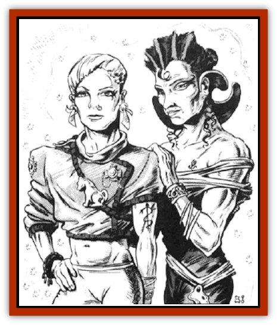

# Reigar

| Statistic | **Reigar** |
| --- | --- |
| **Activity Cycle:** | Mainly day |
| **Alignment:** | Chaotic neutral |
| **Armor Class:** | 2 |
| **Climate/Terrain:** | Any |
| **Damage/Attack:** | See below |
| **Diet:** | Omnivore |
| **Frequency:** | Very rare |
| **Hit Dice:** | 14 |
| **Intelligence:** | Supra-genius (19-20) |
| **Magic Resistance:** | 45% |
| **Morale:** | Fanatic (17-18) |
| **Movement:** | 12 |
| **No. Appearing:** | 1 |
| **No. of Attacks:** | 2 |
| **Organization:** | Solitary |
| **Size:** | M (6-7' tall) |
| **Special Attacks:** | Magic use, shakti |
| **Special Defenses:** | Magic use, shakti |
| **THAC0:** | 7 |
| **Treasure:** | Any |
| **XP Value:** | 6,000 |

The reigar are a near-legendary race, only rarely encountered by the average spacefaring adventurer. They are famed for their artistic prowess and fabulous command of craftsmanship.

As a people, the reigar are androgynous. Their men are very beautiful and their women are extremely handsome. They are of tall human proportions, willowy of build, with reddish-blond hair. Their natural beauty is augmented by the halo or glory surrounding each reigar. This glory is a cloud of twinkling, glittering motes that change color in random patterns. Some rumors say that this glory is lighter in color when the reigar is pleased, and darker when one is displeased. This has yet to be fully documented. This glory contributes to the reigar's tough Armor Class and high magic resistance.

**Combat:** Reigar prefer not to enter into combat personally, as their time is better spent in artistic pursuits (naturally). If attacked, they first send in their helots ([[Golem_General_Information|golem]]-like creatures that have the same attacks as their organic counterparts: AC 2, MV by creature type, HD by creature type +2, unaffected by *sleep* and *charm* spells; helots do not have any special abilities or spell-like abilities their organic forms may possess). If that fails, they call in the [[Lakshu|lakshu]]. Only if the lakshu fail to defeat the opponents does a reigar deign to go toe-to-toe, as it were, with the attackers. And when it does, several hells break loose.

In combat the reigar use an item called a *shakti*. This is a small (palm-sized) statuette that resemble a *figurine of wondrous power* (an item rumored to have been first create by a reigar). Each shakti is designed by and for its user, rendering each one effectively a unique item. A shakti has three purposes, or forms.

First, there is its dormant form. In this state, it may be worn around the neck on a chain or cord, or hung from a kirtle or belt, or carried in a pouch or bag. Its shape is reminiscent of an animal or creature: a [[Cat_Great|panther]], a [[Dragon_General_Information|dragon]], a [[Phoenix|phoenix]], etc.

On a command word known only to the creator/user, this form transmutes into a mode of transportation. The size increases to roughly eight feet long, and the shape changes to that of the creature depicted, lying prone. The reigar may sit or stand on the shakti in this form, and by mental command will it to move or stop. This form has a movement rate of 18 and an AC of -2.

On a second command word (also, of course, known only to the creator/user), the shakti transforms into a suit of armor and an accompanying weapon. The armor is reminiscent of the animal represented by the shakti's dormant form, as is the special attack it bestows on its wearer. The weapon can be anything from a sword to a trident to a weighted net (use weapons tables from the Complete Fighter's Handbook for ideas), and there is always a magical effect released in tandem with the attack. This may be merely for flash and effect, or it may relate to the damage caused. For example, a sword might emit a shower of colored light when swung at an opponent, but inflict no extra damage, or a net might paralyze a trapped victim.

The armor is always made of a metal known only to the reigar. It is harder than steel, with an Armor Class of 0 (not including any magical protections put into it by the creator). More often than not, the chest plate is decorated with an embossed head of the animal depicted by the shakti's form. As mentioned previously, this armor also bestows a special attack on its wearer. If the creature depicted is a panther, for instance, the attack might be a magical rending, performed by making a slashing motion with the arms. If the armor represents a dragon, the attack could be a simulation of that dragon's breath weapon, activated by placing the wrists together with the palms facing outward. These details are left up to the DM to create.

A third command word returns the shakti to its dormant form from either of the other forms.

Reigar shaktis work only for their creators. Should anyone else gain possession of a shakti by way of theft (not likely) or spoils of battle (less likely), that shakti is inoperable. However, it is possible that a reigar might create a gift-shakti for an adventurer who does something very, very important for the reigar - like save his life, or provide transportation (see the "Ecology" section). This kind of gift-shakti, though, is far less powerful - capable of making only one kind of transformation, no more than once per day: to vehicle, armor, or weapon (roll 1d6: 1-2 is vehicle, 3-4 is armor, 5-6 is weapon). Again, final say is up to the DM.

**Habitat/Society:** Legend has it that this race taught the [[Elf|elves]] everything they know about creating beautiful items - and the elves forgot most of it. Supposedly they also taught the [[Dwarf|dwarves]] the same arts - with the same results. Their love of creation for its own sake was also given to the [[Gnome_Tinker|tinker gnomes]] of Krynn, or so it is said. (However, the gnomes did not retain the reigar's love of beauty - they seized on the creative process and took it to a technical extreme.) It is rumored that the reigar built the first spelljamming helm, and never repeated the act. Their mottoes are "Art for for art's sake" and "The ends always justify the means."

While reigar are visually stunning to begin with, they are experts at heightening their already striking appearance.

Hairstyles are an expression of individuality and, of course, artistic creativity. Men and women both may wear short or long tresses, highly decorated or intricately styled or both. They ornament themselves with fine jewelry of their own making, exquisite raiment of their own design. Facial makeup and tattoos for both sexes are not uncommon. This is not a function of class status or of wealth. It is merely a fact of reigar life - one should always strive to outdo everyone else in all aspects of life, and do it with style, beauty, and elan. Their passion fpr artistic creativity extends to all aspects of their lives.

Reigar are consummate users of magical spells, especially those that enhance the creative process. Items such as *Nolzur's marvelous vestments* and the *lyre of building* are particular favorites. In game terms, reigar are not limited to any particular school, but illusions are not likely to be in their repertoire - reigar consider it gauche to create something that isn't real. Any spell can be considered to have artistic merit; it all depends on the time and place. For example, offensive spells like *cloudkill* afford the artistic caster a greater enjoyment of his opponents' deaths - rather than frying instantly, as with a *fireball*, the poor wretches choke, writhe, gasp - and beg. To a reigar, this is art at its best.

The reigar as a race have been without a homeworld for millennia. The rumors reason: Their pursuit of art for art's sake led them to the total destruction of their world, using means of warfare never heard of before or since. The search for the ultimate artistic expression of war was carried out by reigar who were off-world in their [[Esthetic|esthetics]], with no regard for those remaining on the ground. This is a classic example of the reigar code of conduct - "Anything for art, nothing without style, and everyone for himself". Since this decimation of the race, and the destruction of the homeworld, the few remaining reigar have been wandering from sphere to sphere in search of artistic inspiration.

The esthetics are biological in nature, having been created by reigan wizards in the time of the Master Stroke (see the "[[Esthetic|Esthetic]]" entry for details). It is not known for certain whether they can be propagated, or how this could be done should an esthetic be destroyed. Each esthetic will have no more than one reigar on board, but there is a crew of helots and lakshu to take care of the mundane tasks.

The reigar are the source of many a legend in the universe. It is said that, in addition to teaching the elves and dwarfs everything they know about craftsmanship, they are suppliers for the [[Arcane|arcane]]. This is unlikely, as it implies repetition in creation, a bane to reigar. Art is not a repetitive process. A reigar may well have created the first spelljamming helm, but he would not have gone on to mass-produce them. That would quell his artistic expression and prevent him from pursuing the ultimate artistic experience.

Another tale told about the reigar concerns their relationships with other races. The arcane, who look on all other races with total disdain, are said to bow to the reigar and do as the reigar tell them, without question. Similar rumors exist about the [[Mind_Flayer|mindflayers]], but these have been hotly denied by any mindflayer questioned on the subject. Still other legends would have the listener believe that the reigar created these races themselves, as an expression of their creativity and artistic license. Some go so far as to credit the reigar with the creation of humans - denied as hotly by humans as the rumor about mindflayers is crushed by that species. The [[Neogi|neogi]] refer to reigar as "damn liars". One race the reigar are never credited with creating is the [[Clockwork_Horror|clockwork horrors]]: Reigar detest these life forms as "bad art" and refer to them as "springheads".

**Ecology:** Depending on which rumors are believed, the reigar have either had a significant effect on their environment (aside from blowing up their own planet, of course) - or they have done nothing but make pretty trinkets. The only unquestionable fact is that they did destroy their homeworld, and did so with weapons more powerful than can be imagined in present times. No one knows for certain whether that knowledge is retained by the reigar still in existence, but if it is, it could be very, very valuable to anyone, and dangerous in the extreme (especially in the wrong hands - like neogi hands).

Reigar are sell-sufficient, obtaining their needs from their esthetics. These esthetics provide not only shelter and defenses, but nourishment and entertainment. Their crews of helots and lakshu are also sustained by the esthetics.

It is possible that a reigar could be commissioned to create an item for an adventurer or a party but the cost would be astronomical (no pun intended). There is very little a normal adventurer could have that would interest a reigar (except transport; see the "[[Esthetic|Esthetic]]" entry), but flattery goes a long way toward successful negotiation.

**Sample Shakti Statistics**

Here are three known shaktis: the panther, the phoenix, and the dragon. Use this as template for creating more as the need arises.

| Panther | Vehicle | Armor and Weapon |
| --- | --- | --- |
| Armor Class: | 2 | 0 |
| Maneuverability Class: | C | N/A |
| Hit Points: | 50 | N/A |
| Movement: | 36 | N/A |
| Size: | L (8' long) | L (8' tall) |
| Damage: | N/A | 2d6/2d6 slashing damage; long sword +3 |

| Phoenix | Vehicle | Armor and Weapon |
| --- | --- | --- |
| Armor Class: | 2 | 0 |
| Maneuverability Class: | B | N/A |
| Hit Points: | 50 | N/A |
| Movement: | 39 | N/A |
| Size: | L (8' long) | L (8' tall) |
| Damage: | N/A | 3d6 fireball, 30-yard range, 20' radius; mancatcher |

| Dragon | Vehicle | Armor and Weapon |
| --- | --- | --- |
| Armor Class: | 2 | 0 |
| Maneuverability Class: | B | N/A |
| Hit Points: | 50 | N/A |
| Movement: | 48 | N/A |
| Size: | L (8' long) | L (12' tall) |
| Damage: | N/A | 4d6+2 acid breath weapon (spurt 70' long, 5' wide); war hammer +5 |

---
## Discovery & Documentation

**Source Publication:** MC7 Spelljammer Appendix I (1990)
**Campaign Setting:** Advanced Dungeons & Dragons 2nd Edition
**Author(s):** various

### Other Creatures Found in This Source Book
   * [[Aartuk|Aartuk]]
   * [[Albari|Albari]]
   * [[Ancient_Mariner|Ancient Mariner]]
   * [[Argos|Argos]]
   * [[Beholder_Abomination_Astereater|Beholder (Abomination), Astereater]]
   * [[Blazozoid|Blazozoid]]
   * [[Chattur|Chattur]]
   * [[Chevall|Chevall]]
   * [[Clockwork_Horror|Clockwork Horror]]
   * [[Colossus|Colossus]]
   * [[Delphinid|Delphinid]]
   * [[Dizantar|Dizantar]]
   * [[Dog|Dog]]
   * [[Dog_Bog_Hound|Dog, Bog Hound]]
   * [[Esthetic|Esthetic]]
   * [[Focoid|Focoid]]
   * [[Fractine|Fractine]]
   * [[Giant_Spacesea|Giant, Spacesea]]
   * [[Golem_Furnace|Golem, Furnace]]
   * [[Golem_Radiant|Golem, Radiant]]
   * [[Gravislayer|Gravislayer]]
   * [[Grommam|Grommam]]
   * [[Hadozee|Hadozee]]
   * [[Hamster_Giant_Space|Hamster, Giant Space]]
   * [[Jammer_Leech|Jammer Leech]]
   * [[Lakshu|Lakshu]]
   * [[Lumineaux|Lumineaux]]
   * [[Lutum|Lutum]]
   * [[Mimic_Space|Mimic, Space]]
   * [[Misi|Misi]]
   * [[Moon_Rogue|Moon, Rogue]]
   * [[Mortiss|Mortiss]]
   * [[Murderoid|Murderoid]]
   * [[Nay-Churr|Nay-Churr]]
   * [[Phlog-Crawler|Phlog-Crawler]]
   * [[Plasman|Plasman]]
   * [[Plasmoid_DeGleash|Plasmoid, DeGleash]]
   * [[Plasmoid_DelNoric|Plasmoid, DelNoric]]
   * [[Plasmoid_General_Information|Plasmoid, General Information]]
   * [[Plasmoid_Ontalak|Plasmoid, Ontalak]]
   * [[Puffer|Puffer]]
   * [[Q'nidar|Q'nidar]]
   * [[Rastipede|Rastipede]]
   * [[Rock_Hopper|Rock Hopper]]
   * [[Slinker|Slinker]]
   * [[Spider_Asteroid|Spider, Asteroid]]
   * [[Spiritjam|Spiritjam]]
   * [[Survivor|Survivor]]
   * [[Syllix|Syllix]]
   * [[Symbiont_Power|Symbiont, Power]]
   * [[Vine_Infinity|Vine, Infinity]]
   * [[Wiggle|Wiggle]]
   * [[Wizshade|Wizshade]]
   * [[Wryback|Wryback]]
   * [[Zard|Zard]]
   * [[Zodar|Zodar]]
