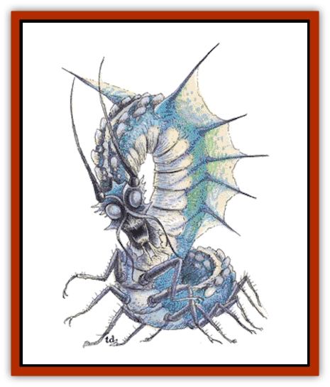

# Remorhaz

| Statistic | **Remorhaz** |
| --- | --- |
| **Activity Cycle:** | Day |
| **Alignment:** | Neutral |
| **Armor Class:** | Overall 0, head 2, underbelly 4 |
| **Climate/Terrain:** | Arctic plain |
| **Damage/Attack:** | Bite: / 7-8 HD: 4-24 / 9-12 HD: 5-30 / 13-14 HD: 6-36 |
| **Diet:** | Carnivore |
| **Frequency:** | Very rare |
| **Hit Dice:** | 7-14 |
| **Intelligence:** | Animal (1) |
| **Magic Resistance:** | 75% |
| **Morale:** | Elite (13-14) |
| **Movement:** | 12 |
| **No. Appearing:** | 1 |
| **No. of Attacks:** | 1 |
| **Organization:** | Solitary |
| **Size:** | G (21-42' long) |
| **Special Attacks:** | Swallow whole, heat lash |
| **Special Defenses:** | Melt metal |
| **THAC0:** | 7-8 HD: 13 / 9-10 HD: 11 / 11-12 HD: 9 / 13-14 HD: 7 |
| **Treasure:** | D |
| **XP Value:** | 5,000 (+1000 per Hit Die over 9) |

Remorhaz, sometimes known as *polar worms*, inhabit only chill arctic wastes. They are very aggressive predators that devour any animal matter, including humans, demihumans, and humanoids; they have even been known to attack [[Giant_Frost|frost giants]].

A remorhaz has a segmented body with a winged head and neck, standing on dozens of chitinous legs. Remorhaz have an ice blue color everywhere except on their backs, where a streak of white sets off the many protrusions located there. The size of a remorhaz is determined by its Hit Dice: a 7 Hit Dice remorhaz is 21 feet long, an 8 Hit Dice creature is 24 feet long, etc. Their language consists of roaring, bellowing, and howling.

**Combat:** In combat the remorhaz beats its small wings, raising up the front quarter of its body. It then snaps itself forward, striking with blinding speed. They are able to swallow prey whole on an unmodified attack roll of 20; any victim swallowed is killed instantly by the intense heat inside the creature. When aroused, the remorhaz secretes a substance that causes its intestines to become very hot and its back protrusions actually glow cherry red from excess heat. Any nonmagical weapon melts from contact with its back and any creature touched by these surfaces suffers 10-100 points of damage.

To determine where a blow has struck a remorhaz, consider where the attacker is in respect to the remorhaz. While the remorhaz is rearing to attack, a blow from the front hits the relatively soft underbelly. When the remorhaz is attacking a creature, any blow inflicted hits the head unless the underside is specifically stated as the object of the attack. In all other cases, the body is the object of the attack, subject to adjudication by the DM.

Remorhaz are slower than most polar dwellers, so they prefer to burrow into the snow and surface when they hear prey nearby, hoping to achieve surprise. Remorhaz have infravision to 60 feet.

**Habitat/Society:** A remorhaz lair usually consists of a number of large, smoothly rounded tunnels in ice and snow or rock, gradually descending to a large central chamber. Tunnels in ice and snow will be very slippery, as the remorhaz's hot back repeatedly melts the snow, leaving it to refreeze. The central chamber is only about twice the size of a remorhaz, while the central chamber of a nesting pair is about four times their size and may contain icy stalactites.

Remorhaz have a hunting range of 60 miles. Except where the game has been hunted to extinction, these creatures tolerate the presence of other remorhaz in their hunting grounds.

**Ecology:** Remorhaz are carnivores, sustaining themselves with a diet of deer, elk, and even [[Bear|polar bears]]. They mate in late summer and stay together for two months before departing to live solitary existences. Remorhaz mate every year but can produce offspring only three or four times in a lifetime; the female lays a clutch of one or two grey-blue eggs, remaining with the eggs at all times, coiling around them to keep them warm; if the eggs are left in the freezing cold for only one minute, they will never hatch. Young remorhaz have 1 Hit Die at birth and grow to 7 Hit Dice after four months, when they leave the nest. Immature remorhaz have weaker armor (+2 AC in all locations); 1-3 Hit Dice remorhaz can only bite for 2-12 points of damage, while 4-6 Hit Dice creatures inflict 3-18 points of damage. From birth, the young remorhaz have all the powers of an adult.

Remorhaz have lifespans of 30 years. Their eggs are valued at 500 gold pieces and are eagerly sought because these creatures can be trained to be excellent guards. However, a remorhaz can be trained to obey only one or two masters, and will attack its master if hungry enough. The heat secretion of a rhemorhaz, thrym, is valuable as a component for heat-related magical items and can be sold to alchemists for 5-10 gold pieces per flask. The remorhaz will contain 10 flasks worth of thrym per Hit Die.

---
## Discovery & Documentation

**Source Publication:** MC1 Volume I (w/binder #1) (1991)
**Campaign Setting:** Advanced Dungeons & Dragons 2nd Edition
**Author(s):** Jay Batista, Scott Bennie, Grant Boucher, William W. Connors, Steve Gilbert, Heike Kubasch, James Lowder, David Edward Martin, Bruce Nesmith, Jean Rabe, Rick Swan, John J. Terra, Gary L. Thomas

### Other Creatures Found in This Source Book
   * [[Bat|Bat]]
   * [[Bear|Bear]]
   * [[Behir|Behir]]
   * [[Boar|Boar]]
   * [[Bookworm|Bookworm]]
   * [[Brownie|Brownie]]
   * [[Bugbear|Bugbear]]
   * [[Carrion_Crawler|Carrion Crawler]]
   * [[Cat_Great|Cat, Great]]
   * [[Catoblepas|Catoblepas]]
   * [[Dragon_General_Information|Dragon, General Information]]
   * [[Dragonfish|Dragonfish]]
   * [[Elemental_Air_Kin_Aerial_Servant|Elemental, Air Kin, Aerial Servant]]
   * [[Elemental_Earth_Kin_Sandling|Elemental, Earth Kin, Sandling]]
   * [[Elephant|Elephant]]
   * [[Gnoll|Gnoll]]
   * [[Hobgoblin|Hobgoblin]]
   * [[Homunculus|Homunculus]]
   * [[Hornet_Giant|Hornet, Giant]]
   * [[Horse|Horse]]
   * [[Hyena|Hyena]]
   * [[Jackal|Jackal]]
   * [[Jackalwere|Jackalwere]]
   * [[Korred|Korred]]
   * [[Lich|Lich]]
   * [[Lizard|Lizard]]
   * [[Lizard_Man|Lizard Man]]
   * [[Lycanthrope_General_Information|Lycanthrope, General Information]]
   * [[Lycanthrope_Seawolf|Lycanthrope, Seawolf]]
   * [[Lycanthrope_Werebear|Lycanthrope, Werebear]]
   * [[Lycanthrope_Weretiger|Lycanthrope, Weretiger]]
   * [[Lycanthrope_Werewolf|Lycanthrope, Werewolf]]
   * [[Manticore|Manticore]]
   * [[Medusa|Medusa]]
   * [[Mind_Flayer|Mind Flayer]]
   * [[Minotaur|Minotaur]]
   * [[Mudman|Mudman]]
   * [[Mummy|Mummy]]
   * [[Nixie|Nixie]]
   * [[Nymph|Nymph]]
   * [[Ogre|Ogre]]
   * [[Ooze_Slime_Jelly_I|Ooze/Slime/Jelly I]]
   * [[Ooze_Slime_Jelly_II|Ooze/Slime/Jelly II]]
   * [[Orc|Orc]]
   * [[Owl|Owl]]
   * [[Owlbear_I|Owlbear I]]
   * [[Pegasus|Pegasus]]
   * [[Piercer|Piercer]]
   * [[Pudding_Deadly|Pudding, Deadly]]
   * [[Rakshasa|Rakshasa]]
   * [[Rat|Rat]]
   * [[Ray|Ray]]
   * [[Satyr|Satyr]]
   * [[Scorpion|Scorpion]]
   * [[Selkie|Selkie]]
   * [[Shadow|Shadow]]
   * [[Skeleton|Skeleton]]
   * [[Skunk|Skunk]]
   * [[Snake|Snake]]
   * [[Spectre|Spectre]]
   * [[Spider|Spider]]
   * [[Sprite|Sprite]]
   * [[Toad_Giant|Toad, Giant]]
   * [[Treant|Treant]]
   * [[Troll|Troll]]
   * [[Umber_Hulk|Umber Hulk]]
   * [[Unicorn|Unicorn]]
   * [[Vampire|Vampire]]
   * [[Wight|Wight]]
   * [[Will_O'Wisp|Will O'Wisp]]
   * [[Wolf|Wolf]]
   * [[Wolfwere|Wolfwere]]
   * [[Wraith|Wraith]]
   * [[Wyvern|Wyvern]]
   * [[Yeti|Yeti]]
   * [[Yuan-ti|Yuan-ti]]
   * [[Zombie|Zombie]]
