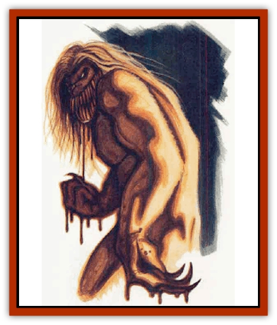

# Render

| Statistic | **Render** |
| --- | --- |
| **Activity Cycle:** | Any |
| **Alignment:** | Chaotic evil |
| **Armor Class:** | -3 |
| **Climate/Terrain:** | Any |
| **Damage/Attack:** | 1d10/1d10/2d10 |
| **Diet:** | Carnivore |
| **Frequency:** | Unique |
| **Hit Dice:** | 13 (104 hit points) |
| **Intelligence:** | High (14) |
| **Magic Resistance:** | 30% |
| **Morale:** | Fearless (20) |
| **Movement:** | 24 |
| **No. Appearing:** | 1 |
| **No. of Attacks:** | 3 |
| **Organization:** | Solitary |
| **Size:** | L (9' tall) |
| **Special Attacks:** | Rending, berserk fury, surprise |
| **Special Defenses:** | Regeneration, + 1 or better weapon to cause normal damage, silver or iron weapons cause 1 point of damage, spell immunities, fear gaze |
| **THAC0:** | 7 |
| **Treasure:** | Nil |
| **XP Value:** | 19,000 |

Created deep within the experimental labs of Darkhold, the render is without a doubt one of the most savage creatures to ever walk the face of Faer�n. The render was created completely by accident, and efforts to duplicate the experiment that brought life to the beast have since met with failure.

The fearless render is an imposing 9 feet of muscles, sinews, claws, and teeth. The creature has deep black, short fur that covers its entire body and is matted down with a slimy, sweatlike secretion. The teeth of the render are between 5 and 9 inches long, and razor sharp. The beast's claws are equally as long, and are often caked with the remains of its last victim. The most unnerving thing about the render is its glowing amber eyes. They seem to strike fear in its victims only moments before they die. The creature has a deep hatred of all life, and kills without mercy or remorse.

**Combat:** The render is one of the most savage, feral, deranged creature in the Realms, and likely the most deadly creature in the Heartlands. It is incredibly quick for its size, and imposes a -2 penalty to all surprise rolls when not encountered on open ground. The render has 60-foot infravision. In addition, anyone glancing into the creature's amber eyes must make a successful saving throw vs. paralyzation or be rooted in place by incredible fear and unable to act for 13 rounds (or until the fear is dispelled). The render attacks with its two claws and fierce bite, and if all three of the attacks are successful, the victim suffers an additional 2d10 points of damage as the beast rends and shreds its prey.

The render's greatest advantage is its ability to regenerate hit points. The monstrosity regains 4 hit points per round, and double that if the creature is in a berserk fury. The beast's regeneration is similar to that of a [[Troll|troll]], and it regenerates even if reduced below -10 hit points. Only electrical damage can permanently kill the render. When it is brought to -10 hit points, over half of the damage done to it must have been electrical for it to be dead and not regenerate.

The creature's magic resistance is considerable at 30%, and it is immune to all poisons, *charm*-type enchantments, and *hold* spells. Normal weapons cannot strike the render. Silver and cold iron weapons have a minimal effect on the creature, inflicting only 1 point of damage per successful strike. Magical weapons do normal damage.

If the creature is somehow brought to below half of its hit points, it throws itself into a berserk fury, gaining double its normal number of attacks and reducing its Armor Class to -4. So brutal are the attacks of the render that if an opponent sustains more than 40 points of damage in one round and is not already dead, the victim must make a successful saving throw vs. death magic or be instantly reduced to 0 hit points - and at the mercy of the creature.

**Habitat/Society:** The creation of the render was an accident. The beast is an unholy combination of a summoned [[Tanar'ri_General_Information|tanar'ri]] and a human prisoner of the Zhentarim. While nefariously allowing the tanar'ri to kill a prisoner for pleasure, a Zhentarim wizard miscast an unknown spell from a scroll. The spell killed the wizard and joined together the tanar'ri and the dying human. The resulting creature killed hundreds of Zhents in Darkhold before escaping into the Far Hills to the south of the citadel, where it has hunted ever since. The render has no memory of its former lives. As far as it is concerned, its existence began in the dungeons of Darkhold.

The creature is in constant pain from its unholy union. The only way it knows to temporarily relieve this pain is to kill and consume prey - thus the render is a constantly active eating machine. Since the creature fears nothing, it is truly deadly.

The Zhentarim are desperate to capture the render, but all attempts to do so thus far by Zhentarim wizards and Zhentilar troops have caused twoscore casualties and met with no success.

**Ecology:** The render knows nothing but pain and the need to eat. The beast's stomach can digest anything organic, and it cares nothing about the freshness of its meal. The beast needs to eat a minimum amount of twice per day, though it will eat more frequently for the sheer pleasure of it. The render is presently unique and has no way to perpetuate its species.

---
## Discovery & Documentation

**Source Publication:** Ruins of Zhentil Keep (1995)
**Campaign Setting:** Forgotten Realms
**Author(s):** John Terra and Kevin Melka

### Other Creatures Found in This Source Book
   * [[Banedead|Banedead]]
   * [[Banelich|Banelich]]
   * [[Burnbones|Burnbones]]
   * [[Elemental_Nature|Elemental, Nature]]
   * [[Gargoyle_Guardgoyle|Gargoyle, Guardgoyle]]
   * [[Golem_Magic|Golem, Magic]]
   * [[Golem_Vault_Guardian|Golem, Vault Guardian]]
   * [[Hybsil|Hybsil]]
   * [[Magedoom|Magedoom]]
   * [[Mist_Scarlet_Dancer|Mist, Scarlet Dancer]]
   * [[Orc_Ondonti|Orc, Ondonti]]
   * [[Rat_Zhentish_Sewer|Rat, Zhentish Sewer]]
   * [[Sacaanti|Sacaanti]]
   * [[Snake_Messenger|Snake, Messenger]]
   * [[Zhentarim_Spirit|Zhentarim Spirit]]
