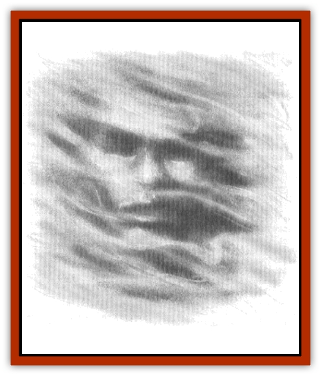
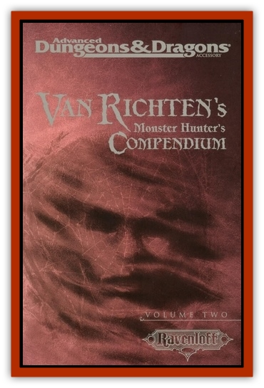

# Resident

| Statistic | **Resident** |
| --- | --- |
| **Activity Cycle:** | Any |
| **Alignment:** | Lawful Neutral |
| **Armor Class:** | 0 |
| **Climate/Terrain:** | Any |
| **Damage/Attack:** | 1d6/1d6 |
| **Diet:** | None |
| **Frequency:** | Rare |
| **Hit Dice:** | 6 |
| **Intelligence:** | Average (8-10) |
| **Magic Resistance:** | 25% |
| **Morale:** | Fanatic (18) |
| **Movement:** | Fly 18 (A) |
| **No. Appearing:** | 1 |
| **No. of Attacks:** | 2 |
| **Organization:** | Solitary |
| **Size:** | M |
| **Special Attacks:** | Keen of despair, freezing grasp |
| **Special Defenses:** | Can be hit only with magical weapons, invisibility at will, immune to certain attack forms |
| **THAC0:** | 12 |
| **Treasure:** | None |
| **XP Value:** | 3,000 |

A resident is a tormented soul, doomed to exist among the living until it can find self-forgiveness. In life, a resident was a person who was offered true love, but lacked the courage or conviction to accept the blessing and thus lost it, becoming embittered.

A typical "resident" tale tells of a lad named Jonas, who met a woman on a chance encounter. He befriended her and became very fond of her as time passed. Then she met a suitor who seemed to make her very happy. Jonas, unwilling to face up to the obligations of marriage but also unwilling to end their relationship, watched as his true love married her suitor and raised a family. Jonas tried to bury his anger, jealousy, and self-hatred, but he was unable to forgive himself and move on with his life. His corrupt spirit carried on his rage after his death. His "resident spirit" now inhabits the overgrown ruins of his love's cottage, where he used to visit her. Few living folk come here as the cottage is widely known to be haunted.

A resident is usually invisible even when it attacks, but it can choose to appear as a soundless, vaporous apparition of manlike shape. In general, it haunts a fixed location, usually a place where its love once lived or where the two met in life. However, should it discover someone who strongly resembles its lost love, the resident often abandons its vigil and proceeds to follow this surrogate love, who will never be harmed. It seeks not to impose its own will on the world, but instead seeks a focus for its existence. In direct melee, a resident only attacks if its surrogate is in trouble. It still follow the rules by which it lived in life, in that it allows its love to lead his or her own life and defeat ordinary challenges without interference.

Although an unattached resident usually remains close to home, it also walks among the living to remind itself of what could have been. Thus, its faith in its curse is renewed. It is a driven creature, clinging to self-hatred and anger, quick to offer love and devotion, and quick to defend its beloved surrogate.

A surrogate can detect a resident's presence from its small deeds. For example, if a bed is left unmade, the surrogate might return later to find that someone has done the chore. If the surrogate expresses a desire to have a certain trinket or other small item, that person might later find the desired item resting on a bed pillow. In determining its ability to move objects, consider the resident as effective as an *unseen servant* spell.

A resident is also a protector of its love, and it seeks vengeance on anyone who troubles the surrogate, particularly if the offender is beyond the surrogate's reach. If a noble speaks a harsh word to a resident's love, the noble risks retribution from the resident, often in the form of a single, one-round attack. To annoy a surrogate is to risk punishment; to gain its hatred by harming its beloved is to court death.

**Combat:** A resident can attack with its ghostly hands, inflicting 1d6 points of cold damage per strike. This is its usual attack against those it wishes to punish or drive away, but sees no need to kill. If it so chooses, however, it can also attempt to grasp a victim (two successful attack rolls are required). A grasp immediately inflicts 1d8 points of cold damage per round, as well as draining 1 point from either Strength, Dexterity, or Charisma (select randomly each round). Ability points are recovered at a rate of 1 per hour of rest. A victim drained of all ability points in any score dies at once, but will not come back as an undead being. Once the victim is grasped, the resident need not make another attack roll to continue damaging the opponent every round afterward. The resident will not relent in its attack unless its beloved surrogate is in danger (drawing its attention to someone else), or the resident is chased away.

The resident cannot be hit except by magical weapons. It is immune to *sleep*, *charm*, *hold*, cold, poison, and death magic. Holy water does 2d4 points of damage to it. Striking at a resident that is grasping a victim will inflict damage on the victim instead unless the attack roll is at least 4 points over the score needed to hit the resident. Any other result means the victim instead was struck, if the score rolled was sufficient to pierce the victim's Armor Class. A priest can turn a resident as a wraith; any result of turning or destruction causes the resident to flee or be dispersed for 2d6 days, after which it will return (see later).

A resident can be temporarily exorcised by defeating it in combat (including the use of holy water) or by a *remove curse* spell. Once all its hit points are gone or the spell is cast, the resident disperses or flees for 2d6 days. There is a 25% chance if *remove curse* is cast that the resident instead becomes enraged and attacks to kill the spellcaster and all other party members except the surrogate (50% chance), or else emits a keening wail of despair that will paralyze all within 60 feet of it for 1d6 rounds (save vs. paralyzation allowed) before it flees for 2d6 days (50% chance). Only if the resident is confronted with evidence that its surrogate does not wish it around, and an *atonement* spell is cast on it, will the resident be permanently removed from the world.

Note that if a hero becomes aware that he or she has become the focus of a resident's misplaced affection, allowing such a relationship to continue without intervention will soon call for a powers check.

**Habitat/Society:** A resident cannot communicate except through magical means such as a *speak with dead* spell, but it has little interest in anyone but the subject of its affections. A resident roams about a fixed location such as a building or grave site of importance to it in life, unless it is distracted by a surrogate.

**Ecology:** A resident has very little effect on either nature or civilization. It consumes nothing and almost never harms living beings unless its loved one is endangered. It is primarily an annoyance.

---
## Discovery & Documentation

**Source Publication:** Van Richten's Monster Hunter's Compendium, Volume Two (1999)
**Campaign Setting:** Ravenloft
**Author(s):** William W. Connors, Eric W. Haddock, Skip Williams, David Wise, David Wu

### Other Creatures Found in This Source Book
   * [[Lich_Psionic|Lich, Psionic]]
