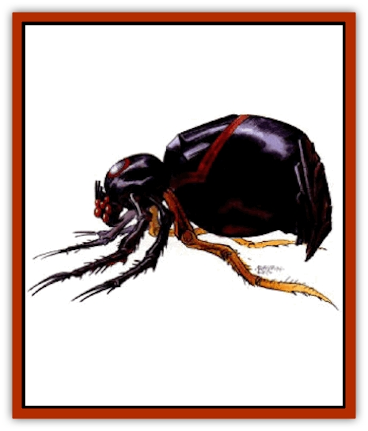

# Retriever - Obsidian

| Statistic | **Retriever, Obsidian** |
| --- | --- |
| **Activity Cycle:** | Any |
| **Alignment:** | Neutral evil |
| **Armor Class:** | -2 |
| **Climate/Terrain:** | Any |
| **Damage/Attack:** | 3d6 (&times;4) |
| **Diet:** | Omnivore |
| **Frequency:** | Very rare |
| **Hit Dice:** | 11 |
| **Intelligence:** | Non (0) |
| **Magic Resistance:** | 20% |
| **Morale:** | Elite (15-16) |
| **Movement:** | 18 |
| **No. Appearing:** | 1 |
| **No. of Attacks:** | 4 |
| **Organization:** | Solitary |
| **Size:** | L (10' tall) |
| **Special Attacks:** | Magic |
| **Special Defenses:** | Spell immunity |
| **THAC0:** | 9 |
| **Treasure:** | Z |
| **XP Value:** | 9,000 |

While at first this creature appears to be some form of [[Spider|spider]], the obsidian retriever is the product of some ancient Athasian sorcery long lost to the known realm.

The obsidian retriever appears similar to the extra-planar creature known as the [[Retriever|retriever]] and might be the result of some ancient magical experiment gone awry. The obsidian retriever is an [[Golem_Athas_II|obsidian stone golem]] in the shape of a spider. The obsidian retriever's four front legs end in barbed needlelike appendages. It has six eyes, two are used for vision and four are imbued with magical attacks.

**Combat:** The obsidian retriever sits motionless as long as the guarded objects are untouched by thieves. If the treasure is threatened, the retriever immediately attacks. The obsidian retriever is single-minded and relentless in its attack on intruders. Initially the creature attacks with the powers in one of its four magical eyes. Each of the eyes contains powers associated with one of the four elemental spheres of magic (earth, air, fire, and water). These powers are *flesh to stone* (earth), *sand storm* (air), *fireball* (fire), and *ice storm* (water). These abilities have the same effects as the spells of the same names and are cast as if by a 15th level spellcaster. Once used, each eye needs 5 rounds to recharge.

The obsidian retriever also can rear up on its back legs and attack with all four of its barbed appendages for 3-18 (3d6) points of damage each. These attacks can be focused on one opponent or can be used against different targets simultaneously. If all four legs hit the same target in one round, the victim is locked in the retriever.s needle like legs. If the victim falls a save vs. breath weapon, he receives another 4-24 (4d6) points of damage per round. The victim receives this saving throw every round of the embrace. To escape, the victim needs a successful Bend Bars/Lift Gates roll.

If a thief escapes with a guarded item, the obsidian retriever relentlessly pursues the perpetrator. The retriever has the innate ability to *locate object* and *find path* at will. The retriever's primary objective is to find and return the stolen item. Anyone who interferes with this goal is attacked.

The obsidian retriever is immune to all mind affecting spells. Fire-based spells and bladed weapons cause only half damage. Weapons must be +2 or better to hit these golems. Lightning-based and electrical-based attacks cause double damage. *Rock to mud* slows a retriever for 2-12 (2d6) rounds. Blunted weapons have a +1 modifier to their damage because of the brittle nature of the obsidian from which these creatures are formed.

**Habitat/Society:** As magical constructs, these beings have no place in any habitat on Athas. They are prized possessions of dragon kings and are controlled through the use of extraordnarily powerful psionic talents. They are also occasionally found in ancient ruins as guardians to whatever treasures such lost societies possessed. Obsidian retrievers take no action of their own accord. Retrievers must be ordered psionically to take a specific action or to guard a specific item. Even with the advantages of shared thought that psionics can afford, retrievers can only understand simple commands.

**Ecology:** Since the obsidian retriever is not a creature of the natural order, it has no place in any ecosystem on Athas. It neither eats nor sleeps and does not die unless destroyed. If the construct is damaged in combat it can heal if a special mud made from obsidian dust is spread across the damaged surfaces of the creature and a *mud to stone* spell is cast upon it.

---
## Discovery & Documentation

**Source Publication:** Dark Sun Appendix II - Terrors Beyond Tyr (1991)
**Campaign Setting:** Dark Sun
**Author(s):** Jim Atkiss, Steve Brown, Timothy B. Brown, Andrew P. Morris, Bruce Nesmith, Wes Nicholson, Bill Slavicsek

### Other Creatures Found in This Source Book
   * [[Aarakocra_Athas|Aarakocra (Athas)]]
   * [[Animal_Domestic_Athas_II|Animal, Domestic (Athas) II]]
   * [[Aviarag|Aviarag]]
   * [[Baazrag|Baazrag]]
   * [[Baazrag_Boneclaw|Baazrag, Boneclaw]]
   * [[Bloodgrass|Bloodgrass]]
   * [[Cactus_Hunting|Cactus, Hunting]]
   * [[Cactus_Rock|Cactus, Rock]]
   * [[Cilops|Cilops]]
   * [[Crodlu|Crodlu]]
   * [[Dagorran|Dagorran]]
   * [[Dhaot|Dhaot]]
   * [[Drake_Lesser_Athas_General_Information|Drake, Lesser (Athas), General Information]]
   * [[Drake_Lesser_Athas_Magma|Drake, Lesser (Athas), Magma]]
   * [[Drake_Lesser_Athas_Rain|Drake, Lesser (Athas), Rain]]
   * [[Drake_Lesser_Athas_Silt|Drake, Lesser (Athas), Silt]]
   * [[Drake_Lesser_Athas_Sun|Drake, Lesser (Athas), Sun]]
   * [[Dray|Dray]]
   * [[Drik|Drik]]
   * [[Dune_Reaper|Dune Reaper]]
   * [[Dwarf_Athas|Dwarf (Athas)]]
   * [[Elemental_Beast_Athas_Air|Elemental Beast (Athas), Air]]
   * [[Elemental_Beast_Athas_Earth|Elemental Beast (Athas), Earth]]
   * [[Elemental_Beast_Athas_Fire|Elemental Beast (Athas), Fire]]
   * [[Elemental_Beast_Athas_Water|Elemental Beast (Athas), Water]]
   * [[Elf_Athas|Elf (Athas)]]
   * [[Fael|Fael]]
   * [[Feylaar|Feylaar]]
   * [[Fordorran|Fordorran]]
   * [[Giant_Half-giant|Giant, Half-giant]]
   * [[Giant_Shadow|Giant, Shadow]]
   * [[Golem_Athas_Magma|Golem (Athas), Magma]]
   * [[Golem_Athas_Salt|Golem (Athas), Salt]]
   * [[Golem_Athas_General_Information|Golem (Athas), General Information]]
   * [[Gorak|Gorak]]
   * [[Halfling_Athas|Halfling (Athas)]]
   * [[Human_Athas|Human (Athas)]]
   * [[Jhakar|Jhakar]]
   * [[Kaisharga|Kaisharga]]
   * [[Kes'trekel|Kes'trekel]]
   * [[Klar|Klar]]
   * [[Krag|Krag]]
   * [[Kragling|Kragling]]
   * [[Lirr|Lirr]]
   * [[Mastyrial|Mastyrial]]
   * [[Meorty|Meorty]]
   * [[Mul|Mul]]
   * [[Nikaal|Nikaal]]
   * [[Paraelemental_Beast_General_Information|Paraelemental Beast, General Information]]
   * [[Paraelemental_Beast_Magma|Paraelemental Beast, Magma]]
   * [[Paraelemental_Beast_Rain|Paraelemental Beast, Rain]]
   * [[Paraelemental_Beast_Silt|Paraelemental Beast, Silt]]
   * [[Paraelemental_Beast_Sun|Paraelemental Beast, Sun]]
   * [[Pakubrazi|Pakubrazi]]
   * [[Psionocus|Psionocus]]
   * [[Psurlon|Psurlon]]
   * [[Raaig|Raaig]]
   * [[Ruktoi|Ruktoi]]
   * [[Ruvoka_Athas|Ruvoka (Athas)]]
   * [[Sand_Howler|Sand Howler]]
   * [[Scorpion_Athas|Scorpion (Athas)]]
   * [[Seed_Brain|Seed, Brain]]
   * [[Silt_Horror_Black|Silt Horror, Black]]
   * [[Silt_Horror_Magma|Silt Horror, Magma]]
   * [[Silt_Horror_Red|Silt Horror, Red]]
   * [[Silt_Spawn|Silt Spawn]]
   * [[Slig|Slig]]
   * [[Spider_Athas|Spider (Athas)]]
   * [[Spinewyrm|Spinewyrm]]
   * [[Ssurran|Ssurran]]
   * [[Stalking_Horror|Stalking Horror]]
   * [[Tarek|Tarek]]
   * [[Tari|Tari]]
   * [[Thri-kreen|Thri-kreen]]
   * [[T'liz|T'liz]]
   * [[Tohr-kreen_II|Tohr-kreen II]]
   * [[Tohr-kreen_III|Tohr-kreen III]]
   * [[Trin|Trin]]
   * [[Tul'k|Tul'k]]
   * [[Undead_Athas_General_Information|Undead (Athas), General Information]]
   * [[Wraith_Athas|Wraith (Athas)]]
   * [[Xerichou|Xerichou]]
   * [[Zombie_Thinking|Zombie, Thinking]]
