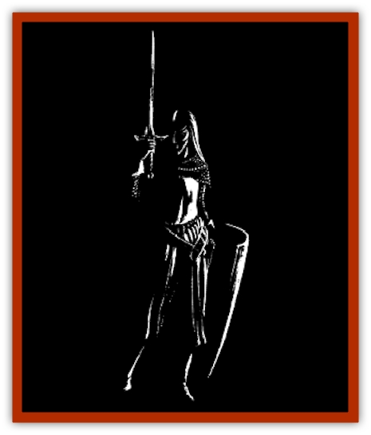

# Reverend One

| Statistic | **Reverend One** |
| --- | --- |
| **Activity Cycle:** | Any |
| **Alignment:** | Chaotic or neutral good |
| **Armor Class:** | 2 |
| **Climate/Terrain:** | Olympus, prime material plane |
| **Damage/Attack:** | 1-10 (x2) or by weapon |
| **Diet:** | None |
| **Frequency:** | Rare |
| **Hit Dice:** | 8+3 |
| **Intelligence:** | Average to high (9-14) |
| **Magic Resistance:** | 10% |
| **Morale:** | Fanatic (18) |
| **Movement:** | 15 |
| **No. Appearing:** | 10d10 |
| **No. of Attacks:** | 2 |
| **Organization:** | Band or army |
| **Size:** | M (6' tall average) |
| **Special Attacks:** | Destroy undead, enchanted weapons |
| **Special Defenses:** | Light armor |
| **THAC0:** | 12 |
| **Treasure:** | Nil |
| **XP Value:** | 3,000 |

There is much debate among [[Elf|elven]] scholars as to exactly what the reverend ones are. Some claim that they are spirits of ancient elven warriors who have chosen to fight for their people even beyond the barrier of death. Others say that they are warrior-beings created by the Seldarine specifically to defend elven communities.

Whatever their origin, there is no denying that the reverend ones are ethereal, impressive creatures, and that when they take the battlefield on behalf of the elven nations, they are a potent and terrifying force.

Reverend ones resemble tall, slender elves with pale skin and brilliant violet eyes, clad in gleaming silver suits of elven plate. Most fight afoot, but some legends tell of bodies of mounted reverend ones riding into battle on barded warhorses.

**Combat:** Reverend ones appear on the battlefield whenever enemies threaten elven nations. They appear in groups of 10-100 and usually act at crucial moments or locations in the battle, striking the enemy from behind, or bolstering a beleaguered elven unit.

Ten percent of all reverend ones are armed with enchanted weapons. The DM may simply select a suitable number from the total force of reverend ones, or roll individually for each reverend one. Weapons range from +1 to +4.

In addition, reverend ones can cause the destruction of undead or evil extra-planar creatures (such as [[Tanar'ri_General_Information|tanar'ri]]). Any undead or evil planar creature that is hit by a reverend one must successfully save vs. death magic or be instantly destroyed if undead, or returned to its home plane if a planar being.

Reverend ones wear gleaming plate armor, which gives off a blinding light, giving opponents a -2 penalty to hit on all melee attacks and -4 penalty to hit with missile weapons.

If a reverend one is slain in battle, he or she returns to Arvandor, and any enchanted weapons and armor vanish as well. On occasion, a reverend one's enchanted weapons will be given to a deserving elven warrior, but this is a rare occurrence.

**Habitat/Society:** Little is known about the reverend ones' society. It is known that their primary function on the prime material plane is to act as warriors and defenders of elves and elven civilization. They may appear individually to defend important elves or in groups during battle, but they never speak, and always vanish as soon as their task is completed.

---
## Discovery & Documentation

**Source Publication:** FOR5 Elves of Evermeet (1993)
**Campaign Setting:** Forgotten Realms
**Author(s):** Anthony Prior

### Other Creatures Found in This Source Book
   * [[Cat_Great_Cath_Shee|Cat, Great, Cath Shee]]
   * [[Horse_Moon-|Horse, Moon-]]
   * [[Kholiathra|Kholiathra]]
   * [[Lycanthrope_Lythari|Lycanthrope, Lythari]]
   * [[White_Stag_The|White Stag, The]]
