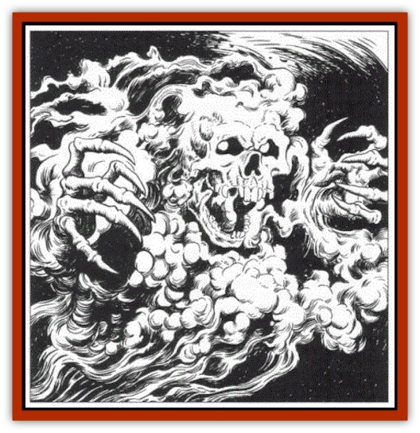
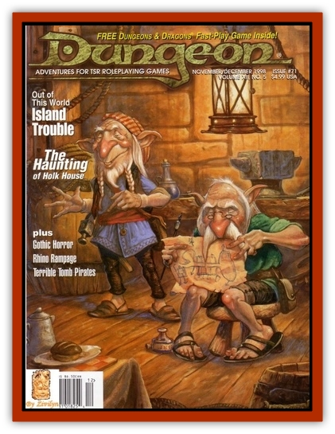

# Reviler

| Statistic | **Reviler** |
| --- | --- |
| **Activity Cycle:** | Any |
| **Alignment:** | Any evil |
| **Armor Class:** | 2 |
| **Climate/Terrain:** | Abandoned buildings, dungeons and ruins |
| **Damage/Attack:** | 1-6/1-6 |
| **Diet:** | None |
| **Frequency:** | Very rare |
| **Hit Dice:** | 4 |
| **Intelligence:** | Average to High (8-14) |
| **Magic Resistance:** | 40% |
| **Morale:** | Steady (12) |
| **Movement:** | Fly 24 (B) |
| **No. Appearing:** | 1-8 |
| **No. of Attacks:** | 2 |
| **Organization:** | Pack |
| **Size:** | M (5' long) |
| **Special Attacks:** | Spells, alter alignment, poison |
| **Special Defenses:** | +1 or better weapona to hit; see below |
| **THAC0:** | 17 |
| **Treasure:** | Nil |
| **XP Value:** | 1,400 |

Revilers are undead spirits similar to [[Haunt|haunts]]. They are created by evil gods for the purpose of spreading strife, woe, and terror. Revilers hate all things that are good and pure and seek to corrupt them, or at the very least twist their plans toward evil ends. Good beings turned to evil by the revilers' touch are used to sow discord and reap destruction.

Revilers are almost always invisihle unless attempting to possess a victim, when they appear �s ghostly, swooping shapes with leering skull faces and clawed, grasping limbs. Their presence is sometimes revealed by soft, eerie whisperings. A *detect undead*, *detect evil*, or *detect invisibility* spell reveals the revilers' presence. A *true seeing* spell reveals their true shape.

Revilers converse with one another in hollow whispers. They can speak any intelligent language they knew in life. Most revilers know the Common tongue.

**Combat:** Revilers can attack with two sharps claws, but they must turn visible to do so. They can also corrupt good or neutral victims by poisoning their minds. By giving up both wounding attacks, a reviler can alter the ethics of any living being it touches (requiring a successful attack roll). Any good-aligned being touched by a reviler must make a Wisdom check. If the roll fails, the victim's alignment is changed to that of the reviler until a *remove curse* or *dispel evil* is cast. A reviler may only attempt to "poison" a certain individual once. If the attempt fails, the victim is immune to any further attacks by that particular reviler.

Revilers also have the following spell-like abilities, cast at the 10th level of ability. Usable once/day: *animate ohject*, *suggestion*, *spectral force*, *stone shape*. Usable thrice/day: *detect good*, *detect magic*, *telekinesis*, *wizard lock*.

Revilers have the ability to *create poison* twice/day. Any liquid within 10' may be transformed into poison of Type I. The internal liquids of living creatures cannot be affected. A single reviler may affect up to 1 cubic foot of liquid, and several revilers often work together to poison water wells, drinking springs, ponds, or any other liquid likely to come in contact with good-aligned beings. Such transformed liquid remains poisonous for 2d6 hours. If *neutralize poison*, *cure disease*, or *purify food and drink* is cast upon the poisoned liquid, it reverts to normal.

Revilers remain invisible until they attack. They are also non-corporeal and can move through solid objects, although doing so costs them half their movement.

Revilers are immune to *sleep*, *charm*, *hold* and mind-influencing spells, as well as poison and paralyzation. They are turned as spectres. Holy water inflicts 1d8 hp damage per vial. *Holy ward* and *dispel evil* spells banish them permanently. They require +1 or better weapons to hit.

**Habitat/Society:** Revilers inhabit abandoned buildings and ruins and are occasionally encounteres in catacombs and and cemeteries. As the servants of an evil deity, they are often confined to a specific location and cannot leave that location unless their master dictates otherwise. A typical reviler "haunt" can be anything from a single structure to an entire, forlorn domain. Revilers' lairs radiate strong emanations of evil and therefore tend to attract evil monsters, especially other forms of undead.

**Ecology:** Revilers are created from the souls of slain men and women of evil disposition. They seek freedom from their tormented state by serving the dark whims of their evil lord, but their undead existence only heightens the malevolence they possessed in life.

---
## Discovery & Documentation

**Source Publication:** Dungeon #71 (1998)
**Campaign Setting:** Dungeon Magazine
**Author(s):**
