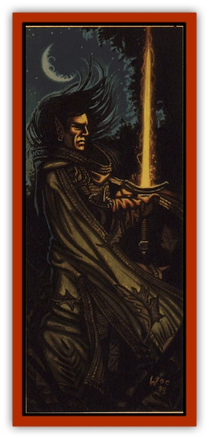
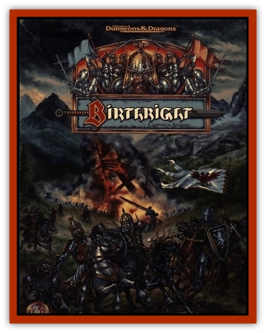

# Rhuobhe Manslayer

| Statistic | **Rhuobhe Manslayer** |
| --- | --- |
| **Activity Cycle:** | Nocturnal |
| **Alignment:** | Neutral evil |
| **Armor Class:** | 6 (base); -8 in armor |
| **Blood:** | True (Azrai): 95 |
| **Blood Abilities:** | Awareness (minor), Bloodform (major), Enhanced sense (major), Fear (major), Regeneration (minor) |
| **Climate/Terrain:** | Rhuobhe/Forests |
| **Damage/Attack:** | 2d4+7 (sword) or 1d8+3 (bow) |
| **Diet:** | Special |
| **Frequency:** | Unique |
| **Hit Points:** | 88 |
| **Intelligence:** | Genius (18) |
| **Magic Resistance:** | 25% |
| **Morale:** | Fearless (20) |
| **Movement:** | 15 |
| **No. Appearing:** | 1 |
| **No. of Attacks:** | 2/1 |
| **Organization:** | Solitary |
| **Realm Spells:** | <i>Demagague, dispel realm magic, mass destruction, raze, scry, subversion, warding</i> |
| **Size:** | L (7') |
| **Special Attacks:** | Create arrows |
| **Special Defenses:** | +3 or better weapons to hit, invulnerable to arrows |
| **THAC0:** | 5 (base); -2 with sword or bow |
| **Treasure:** | Domain Treasure |
| **XP Value:** | 21,000 |

**Spells Memorized:**

1st: *Charm person*, *chill touch*, *jump*, *magic missile* (x2)  
2nd: *Blindness*, *fog cloud*, *levitate*, *stinking cloud*, *web*  
3rd: *Blink*, *dispel magic*, *fly*, *haste*, *lightning bolt*  
4th: *Fire shield*, *ice storm*, *minor globe of invulnerability*, *plant growth*, *polymorph self*  
5th: *Animate dead*, *conjure elemental*, *contact other plane*, *dismissal*, *telekinesis*  
6th: *Disintegrate*, *Otiluke's freezing sphere*  
7th: *Prismatic spray*  

When Rhuobhe Manslayer (pronounced Rove) was a young elf, whiling his time away in the southern Aelvinnwode on the banks of the River Maesil (in the land now known as Ghoere), the [[Human_Cerilia|human]] tribes began migrating to Cerilia. Though they were not always peaceful toward the elves (and vice versa), no particular animosity arose between the two species. Thus, the elves sought human aid in counteracting the rising [[Goblin_Cerilia|goblin]] tide.

Humans and elves worked together, though not always side by side, and they learned much about each other. As the humans pushed the goblins back, Rhuobhe found himself fascinated by the newcomers.

Eventually, when the goblins were beaten, the humans began to settle the Cerilian shores. Rhuobhe thought nothing of this and even befriended a few newcomers, showing them the secrets and wonders of Cerilia.

When the humans began to abuse the forests, however, betraying the trust he had placed in them, he had second thoughts. He spoke to his friends and asked them to cease their destructive ways. However, they mocked him and sent him on his way. Bitter and angry, be joined the gheallie Sidbe, the Hunt of the Elves, and hunted humans with a fervor heretofore unseen by the elves. Still, the hunters were glad to have him, for Rhuobhe was an excellent killer, and they labeled him Manslayer for his efforts.

When Azrai approached the elves with his plan to destroy the humans, Rhuobhe eagerly signed on. Later, when the elf armies deserted Azrai upon the realization of what he stood for, Rhuobhe remained with the god of evil. Indeed, he was astonished that his fellows would desert their hatreds for the humans so quickly. As a result of his loyalty and his hatred, he was bathed in Azrai's essence and transformed into an abomination.

Rhuobhe Manslayer has since used his powers to further his agenda of human destruction. Establishing himself in a strategically important pass between the Seamists and the Stonecrown mountain ranges, he has harried and bedeviled humans for nearly 1,500 years.

Through the years, the Manslayer's skin has become a dusky gray, like light ash or cold marble. The pupils and irises of his eyes have vanished, leaving cold white orbs. When angry, bis new eyes blaze with light and fury. Rhuobhe is one of the most powerful of the Anuirean awnsheghlien, second only to [[The_Gorgon|the Gorgon]].

**Combat:** When Rhuobhe prepares himself for combat, his entire realm knows it. Perhaps there's tension in the air, or perhaps a faint rumbling in the earth signals his intent. When he dons *Glaivebreaker* (his suit of *elven plate +4*) and *Anger's Turning* (his *shield +3*), and raises *Heartspiller* (his *bastard sword +4, life stealing*) or *Winged Death* (a *long bow +3*), his domain waits with bated breath, eagerly anticipating the destruction of Rhuobhe's enemies.

Rhuobbe need not cany a quiver of arrows with him, for he can summon bolts of energy from the air. The incandescent blue bolts have no bonuses to attacks, though they are treated as +5 enchanted weapons for purpose of hitting creatures with immunities to normal weapons. When these arrows bit, the target must save vs. spell or suffer an additional 1d6 points of damage.

The blood of Azrai has somehow altered Rhuobhe so that be cannot be harmed by arrows, quarrels, or other propelled missiles. Though catapults, daggers, and axes can injure him, arrows bounce from his skin with no effect.

Nothing invisible escapes his milky eyes. They strip away subterfuge and illusions to reveal the heart of a matter, forcing Rhuobhe's enemies to combat him in the open. However, his sensitive eyes can not tolerate bright light; in highly illuminated areas, he attacks with a -4 penalty. He can no longer walk in the daylight world as be was wont to do before his transformation. He is a creature of the twilight now, and he curses those who have the ability to enjoy the day.

Rhuobhe is also a potent sorcerer. He can cast spells in combat while wearing his plate armor, though his bands must be free to do so. It is said that he regularly consorts with creatures from the nether planes, binding them to his bidding and learning arcane secrets from them. Though this is probably mere superstition-a tale to frighten small children- it tangibly adds to the very real aura of menace that bangs about the elf.

**Habitat/Society:** Rhuobhe now spends his time plotting the downfall of humanity from his fortress, Ruannoch, on the shores of a snow-fed lake at the base of the Seamist mountain range. He has gathered a force of many hundreds of elves to him, and is training them to destroy neighboring kingdoms.

His tower is a blackened spire, the base of which is a tremendous tree stump. The lower portion is surrounded by a wall of thorns, with only a small, well-guarded path to the portcullis. Cages hang from outcroppings on the spire, filled with the skeletons of elves treacherous to his cause, and humans who've foolishly attempted to destroy the Manslayer.

**Ecology:** Rhuobhe has undergone a remarkable metamorphosis. Throughout his long years of life, be has become more and more lawful, his life dedicated more to preserving and expanding the elven way of life at the cost of enjoying his own. Though Cerilian elves are traditionally chaotic, he has drifted into the realm of neutrality. Thus, some would say that be no longer represents the elven way, and is therefore unfit to drive the humans from Cerilia.

---
## Discovery & Documentation

**Source Publication:** Birthright Campaign Setting Box Set (1995)
**Campaign Setting:** Birthright
**Author(s):** L. Richard Baker III, Colin McComb, Walter Velez, Tony Szczudlo, William O'Connor, Eric Hotz, Carrie Bebris, Roger E. Moore, Sue Weinlein, Peggy Cooper

### Other Creatures Found in This Source Book
   * [[Dragon_Cerilia|Dragon (Cerilia)]]
   * [[Giant_Cerilia|Giant (Cerilia)]]
   * [[Goblin_Cerilia|Goblin (Cerilia)]]
   * [[Orog_Cerilia|Orog (Cerilia)]]
   * [[The_Gorgon|The Gorgon]]
   * [[The_Seadrake|The Seadrake]]
   * [[The_Spider|The Spider]]
