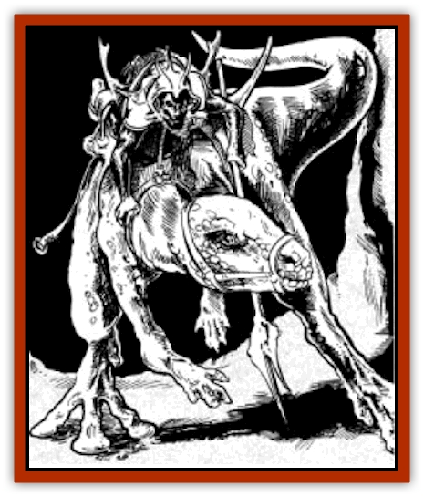

# Riding Lizard

| Statistic | **Riding Lizard** |
| --- | --- |
| **Activity Cycle:** | Any |
| **Alignment:** | Lawful neutral |
| **Armor Class:** | 7 |
| **Climate/Terrain:** | Any subterranean |
| **Damage/Attack:** | 2-8/2-12/2-12 |
| **Diet:** | Omnivore |
| **Frequency:** | Common |
| **Hit Dice:** | 5 |
| **Intelligence:** | Average (8-10) |
| **Magic Resistance:** | Nil |
| **Morale:** | Elite (13-14) |
| **Movement:** | 16, Sw 20 |
| **No. Appearing:** | 1-6 |
| **No. of Attacks:** | 3 |
| **Organization:** | Solitary or pack |
| **Size:** | H (stands 12' high; tail is another 8-10' long) |
| **Special Attacks:** | Nil |
| **Special Defenses:** | See below |
| **THAC0:** | 15 |
| **Treasure:** | Nil (except as carried) |
| **XP Value:** | 975 |

Riding or "mount" [[Lizard|lizards]] are light, sleek reptiles, able to run swiftly on their hind legs when unencumbered. Unknown on the surface, they take the place of the [[Horse|horse]] as the general steed of intelligent races in the Underdark.

**Combat:** Riding lizards are darting, alert beasts who hunt prey aggressively when "in the wild", preferring small snakes, centipedes, and - best of all - the small scurry [[Rat|rat]] of the Underdark. Riding lizards also eat lichens and fungi. Their diets make them immune to the poisons of centipedes, insects, arachnids, and fungi - and also immune to all known fungi spore effects.

In combat, a riding lizard bites for 2d4 damage, and can kick with either or both of its large hind legs in a round, doing 2d6 damage with each one. Those same legs propel it on prodigious leaps, of up to 30' upwards, and 50' horizontally, and it can descend, without harm, up to 80' in a single round (with a rider mounted on it, reduce these three "safe" distances by 10'). It uses its leaps, and its ability to cling to any solid surface that it strikes - such as a stalactite, halfway across the roof of a vast cavern - to cross "uncrossable" chasms, or to reach remote rock ledges where prey lairs.

Riding lizards have keen balance and infravision (effective up to 160' away, unless within sight of a fire or magma-flow, when it is reduced to half range). When it has been trained by [[Elf_Drow|drow]], and is magically compelled (e.g. by the use of spells or house insignia) by a drow who is present, the effective morale of a riding lizard rises to "Fearless" (20).

The movement rate of a riding lizard carrying a single M-sized rider and gear (a drow warrior with weapons and provisions, for example), is reduced to 15. Riding lizards carrying two such beings move at only 13; one equipped with a [[Lizard_Subterranean_Toril|pack-lizard]]-style cargo-harness can leap only short distances, and downwards (up to 30'), with out harm, and moves at only 11. Any leaping and clinging movements, encumbered or unencumbered, force a Dexterity Check on the lizard (see below for effects).

Riding lizards regenerate 1 hit point of physical damage every 5 turns. Heat- and fire-based attacks inflict only half damage on them, but cold-based attacks do them an extra point of damage per die.

Riding lizards have sticky pads on their three-toed feet, exuding an adhesive that they can neutralize instantly with another secretion. These allow them to trot or even run in utter silence along the floors, ceilings, and walls of caverns and structures, retaining their grip even when laden (riders who are not strapped in must take care to hold on, with a successful Strength Check, when their mount leaps or is upside down - or they'll fall out!).

Riding lizards run lightly on their back legs or on all fours, and can scale stone as easily as a [[Spider|spider]]. Left to themselves, they take an irregular route, using leaps, passage ceilings, walls, and dry, non-slippery stalactites and stalagmites more than floors, to avoid being tracked by predators of the Underdark who possess infravision.

**Habitat/Society:** Riding lizards are typically captured by means of spells, and trained for most of a year, to make them fully obedient to more than one rider. Most drow communities capture lizards only to acquire new bloodlines; they breed and raise their lizard stock from previously-captured sires.

In the wild, riding lizards run in large, loose packs, the stronger individuals of either sex serving as sentinels and guards for the others. They mate often, but do not form families; the defense and feeding of a pregnant female is the common responsibility of all. Female riding lizards typically give birth to a "litter" of 1d8 live young once every 7 months or so.

The young are born able to run and leap as their parents do. They run and hunt with their parents from the outset, joining the pack, and are AC 7; MV 16, Sw 16 (unable to carry even a S-size rider); HD 2; THAC0 19; #AT 3; Dmg 1-4/1-4/1-6; SD poison immunities, regeneration; SZ M (body 4-6' + tail of up to 4'); ML 13; XP 120.

**Ecology:** Eaten by many predators, riding lizard meat is a staple of [[Dwarf_Duergar|duergar]] diet. Drow only eat those that perish through misfortune. A good trained mount can fetch up to 1,000 gp (most go for 600-700); untrained young sell for 200-500 gp.

---
## Discovery & Documentation

**Source Publication:** Menzoberranzan (1992)
**Campaign Setting:** Forgotten Realms
**Author(s):** Greenwood, Niles, and Salvatore

### Other Creatures Found in This Source Book
   * [[Alhoon|Alhoon]]
   * [[Cloaker_Lord|Cloaker Lord]]
   * [[Foulwing|Foulwing]]
   * [[Lizard_Subterranean_Toril|Lizard, Subterranean (Toril)]]
   * [[Wingless_Wonder|Wingless Wonder]]
