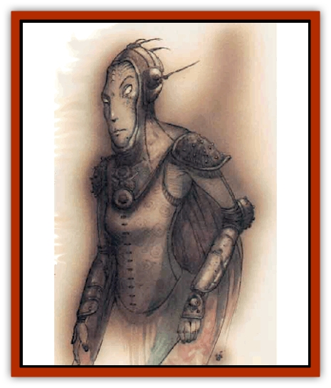

# Rilmani - Abiorach

| Statistic | **Rilmani, Abiorach** |
| --- | --- |
| **Activity Cycle:** | Any |
| **Alignment:** | Neutral |
| **Armor Class:** | 2 |
| **Climate/Terrain:** | The Spire, any Inner Planes |
| **Damage/Attack:** | 3d4+3 (weapon) |
| **Diet:** | Omnivore |
| **Frequency:** | Rare |
| **Hit Dice:** | 5 |
| **Intelligence:** | High (13-14) |
| **Magic Resistance:** | 25% |
| **Morale:** | Elite (13-14) |
| **Movement:** | 15, Fl 18 |
| **No. Appearing:** | 1-8 |
| **No. of Attacks:** | 1 |
| **Organization:** | Band |
| **Size:** | M (5' tall) |
| **Special Attacks:** | Spell-like powers |
| **Special Defenses:** | Struck only by +1 or better weapons |
| **THAC0:** | 15 |
| **Treasure:** | W |
| **XP Value:** | 2,000 |

The Elemental Planes are a theater of conflict between the forces of good and evil, just as the Prime Material and the Outer Planes are. Malicious demielementals such as [[Genie|dao]] or [[Genie|efreet]] pursue wars of expansion and aggression against the lawful or good residents of those planes. The creatures known as the [[Archomental_Evil|princes of elemental evil]] seek to control all of their kind. The rilmani're as watchful over these arenas of conflict as they are of any others, and the abiorachs're their agents in the Elemental Planes.

Generally, abiorachs avoid conflict with the powerful denizens of the Elemental Planes. They're among the weakest of the [[Rilmani_General_Information|rilmani]] and look for ways to solve problems thrqugh manipulation and trickery rather than open battle. Abiorachs aren't often called upon to intervene in the affairs of the Elemental Planes, since the elements have a natural inclination to neutrality, but there's always some blood who wants to change that, so the abiorachs rarely let down their guard.

Abiorachs bear a passing resemblance to adolgscent humans, with slight builds and youthful features. However, their bodies gleam with a liquid, silver shine that flows and shifts with every movement. Their eyes are crystalline and tend to catch a rainbow of colors. Abiorachs're a little more open and carefree than most of their kind, but they can be temperamental and capricious creatures; they're used to looking at things om an elemental, not human, viewpoint.

**Combat:** Abiorachs prefer to fight with short, broad-bladed forks, demilunes, or tridents enchanted to a +1 value. Like many rilmani, they're stronger than they look; an abiorach's got an effective 18 Strength and gains the appropriate damage bonuses. (Many a [[Mephit_General_Information|mephit's]] misjudged an abiorach to its everlasting woe!) Abiorachs've got a very useful and powerful natural defense: While on an Elemental Plane, they can attune themselves completely to that plane, gaining the movement and immunities of an [[Elemental_General_Information|elemental]] of that type. For example, an abiorach on the Elemental Plane of Fire can't be harmed by fire, is accepted by [[Elemental_Fire_Water|fire elementals]] as one of their own kind, and can move through the plane as if she were an elemental guide.

Abiorachs can use the spell-like abilities of *charm monster* (including attuned elementals), *detect alignment*, *gaze reflection*, *glitterdust*, *invisibility*, *mirror image*, and *shocking grasp* (1d8+5 points of damage) at will. Up to three times per day abiorachs can use one of the following minor powers, depending on which plane they're attuned to: *dig*, *flaming sphere*, *gust of wind*, or *lower water*. Once per day they may use a major power, including *transmute water to dust*, *wall of fire*, *wall of force (air)*, or *wall of stone*.

Abiorachs can be struck only by +1 or better weapons. They cannot gate, but in an attuned plane an abiorach has a 25% chance to successfully summon an elemental to her aid.

**Habitat/Society:** Abiorachs often travel the Elemental Planes in small bands, easily shifting from one to the other by usng their elemental immunity. They rarely remain in one area for long. Normally, the most intelligent and experiences abiorach acts as informal captain for the group, directing its activities. On the Outlands, abiorachs are more subdued and reserved - being under the noses of the [[Rilmani_Aurumach|auromachs]] and [[Rilmani_Argenach|argemachs]] brings out their serious side.

---
## Discovery & Documentation

**Source Publication:** Planescape II (1996)
**Campaign Setting:** Planescape
**Author(s):** Rich Baker, Karen S. Boomgarden

### Other Creatures Found in This Source Book
   * [[Aasimar|Aasimar]]
   * [[Abrian|Abrian]]
   * [[Arcane|Arcane]]
   * [[Balaena|Balaena]]
   * [[Beholder-kin_Observer|Beholder-kin, Observer]]
   * [[Bloodthorn|Bloodthorn]]
   * [[Bonespear|Bonespear]]
   * [[Darkweaver|Darkweaver]]
   * [[Demarax|Demarax]]
   * [[Dhour|Dhour]]
   * [[Eater_of_Knowledge|Eater of Knowledge]]
   * [[Eladrin_Greater_Firre|Eladrin, Greater, Firre]]
   * [[Eladrin_Greater_Ghaele|Eladrin, Greater, Ghaele]]
   * [[Eladrin_Greater_Tulani|Eladrin, Greater, Tulani]]
   * [[Eladrin_Lesser_Bralani|Eladrin, Lesser, Bralani]]
   * [[Eladrin_Lesser_Coure|Eladrin, Lesser, Coure]]
   * [[Eladrin_Lesser_Noviere|Eladrin, Lesser, Noviere]]
   * [[Eladrin_Lesser_Shiere|Eladrin, Lesser, Shiere]]
   * [[Fhorge|Fhorge]]
   * [[Ghostlight|Ghostlight]]
   * [[Guardinal_Avoral|Guardinal, Avoral]]
   * [[Guardinal_Cervidal|Guardinal, Cervidal]]
   * [[Guardinal_General_Information|Guardinal, General Information]]
   * [[Guardinal_Equinal|Guardinal, Equinal]]
   * [[Guardinal_Leonal|Guardinal, Leonal]]
   * [[Guardinal_Lupinal|Guardinal, Lupinal]]
   * [[Guardinal_Ursinal|Guardinal, Ursinal]]
   * [[Hollyphant|Hollyphant]]
   * [[Incantifer|Incantifer]]
   * [[Ironmaw|Ironmaw]]
   * [[Keeper|Keeper]]
   * [[Khaasta|Khaasta]]
   * [[Leomarh|Leomarh]]
   * [[Monster_of_Legend|Monster of Legend]]
   * [[Mortai|Mortai]]
   * [[Noctral|Noctral]]
   * [[Quill|Quill]]
   * [[Razorvine|Razorvine]]
   * [[Reave|Reave]]
   * [[Retriever|Retriever]]
   * [[Rilmani_General_Information|Rilmani, General Information]]
   * [[Rilmani_Argenach|Rilmani, Argenach]]
   * [[Rilmani_Aurumach|Rilmani, Aurumach]]
   * [[Rilmani_Cuprilach|Rilmani, Cuprilach]]
   * [[Rilmani_Ferrumach|Rilmani, Ferrumach]]
   * [[Rilmani_Plumach|Rilmani, Plumach]]
   * [[Shadowdrake|Shadowdrake]]
   * [[Spellhaunt|Spellhaunt]]
   * [[Spider_Hook|Spider, Hook]]
   * [[Sunfly|Sunfly]]
   * [[Sword_Spirit|Sword Spirit]]
   * [[Tanar'ri_Lesser_Bulezau|Tanar'ri, Lesser, Bulezau]]
   * [[Tanar'ri_Lesser_Maurezhi|Tanar'ri, Lesser, Maurezhi]]
   * [[Tanar'ri_Lesser_Yochlol|Tanar'ri, Lesser, Yochlol]]
   * [[Tanar'ri_General_Information|Tanar'ri, General Information]]
   * [[Tanar'ri_True_Alkilith|Tanar'ri, True, Alkilith]]
   * [[Terlen|Terlen]]
   * [[Tso|Tso]]
   * [[T'uen-rin|T'uen-rin]]
   * [[Vaporighu|Vaporighu]]
   * [[Vorr|Vorr]]
   * [[Wastrel|Wastrel]]
   * [[Wraithworm|Wraithworm]]
   * [[Yugoloth_Lesser_Canoloth|Yugoloth, Lesser, Canoloth]]
   * [[Zoveri|Zoveri]]
