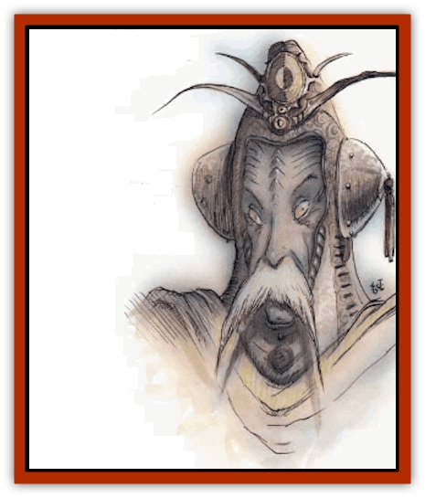

# Rilmani - Argenach

| Statistic | **Rilmani, Argenach** |
| --- | --- |
| **Activity Cycle:** | Any |
| **Alignment:** | Neutral |
| **Armor Class:** | -1 |
| **Climate/Terrain:** | The Spire, any prime world |
| **Damage/Attack:** | 1d20/1d20 (rays) or 1d8+10 (weapon +3, +7 damage) or 1d10 (bare fists) |
| **Diet:** | Omnivore |
| **Frequency:** | Very rare |
| **Hit Dice:** | 9 |
| **Intelligence:** | Genius (17-18) |
| **Magic Resistance:** | 55% |
| **Morale:** | Champion (15-16) |
| **Movement:** | 15 |
| **No. Appearing:** | 1 (1-4 at the Spire) |
| **No. of Attacks:** | 2 or 1 |
| **Organization:** | Solitary |
| **Size:** | M (7' tall) |
| **Special Attacks:** | Beams, spells |
| **Special Defenses:** | +3 weapon to hit |
| **THAC0:** | 11 |
| **Treasure:** | R,Z,U |
| **XP Value:** | 16,000 |

Wherever the Balance is threatened, that's where the argenachs'll be found. They're advisers and agitators, working to ensure that no one gains the upper hand for long in any part of the multiverse. Argenachs are the second-highest bloods among the [[Rilmani_General_Information|rilmani]], entrusted with the execution of the most delicate and subtle parts of the rilmani's grand purpose: the careful adjustment of the Balance in places where it's out of kilter and can't fix itself.

Argenachs are especially interested in the affairs of the countless prime worlds, since they believe that the war of good and evil, law and chaos, will be fought and won in the realms of mortals. Even now, they say, the powers that exemplify these causes squabble over the spirits of humankind. The Prime's the only theater that counts. Thus, argenachs spend a lot of time away from the Outlands, mired in endless struggles on the Prime Material Plane.

The argenachs' methods are subtle, but simple. They give advice and knowledge to whatever side's threatened, trying to even things out. Argenachs often conceal their true identity, since no one likes being played for a puppet. They'll be found masquerading as helpful sages who aid their proteges in a struggle against evil or chaos, or as cold-hearted bloods advising ambitious cutters on how to go about besting the forces of law or good. More often than not, argenachs'll take a neutral role and just watch to see how things are turning out.

Argenachs are tall, slender creatures with a silvery sheen to their skins. They often dress in white, flowing robes on their home plane, but can take on any shape or dress in the performance of their mission. Argenachs favor great, wide-bladed broad swords and long-handled axes in combat.

**Combat:** Argenachs avoid physical combat when possible. Their primary means of defense are rays of silvery light projected from their hands. These rays inflict 1d20 points of damage, and always strike as an energy form their target's vulnerable to. For example, [[Baatezu_General_Information|baatezu]] are immune to fire, so the argenachs rays might strike as electricity or magic missiles.

Argenachs can fire two rays per round, to a range of 60 yards. Argenachs are deceptively strong, with the equivalent of a 19 Strength. If forced into melee combat, they strike with their mystic weapons (usually enchanted to +3 value) at a +3 attack bonus and inflict +7 points of damage. An argenach who fights bare-handed can still inflict 1d10 points of damage per hit.

Argenachs also command a battery of formidable spell-like powers, which they can use one at a time, once per round. These include: *advanced illusion*, *cone of cold* (9d4+9 points of damage, 3/day), *detect magic*, *detect invisibility*, *ESP*, *fly* , *geas* (1/week), *hallucinatory terrain*, *invisibility*, *legend lore* (1/day), *mass charm*, *mirror image*, *prismatic spray* (1/day), *slow*, *solid fog*, *suggestion*, and *wall of fire*. An argenach can also *lay on hands* once per day, duplicating the effects of a *heal* spell except that no more than 36 points of damage can be cured.

Argenachs can be damaged only by +3 or better weapons. They prefer to use their spell-like powers of *charm*, *illusion*, or *suggestion* to avoid physical confrontations, but fight with ruthless efficiency when required. Once per day argenachs can open a *gate* (75% chance of success), bringing 1 to 4 [[Rilmani_Ferrumach|ferrumachs]] (60% chance) or 1 other argenach (40% chance) to their aid.

**Habitat/Society:** Argenachs are the loners of rilmani society, which is fairly reclusive to begin with. They answer directly to the [[Rilmani_Aurumach|aurumachs]] and are usually given only broad guidelines instead of specific orders. For example, an argenach might be ordered into a struggle with no instruction more detailed than "There's trouble on Toril. Deal with it." Of course, an argenach's extremely intelligent and resourceful, and that's all the orders he'll need to get the job done.

---
## Discovery & Documentation

**Source Publication:** Planescape II (1996)
**Campaign Setting:** Planescape
**Author(s):** Rich Baker, Karen S. Boomgarden

### Other Creatures Found in This Source Book
   * [[Aasimar|Aasimar]]
   * [[Abrian|Abrian]]
   * [[Arcane|Arcane]]
   * [[Balaena|Balaena]]
   * [[Beholder-kin_Observer|Beholder-kin, Observer]]
   * [[Bloodthorn|Bloodthorn]]
   * [[Bonespear|Bonespear]]
   * [[Darkweaver|Darkweaver]]
   * [[Demarax|Demarax]]
   * [[Dhour|Dhour]]
   * [[Eater_of_Knowledge|Eater of Knowledge]]
   * [[Eladrin_Greater_Firre|Eladrin, Greater, Firre]]
   * [[Eladrin_Greater_Ghaele|Eladrin, Greater, Ghaele]]
   * [[Eladrin_Greater_Tulani|Eladrin, Greater, Tulani]]
   * [[Eladrin_Lesser_Bralani|Eladrin, Lesser, Bralani]]
   * [[Eladrin_Lesser_Coure|Eladrin, Lesser, Coure]]
   * [[Eladrin_Lesser_Noviere|Eladrin, Lesser, Noviere]]
   * [[Eladrin_Lesser_Shiere|Eladrin, Lesser, Shiere]]
   * [[Fhorge|Fhorge]]
   * [[Ghostlight|Ghostlight]]
   * [[Guardinal_Avoral|Guardinal, Avoral]]
   * [[Guardinal_Cervidal|Guardinal, Cervidal]]
   * [[Guardinal_General_Information|Guardinal, General Information]]
   * [[Guardinal_Equinal|Guardinal, Equinal]]
   * [[Guardinal_Leonal|Guardinal, Leonal]]
   * [[Guardinal_Lupinal|Guardinal, Lupinal]]
   * [[Guardinal_Ursinal|Guardinal, Ursinal]]
   * [[Hollyphant|Hollyphant]]
   * [[Incantifer|Incantifer]]
   * [[Ironmaw|Ironmaw]]
   * [[Keeper|Keeper]]
   * [[Khaasta|Khaasta]]
   * [[Leomarh|Leomarh]]
   * [[Monster_of_Legend|Monster of Legend]]
   * [[Mortai|Mortai]]
   * [[Noctral|Noctral]]
   * [[Quill|Quill]]
   * [[Razorvine|Razorvine]]
   * [[Reave|Reave]]
   * [[Retriever|Retriever]]
   * [[Rilmani_Abiorach|Rilmani, Abiorach]]
   * [[Rilmani_General_Information|Rilmani, General Information]]
   * [[Rilmani_Aurumach|Rilmani, Aurumach]]
   * [[Rilmani_Cuprilach|Rilmani, Cuprilach]]
   * [[Rilmani_Ferrumach|Rilmani, Ferrumach]]
   * [[Rilmani_Plumach|Rilmani, Plumach]]
   * [[Shadowdrake|Shadowdrake]]
   * [[Spellhaunt|Spellhaunt]]
   * [[Spider_Hook|Spider, Hook]]
   * [[Sunfly|Sunfly]]
   * [[Sword_Spirit|Sword Spirit]]
   * [[Tanar'ri_Lesser_Bulezau|Tanar'ri, Lesser, Bulezau]]
   * [[Tanar'ri_Lesser_Maurezhi|Tanar'ri, Lesser, Maurezhi]]
   * [[Tanar'ri_Lesser_Yochlol|Tanar'ri, Lesser, Yochlol]]
   * [[Tanar'ri_General_Information|Tanar'ri, General Information]]
   * [[Tanar'ri_True_Alkilith|Tanar'ri, True, Alkilith]]
   * [[Terlen|Terlen]]
   * [[Tso|Tso]]
   * [[T'uen-rin|T'uen-rin]]
   * [[Vaporighu|Vaporighu]]
   * [[Vorr|Vorr]]
   * [[Wastrel|Wastrel]]
   * [[Wraithworm|Wraithworm]]
   * [[Yugoloth_Lesser_Canoloth|Yugoloth, Lesser, Canoloth]]
   * [[Zoveri|Zoveri]]
