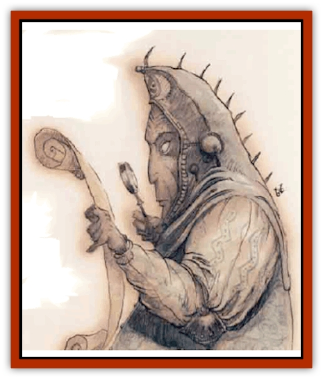
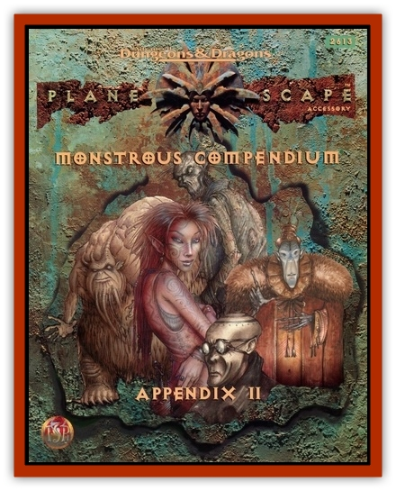

# Rilmani - Aurumach

| Statistic | **Rilmani, Aurumach** |
| --- | --- |
| **Activity Cycle:** | Any |
| **Alignment:** | Neutral |
| **Armor Class:** | -3 (-7 in armor) |
| **Climate/Terrain:** | The Spire |
| **Damage/Attack:** | 1d10+11 (weapon +3, Strength bonus) or 2d8 (bare fists) |
| **Diet:** | Omnivore |
| **Frequency:** | Very rare |
| **Hit Dice:** | 12 |
| **Intelligence:** | Godlike (21+) |
| **Magic Resistance:** | 65% |
| **Morale:** | Fanatic (17-18) |
| **Movement:** | 15 |
| **No. Appearing:** | 1 (1-3 on the Spire) |
| **No. of Attacks:** | 3 |
| **Organization:** | Solitary |
| **Size:** | L (10' tall) |
| **Special Attacks:** | Aura, spells |
| **Special Defenses:** | Aura, struck only by +4 or better weapons |
| **THAC0:** | 9 |
| **Treasure:** | R,U,V&times;2 |
| **XP Value:** | 27,000 |

Very few nonrilmani have ever seen one of these bloods. The aurumachs are the leaders of the [[Rilmani_General_Information|rilmani]] race, the high-ups who call the shots and pull the strings. It's said that even the powers don't know half the darks the aurumachs do. More than any other creatures in the entire multiverse, they stand aside from the path of things and objectively measure the state of the Balance, acting to correct it when it leans too far to one side or the other.

The aurumachs'll almost never be found away from the Spire. As leaders and organizers, it's not their job to intervene personally, and only the most dangerous situations'll make them change their policy. Aurumachs don't make any special effort to avoid visitors, but a cutter'd have to have a [[Tiefling|tiefling's]] own luck to find one - it's said that there's only a hundred aurumachs on all the Outlands.

Aurumachs are tall, athletic humanoids with beatific features and metallic golden skin. Their eyes are too brieght to look at directly, and an aura of power and patience surrounds their form. Aurumachs are occasionally found in fluted golden plate armor, bearing mighty swords or maces, but at the Spire they rarely need such martial trappings.

**Combat:** Although they're the size of ogres, aurumachs are far faster and more graceful than even the most agile humans. They wield mighty enchanted *vorpal swords +3* with astounding speed and strength, striking 3 times per round with a +6 attack bonus. The aurumach's weapon is created by an act of will and materializes in her hand with a thought - she can never be disarmed or caught off-guard. An aurumach's armor is the equivalent of field plate +4 and can be summoned in a similar fashion to her weapon. Aurumachs have an effective Strength of 20 and can strike for 2d8 points of damage even without their great swords.

Aurumachs can attack with golden energy similar to the rays cast by an [[Rilmani_Argenach|argenach]]. This energy automatically assumes a form that exploits an enemy's vulnerabilities: fire, ice, positive, negative, etc. Unlike that of the argcnach, this energy is not directed in rays, but instead takes the form of a golden halo surrounding the aurumach at a 15-foot radius. Any hostile creature entering this area must successfully save vs. spell or suffer 2d12 points of damage from the aurumach's aura. The aura also functions as a *globe of invulnerability* with an added bonus: it stops missile attacks of any kind.

Aurumachs *detect magic and invisibility* by sight and can call upon the following spell-like powers: *advanced illusion*, *cone of cold* (12d4+12 points of damage), *ESP*, *fly*, *geas* (1/day), *hallucinatory terrain*, *improved invisibility*, *mass charm*, *mass suggestion*, *mirror image*, *prismatic spray*, *slow*, *solid fog* or *death fog*, and *wall of fire, of ice, of iron, or of force*. Once per day the aurumach can use any *symbol* or *time stop*, once per year she can grant another's *wish*. Aurumachs can *lay on hands* three times per day, combining the effects of *heal*, *regeneration*, and *restoration*.

Aurumachs can be damaged only by weapons of +4 or better enchantment. At will they can gate in 1 to 8 [[Rilmani_Ferrumach|ferrumachs]] (75%) or 1 to 3 [[Rilmani_Argenach|argenachs]] (25%) with an 80% chance of success.

**Habitat/Society:** Aurumachs know no peer among the rilmani and are the equal of the most powerful fiends or [[Aasimon_General_Information|aasimon]]. The rilmani have no particular order, hierarchy. or system of government - aurumachs function as advisers and mentors to the entire race. Even though an aurumach isn't recognized as a king or an overlord, her suggestions as sufficient to make any lesser rilmani leap to do her bidding.

Aurumachs leave the Outlands only to deal with the gravest of threats to the balance of the universe. They are remorseless and coldly efficient when such a cause pulls them away from the Spire: cutters who meet them at these times'd be wise not to get on the aurumach's bad side.

---
## Discovery & Documentation

**Source Publication:** Planescape II (1996)
**Campaign Setting:** Planescape
**Author(s):** Rich Baker, Karen S. Boomgarden

### Other Creatures Found in This Source Book
   * [[Aasimar|Aasimar]]
   * [[Abrian|Abrian]]
   * [[Arcane|Arcane]]
   * [[Balaena|Balaena]]
   * [[Beholder-kin_Observer|Beholder-kin, Observer]]
   * [[Bloodthorn|Bloodthorn]]
   * [[Bonespear|Bonespear]]
   * [[Darkweaver|Darkweaver]]
   * [[Demarax|Demarax]]
   * [[Dhour|Dhour]]
   * [[Eater_of_Knowledge|Eater of Knowledge]]
   * [[Eladrin_Greater_Firre|Eladrin, Greater, Firre]]
   * [[Eladrin_Greater_Ghaele|Eladrin, Greater, Ghaele]]
   * [[Eladrin_Greater_Tulani|Eladrin, Greater, Tulani]]
   * [[Eladrin_Lesser_Bralani|Eladrin, Lesser, Bralani]]
   * [[Eladrin_Lesser_Coure|Eladrin, Lesser, Coure]]
   * [[Eladrin_Lesser_Noviere|Eladrin, Lesser, Noviere]]
   * [[Eladrin_Lesser_Shiere|Eladrin, Lesser, Shiere]]
   * [[Fhorge|Fhorge]]
   * [[Ghostlight|Ghostlight]]
   * [[Guardinal_Avoral|Guardinal, Avoral]]
   * [[Guardinal_Cervidal|Guardinal, Cervidal]]
   * [[Guardinal_General_Information|Guardinal, General Information]]
   * [[Guardinal_Equinal|Guardinal, Equinal]]
   * [[Guardinal_Leonal|Guardinal, Leonal]]
   * [[Guardinal_Lupinal|Guardinal, Lupinal]]
   * [[Guardinal_Ursinal|Guardinal, Ursinal]]
   * [[Hollyphant|Hollyphant]]
   * [[Incantifer|Incantifer]]
   * [[Ironmaw|Ironmaw]]
   * [[Keeper|Keeper]]
   * [[Khaasta|Khaasta]]
   * [[Leomarh|Leomarh]]
   * [[Monster_of_Legend|Monster of Legend]]
   * [[Mortai|Mortai]]
   * [[Noctral|Noctral]]
   * [[Quill|Quill]]
   * [[Razorvine|Razorvine]]
   * [[Reave|Reave]]
   * [[Retriever|Retriever]]
   * [[Rilmani_Abiorach|Rilmani, Abiorach]]
   * [[Rilmani_General_Information|Rilmani, General Information]]
   * [[Rilmani_Argenach|Rilmani, Argenach]]
   * [[Rilmani_Cuprilach|Rilmani, Cuprilach]]
   * [[Rilmani_Ferrumach|Rilmani, Ferrumach]]
   * [[Rilmani_Plumach|Rilmani, Plumach]]
   * [[Shadowdrake|Shadowdrake]]
   * [[Spellhaunt|Spellhaunt]]
   * [[Spider_Hook|Spider, Hook]]
   * [[Sunfly|Sunfly]]
   * [[Sword_Spirit|Sword Spirit]]
   * [[Tanar'ri_Lesser_Bulezau|Tanar'ri, Lesser, Bulezau]]
   * [[Tanar'ri_Lesser_Maurezhi|Tanar'ri, Lesser, Maurezhi]]
   * [[Tanar'ri_Lesser_Yochlol|Tanar'ri, Lesser, Yochlol]]
   * [[Tanar'ri_General_Information|Tanar'ri, General Information]]
   * [[Tanar'ri_True_Alkilith|Tanar'ri, True, Alkilith]]
   * [[Terlen|Terlen]]
   * [[Tso|Tso]]
   * [[T'uen-rin|T'uen-rin]]
   * [[Vaporighu|Vaporighu]]
   * [[Vorr|Vorr]]
   * [[Wastrel|Wastrel]]
   * [[Wraithworm|Wraithworm]]
   * [[Yugoloth_Lesser_Canoloth|Yugoloth, Lesser, Canoloth]]
   * [[Zoveri|Zoveri]]
