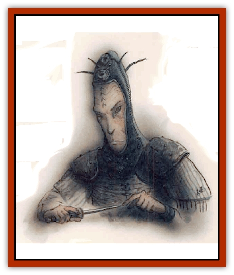

# Rilmani - Cuprilach

| Statistic | **Rilmani, Cuprilach** |
| --- | --- |
| **Activity Cycle:** | Any |
| **Alignment:** | Neutral |
| **Armor Class:** | 0 |
| **Climate/Terrain:** | The Spire, any Outer Planes |
| **Damage/Attack:** | 1d6+7 (<i>short sword +2</i>) or 1d4+5 (<i>throwing star +1</i>) or 1d8 (bare fists) |
| **Diet:** | Omnivore |
| **Frequency:** | Rare |
| **Hit Dice:** | 8 |
| **Intelligence:** | Exceptional (15-16) |
| **Magic Resistance:** | 45% |
| **Morale:** | Fanatic (17-18) |
| **Movement:** | 18 |
| **No. Appearing:** | 1-2 (1-6 on the Spire) |
| **No. of Attacks:** | 2 |
| **Organization:** | Band |
| **Size:** | M (5½' tall) |
| **Special Attacks:** | Backstab, acid, quickness |
| **Special Defenses:** | Struck only by +2 or better weapons |
| **THAC0:** | 13 |
| **Treasure:** | R,W |
| **XP Value:** | 9,000 |

Cuprilachs're the spies, assassins, and secret soldiers of the [[Rilmani_General_Information|rilmani]]. The [[Rilmani_Argenach|argenachs]] act as advisers, and the [[Rilmani_Ferrumach|ferrumachs]] stand bravely on the field of battle, but the cuprilachs strike from the shadows using stealth and speed to accomplish their goals. Cuprilachs believe that the only way the Balance'll ever be safe is by neutralizing high-up creatures of extreme alignment. They're easily the most dangerous rilmani, simply because they're the ones who're most likely to decide on the spot that a basher needs to be lost.

Cuprilachs appear as slight and wiry humans, with the easy grace and trim build of an [[Elf|elf]] or [[Elf|half-elf]]. Their features are human enough, except for the coppery sheen of their skins and their featureless, ruby-red eyes. There aren't many bloods in the Outlands who're as cocky or arrogant as a cuprilach, but their attitude stems from a professional pride - they're some of the best assassins on the planes, and they know it.

While cuprilachs make no secret o their calling or beliefs in the rilmani strongholds of the Spire, they're extremely capable and clever spies when they're about their business. They'll use their *polymorph self* ability to great effect, and consider no ruse, charade, or dirty trick to be beneath them when there's work to be done. It's said that no one's ever spotted a cuprilach before he struck, but this is an exaggeration&hellip; probably.

**Combat:** Cuprilachs don't fight fair. They're killers, not warriors, and they do whatever it takes to silence the opposition quickly and efficiently. Cuprilachs're fond of striking with two coppery *short swords +2* in melee combat. The cuprilach's native grace and speed confers quickness to his hand-to-hand attacks, and he always attacks first in a round. Cuprilachs have a Strength of 18/76 despite their slight build and agility. They also use special *throwing stars +1* with a range of 50 feet. The stars return if they miss. A word of caution: Don't assume that an unarmed cuprilach ain't dangerous. They're skilled martial artists and wrestlers who can strike twice per round for 1d8 points of damage even without their weapons.

Cuprilachs can perform all thief functions, including backstabbing, as if they were 12th-level thieves. They command the following spell-like abilities: *charm person*, *delude*, *detect invisibility*, *enervation* (2 levels), *ESP*, *fog cloud*, *forget*, *improved invisibility*, *poison*, and *wraithform*. Once per day a cuprilach can create a fan-shaped spray of acid 20 feet long and 10 feet wide that causes 5d4+5 points of damage to any creature who fails a saving throw versus spell.

Cuprilachs can be damaged only by +2 or better weapons. Once per day they may attempt to *gate* in 1d3 more cuprilachs with a 40% chance of success.

**Habitat/Society:** Cuprilachs rank below argenachs and above the ferrumachs and [[Rilmani_Abiorach|abiorachs]] in the society of the Spire. They're hardly model citizens, though. Cuprilachs're hot-tempered, violent, and rebellious at the best of times. Despite this, they never refuse a target and serve to the best of their ability when an [[Rilmani_Aurumach|aurumach]] tells 'em to put some cutter under.

When cuprilachs aren't on the job, they're often pursuing rigorous training and driving themselves at a brutal pace, or tearing up the Spire in wild celebration. Other rilmani stay out of their way when cuprilachs get together and "relax".

---
## Discovery & Documentation

**Source Publication:** Planescape II (1996)
**Campaign Setting:** Planescape
**Author(s):** Rich Baker, Karen S. Boomgarden

### Other Creatures Found in This Source Book
   * [[Aasimar|Aasimar]]
   * [[Abrian|Abrian]]
   * [[Arcane|Arcane]]
   * [[Balaena|Balaena]]
   * [[Beholder-kin_Observer|Beholder-kin, Observer]]
   * [[Bloodthorn|Bloodthorn]]
   * [[Bonespear|Bonespear]]
   * [[Darkweaver|Darkweaver]]
   * [[Demarax|Demarax]]
   * [[Dhour|Dhour]]
   * [[Eater_of_Knowledge|Eater of Knowledge]]
   * [[Eladrin_Greater_Firre|Eladrin, Greater, Firre]]
   * [[Eladrin_Greater_Ghaele|Eladrin, Greater, Ghaele]]
   * [[Eladrin_Greater_Tulani|Eladrin, Greater, Tulani]]
   * [[Eladrin_Lesser_Bralani|Eladrin, Lesser, Bralani]]
   * [[Eladrin_Lesser_Coure|Eladrin, Lesser, Coure]]
   * [[Eladrin_Lesser_Noviere|Eladrin, Lesser, Noviere]]
   * [[Eladrin_Lesser_Shiere|Eladrin, Lesser, Shiere]]
   * [[Fhorge|Fhorge]]
   * [[Ghostlight|Ghostlight]]
   * [[Guardinal_Avoral|Guardinal, Avoral]]
   * [[Guardinal_Cervidal|Guardinal, Cervidal]]
   * [[Guardinal_General_Information|Guardinal, General Information]]
   * [[Guardinal_Equinal|Guardinal, Equinal]]
   * [[Guardinal_Leonal|Guardinal, Leonal]]
   * [[Guardinal_Lupinal|Guardinal, Lupinal]]
   * [[Guardinal_Ursinal|Guardinal, Ursinal]]
   * [[Hollyphant|Hollyphant]]
   * [[Incantifer|Incantifer]]
   * [[Ironmaw|Ironmaw]]
   * [[Keeper|Keeper]]
   * [[Khaasta|Khaasta]]
   * [[Leomarh|Leomarh]]
   * [[Monster_of_Legend|Monster of Legend]]
   * [[Mortai|Mortai]]
   * [[Noctral|Noctral]]
   * [[Quill|Quill]]
   * [[Razorvine|Razorvine]]
   * [[Reave|Reave]]
   * [[Retriever|Retriever]]
   * [[Rilmani_Abiorach|Rilmani, Abiorach]]
   * [[Rilmani_General_Information|Rilmani, General Information]]
   * [[Rilmani_Argenach|Rilmani, Argenach]]
   * [[Rilmani_Aurumach|Rilmani, Aurumach]]
   * [[Rilmani_Ferrumach|Rilmani, Ferrumach]]
   * [[Rilmani_Plumach|Rilmani, Plumach]]
   * [[Shadowdrake|Shadowdrake]]
   * [[Spellhaunt|Spellhaunt]]
   * [[Spider_Hook|Spider, Hook]]
   * [[Sunfly|Sunfly]]
   * [[Sword_Spirit|Sword Spirit]]
   * [[Tanar'ri_Lesser_Bulezau|Tanar'ri, Lesser, Bulezau]]
   * [[Tanar'ri_Lesser_Maurezhi|Tanar'ri, Lesser, Maurezhi]]
   * [[Tanar'ri_Lesser_Yochlol|Tanar'ri, Lesser, Yochlol]]
   * [[Tanar'ri_General_Information|Tanar'ri, General Information]]
   * [[Tanar'ri_True_Alkilith|Tanar'ri, True, Alkilith]]
   * [[Terlen|Terlen]]
   * [[Tso|Tso]]
   * [[T'uen-rin|T'uen-rin]]
   * [[Vaporighu|Vaporighu]]
   * [[Vorr|Vorr]]
   * [[Wastrel|Wastrel]]
   * [[Wraithworm|Wraithworm]]
   * [[Yugoloth_Lesser_Canoloth|Yugoloth, Lesser, Canoloth]]
   * [[Zoveri|Zoveri]]
