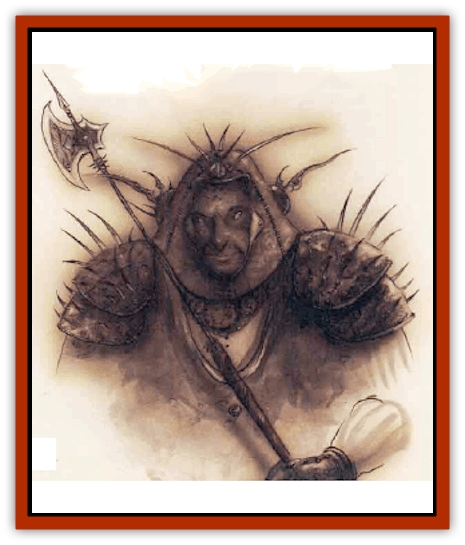

# Rilmani - Ferrumach

| Statistic | **Rilmani, Ferrumach** |
| --- | --- |
| **Activity Cycle:** | Any |
| **Alignment:** | Neutral |
| **Armor Class:** | 3 (-4 in armor) |
| **Climate/Terrain:** | The Spire, any Outer Planes |
| **Damage/Attack:** | 1d10+9 (weapon) or 1d3+7 (fists) |
| **Diet:** | Omnivore |
| **Frequency:** | Uncommon |
| **Hit Dice:** | 6 |
| **Intelligence:** | High (13-14) |
| **Magic Resistance:** | 35% |
| **Morale:** | Fanatic (17-18) |
| **Movement:** | 12 |
| **No. Appearing:** | 4-16 |
| **No. of Attacks:** | 3 per 2 rounds |
| **Organization:** | Platoon |
| **Size:** | M (6½' tall) |
| **Special Attacks:** | Specialization |
| **Special Defenses:** | Struck only by +1 or better weapons |
| **THAC0:** | 15 |
| **Treasure:** | R |
| **XP Value:** | 4,000 |

When the [[Rilmani_General_Information|rilmani]] are moved to take direct action in the cause of neutrality, it's the ferrumachs who answer the call of duty. They're the soldiers of the Spire, the iron legions who wait to serve in battle whenever and wherever they're needed. Ferrumachs've got no existence or purpose beyond soldiering, and patiently await their next call to battle in misty halls on the slopes of the Spire.

Ferrumachs resemble tall, grim-faced humans. They are very powerfully muscled, with deep chests, wide shoulders, and thick arms. There's no hint of grace, athleticism, or agility about them; ferrumachs are walking slabs of stone. Their skin is a sooty gray - the color of bare iron, with an elusive gun-metal gleam when struck by the light.

Ferrumachs wear heavy suits of dark, spiked plate armor. Their powerful builds allow them to wear armor of unusual strength and weight. Halberds, two-handed axes, and great flails are popular among their ranks.

**Combat:** Physical conflict is the forte of the ferrumachs, and they'll not hesitate to wade into any battle that concerns the cause of neutrality. Ferrumachs're extremely strong, with a Strength of 19, and they're quite skilled with their weapon of choice. Because of this specialization, ferrumachs attack 3 times per 2 rounds (once in the first round, twice in the second, once in the third, and so on) with their *halberds* or *axes +1*. If disarmed, ferrumachs can still strike for 1d3+7 points of damage with their heavy, armored fists.

Since fenumachs exist to solve problems through physical combat, their spell-like abilities are minimal compared to those of other rilmani. Once per round, they can use the powers of *blur*, *detect invisibility*, *silence 15' radius*, and *wall of fog*. Three times per day, a fenumach can *dispel magic* or create an *ice storm*. Fenumachs can *lay on hands* once per day, which *cures disease*, *neutralizes poison*, and heals up to 18 points of damage.

Fenumachs can be struck only by +1 or better weapons. They can gate in 2 to 8 more ferrumachs or 1 [[Rilmani_Argenach|argenach]] with a chance of success equal to 10% for every ferrumach who participates in the summoning.

**Habitat/Society:** As the soldiers of the rilmani, the ferrumachs hold themselves ready for action at any time. They don't mix with the other rilmani, living apart in gray fortresses and towers that watch over the Spire with unending vigilance. The ferrumachs're the most lawful of the rilmani, and obey the argenachs and [[Rilmani_Aurumach|aurumachs]] without hesitation. They're also on good terms with the [[Rilmani_Cuprilach|cuprilachs]], whom they regard as fellow fighters and professionals.

It's said that the ferrumachs are created from the spirits of warriors  who died fighting in lost causes, but this ain't true. They're rilmani, just like the rest of their kind, and they've always been that way.

---
## Discovery & Documentation

**Source Publication:** Planescape II (1996)
**Campaign Setting:** Planescape
**Author(s):** Rich Baker, Karen S. Boomgarden

### Other Creatures Found in This Source Book
   * [[Aasimar|Aasimar]]
   * [[Abrian|Abrian]]
   * [[Arcane|Arcane]]
   * [[Balaena|Balaena]]
   * [[Beholder-kin_Observer|Beholder-kin, Observer]]
   * [[Bloodthorn|Bloodthorn]]
   * [[Bonespear|Bonespear]]
   * [[Darkweaver|Darkweaver]]
   * [[Demarax|Demarax]]
   * [[Dhour|Dhour]]
   * [[Eater_of_Knowledge|Eater of Knowledge]]
   * [[Eladrin_Greater_Firre|Eladrin, Greater, Firre]]
   * [[Eladrin_Greater_Ghaele|Eladrin, Greater, Ghaele]]
   * [[Eladrin_Greater_Tulani|Eladrin, Greater, Tulani]]
   * [[Eladrin_Lesser_Bralani|Eladrin, Lesser, Bralani]]
   * [[Eladrin_Lesser_Coure|Eladrin, Lesser, Coure]]
   * [[Eladrin_Lesser_Noviere|Eladrin, Lesser, Noviere]]
   * [[Eladrin_Lesser_Shiere|Eladrin, Lesser, Shiere]]
   * [[Fhorge|Fhorge]]
   * [[Ghostlight|Ghostlight]]
   * [[Guardinal_Avoral|Guardinal, Avoral]]
   * [[Guardinal_Cervidal|Guardinal, Cervidal]]
   * [[Guardinal_General_Information|Guardinal, General Information]]
   * [[Guardinal_Equinal|Guardinal, Equinal]]
   * [[Guardinal_Leonal|Guardinal, Leonal]]
   * [[Guardinal_Lupinal|Guardinal, Lupinal]]
   * [[Guardinal_Ursinal|Guardinal, Ursinal]]
   * [[Hollyphant|Hollyphant]]
   * [[Incantifer|Incantifer]]
   * [[Ironmaw|Ironmaw]]
   * [[Keeper|Keeper]]
   * [[Khaasta|Khaasta]]
   * [[Leomarh|Leomarh]]
   * [[Monster_of_Legend|Monster of Legend]]
   * [[Mortai|Mortai]]
   * [[Noctral|Noctral]]
   * [[Quill|Quill]]
   * [[Razorvine|Razorvine]]
   * [[Reave|Reave]]
   * [[Retriever|Retriever]]
   * [[Rilmani_Abiorach|Rilmani, Abiorach]]
   * [[Rilmani_General_Information|Rilmani, General Information]]
   * [[Rilmani_Argenach|Rilmani, Argenach]]
   * [[Rilmani_Aurumach|Rilmani, Aurumach]]
   * [[Rilmani_Cuprilach|Rilmani, Cuprilach]]
   * [[Rilmani_Plumach|Rilmani, Plumach]]
   * [[Shadowdrake|Shadowdrake]]
   * [[Spellhaunt|Spellhaunt]]
   * [[Spider_Hook|Spider, Hook]]
   * [[Sunfly|Sunfly]]
   * [[Sword_Spirit|Sword Spirit]]
   * [[Tanar'ri_Lesser_Bulezau|Tanar'ri, Lesser, Bulezau]]
   * [[Tanar'ri_Lesser_Maurezhi|Tanar'ri, Lesser, Maurezhi]]
   * [[Tanar'ri_Lesser_Yochlol|Tanar'ri, Lesser, Yochlol]]
   * [[Tanar'ri_General_Information|Tanar'ri, General Information]]
   * [[Tanar'ri_True_Alkilith|Tanar'ri, True, Alkilith]]
   * [[Terlen|Terlen]]
   * [[Tso|Tso]]
   * [[T'uen-rin|T'uen-rin]]
   * [[Vaporighu|Vaporighu]]
   * [[Vorr|Vorr]]
   * [[Wastrel|Wastrel]]
   * [[Wraithworm|Wraithworm]]
   * [[Yugoloth_Lesser_Canoloth|Yugoloth, Lesser, Canoloth]]
   * [[Zoveri|Zoveri]]
