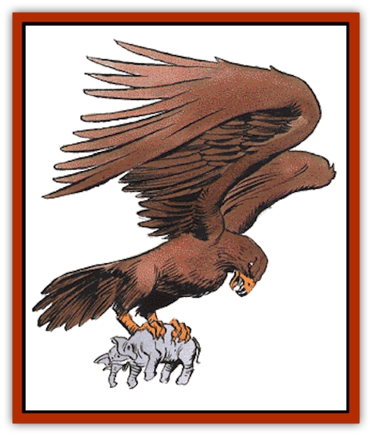

# Roc

| Statistic | **Roc** |
| --- | --- |
| **Activity Cycle:** | Day |
| **Alignment:** | Neutral |
| **Armor Class:** | 4 |
| **Climate/Terrain:** | Subtropical/Mountains |
| **Damage/Attack:** | 3-18/3-18 or 4-24 |
| **Diet:** | Omnivore |
| **Frequency:** | Rare |
| **Hit Dice:** | 18 |
| **Intelligence:** | Animal (1) |
| **Magic Resistance:** | Nil |
| **Morale:** | Steady (11) |
| **Movement:** | 3, Fl 30 |
| **No. Appearing:** | 1-2 |
| **No. of Attacks:** | 2 or 1 |
| **Organization:** | Solitary |
| **Size:** | G (60' long + wingspan) |
| **Special Attacks:** | Surprise |
| **Special Defenses:** | Nil |
| **THAC0:** | 3 |
| **Treasure:** | C |
| **XP Value:** | 10,000 |

Looking almost too big to be real, rocs are huge [[Bird|birds]] of prey that dwell in warm mountainous regions and are known for carrying off large animals (cattle, [[Horse|horses]], [[Elephant|elephants]]) for food.

Rocs resemble large [[Eagle|eagles]], with either dark brown plumage or all golden feathers from head to tail. In a few rare instances, rocs of all red, black or white are sighted, but such sightings are often considered bad omens. These giant birds are 60 feet long from beak to tail feathers, with wingspans as wide as 120 feet.

**Combat:** The roc swoops down upon prey, seizes it in powerful talons, and carries it off to the roc's lair to be devoured at leisure. The resulting damage is 3d6 per claw. Most of the time (95%), a roc carries off its prey only if both claws hit. If the prey was hit by only one claw, the roc usually lets go, then turns around and attempts another grab. Once the prey has been secured, the roc flies back to its nest. If the creature resists, the roc strikes with its beak, inflicting 4d6 points of damage per hit.

Should a human, humanoid, or demihuman be captured, there is a 65% chance that the victim's arms are both pinned to his sides, making impossible melee weapon attacks or spellcasting that requires hand gestures. A roc will let go of its prey if it suffers damage equal to a quarter of its hit points. A roc can pick up two targets simultaneously if they are within 10 feet of each other.

A roc usually cruises at a height of about 300 feet, seeking out likely prey with its sharp eyes. When a good target is found, it swoops down silently. The stealth of this first attack imposes a -5 penalty to its opponents' surprise rolls.

**Habitat/Society:** Roc lairs are vast nests made of trees, branches, and the like. They inhabit the highest mountains in warm regions. Rocs are not given to nesting close to each other, with a nest rarely being located within 20 miles of another nest. There is a 15% chance of finding 1d4+1 eggs in a roc nest. These eggs sell for 2d6x100 gp to merchants specializing in exotic items. As may be expected, rocs fight to the death to protect these nests and their contents, gaining a +1 bonus to their attack roll.

The treasure of a roc is usually strewn about and below the nest, for the creature does not value such. It is the residue from its victims. If the roc has been seizing pack horses and mules, some of that treasure may be merchant's wares such as spices, rugs, tapestries, perfume, rich clothing, or jewels.

The roc ranges for food three times a day; about an hour after sunrise, at noon, and an hour before sunset. If there are young in the nest, a fourth feeding, approximately two hours after noon, is added to keep the young strong and well-fed.

**Ecology:** Rocs are occasionally tamed and used by [[Giant_Cloud|cloud]] or [[Giant_Storm|storm giants]]. Good-aligned giants do not allow their rocs to attack civilized areas and the animals therein.

As mentioned before, rocs do not nest too closely together, since such a high concentration of these hungry predators would deprive entire regions of its animal population. Rocs serve to keep down the number of large predators, as they are fond of [[Ankheg|ankheg]], [[Worm|purple worms]], and [[Harpy|harpies]]. Thanks to the rocs' prodigious appetites, these creatures are not swarming about with impunity.

It is said that roc feathers can be used in the manufacture of *Quaal's feather tokens*, as well as *wings* and *brooms of flying*.

One race that has little love for rocs is [[Dwarf|dwarves]]. Dwarven mines located in remote mountains often have to contend with unruly rocs intent on protecting their territory. Attempts by the dwarves to tame rocs have all met with failure, so the accepted manner of dealing with rocs is to kill them and smash their eggs. Adventurers who happen on a community of mountain dwarves may find employment as roc hunters. Such groups would do well not to allow any druids to find this out.

---
## Discovery & Documentation

**Source Publication:** MC2 Volume II (1993)
**Campaign Setting:** Advanced Dungeons & Dragons 2nd Edition
**Author(s):** Jay Batista, Scott Bennie, Grant Boucher, William W. Connors, Steve Gilbert, Heike Kubasch, James Lowder, David Edward Martin, Bruce Nesmith, Jean Rabe, Rick Swan, John J. Terra, Gary L. Thomas

### Other Creatures Found in This Source Book
   * [[Ant|Ant]]
   * [[Ant_Lion_Giant|Ant Lion, Giant]]
   * [[Ape_Carnivorous|Ape, Carnivorous]]
   * [[Baboon|Baboon]]
   * [[Badger|Badger]]
   * [[Barracuda|Barracuda]]
   * [[Beetle_Giant|Beetle, Giant]]
   * [[Bulette|Bulette]]
   * [[Bullywug|Bullywug]]
   * [[Dwarf_Duergar|Dwarf, Duergar]]
   * [[Dwarf_Gully|Dwarf, Gully]]
   * [[Eagle|Eagle]]
   * [[Eel|Eel]]
   * [[Elemental_Air_Kin|Elemental, Air Kin]]
   * [[Elemental_Water_Kin|Elemental, Water Kin]]
   * [[Elemental_Water_Kin_Water_Weird|Elemental, Water Kin, Water Weird]]
   * [[Firestar|Firestar]]
   * [[Firetail|Firetail]]
   * [[Fish_Giant|Fish, Giant]]
   * [[Frog|Frog]]
   * [[Gorgon|Gorgon]]
   * [[Hawk|Hawk]]
   * [[Heucuva|Heucuva]]
   * [[Hippocampus|Hippocampus]]
   * [[Hippogriff|Hippogriff]]
   * [[Kelpie|Kelpie]]
   * [[Kenku|Kenku]]
   * [[Killmoulis|Killmoulis]]
   * [[Kuo-Toa|Kuo-Toa]]
   * [[Lamia|Lamia]]
   * [[Lammasu|Lammasu]]
   * [[Lamprey|Lamprey]]
   * [[Leech|Leech]]
   * [[Leprechaun|Leprechaun]]
   * [[Leucrotta|Leucrotta]]
   * [[Locathah|Locathah]]
   * [[Lycanthrope_Wereboar|Lycanthrope, Wereboar]]
   * [[Lycanthrope_Werefox|Lycanthrope, Werefox]]
   * [[Mammal_Minimal|Mammal, Minimal]]
   * [[Mammal_Small|Mammal, Small]]
   * [[Mimic|Mimic]]
   * [[Morkoth|Morkoth]]
   * [[Muckdweller|Muckdweller]]
   * [[Myconid|Myconid]]
   * [[Naga|Naga]]
   * [[Obliviax|Obliviax]]
   * [[Octopus_Giant|Octopus, Giant]]
   * [[Otyugh|Otyugh]]
   * [[Piranha|Piranha]]
   * [[Plant_Dangerous_I|Plant, Dangerous I]]
   * [[Plant_Intelligent|Plant, Intelligent]]
   * [[Poltergeist|Poltergeist]]
   * [[Porcupine|Porcupine]]
   * [[Rat_Osquip|Rat, Osquip]]
   * [[Roper|Roper]]
   * [[Rot_Grub|Rot Grub]]
   * [[Rust_Monster|Rust Monster]]
   * [[Sahuagin|Sahuagin]]
   * [[Sea_Lion|Sea Lion]]
   * [[Sea_Horse_Giant|Sea Horse, Giant]]
   * [[Shambling_Mound|Shambling Mound]]
   * [[Shark|Shark]]
   * [[Sphinx|Sphinx]]
   * [[Squid_Giant|Squid, Giant]]
   * [[Stirge|Stirge]]
   * [[Swanmay|Swanmay]]
   * [[Tarrasque|Tarrasque]]
   * [[Tasloi|Tasloi]]
   * [[Triton|Triton]]
   * [[Troglodyte|Troglodyte]]
   * [[Urchin|Urchin]]
   * [[Urd|Urd]]
   * [[Weasel|Weasel]]
   * [[Wolverine|Wolverine]]
   * [[Yellow_Musk_Creeper|Yellow Musk Creeper]]
